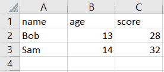
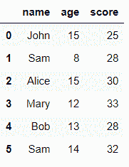
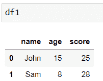
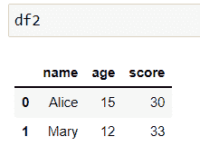
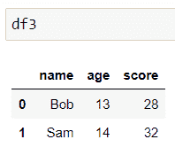
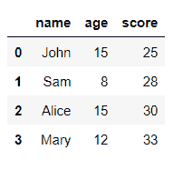
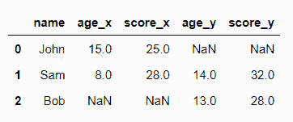

# 如何用 Python 合并 CSV 文件？

> 原文：<https://www.askpython.com/python-modules/pandas/combine-csv-files-using-python>

通常在处理 CSV 文件时，我们需要处理大型数据集。根据数据分析的要求，我们可能会发现所有需要的数据都不会出现在一个 CSV 文件中。然后，需要合并多个文件以获得所需的数据。然而，将所需的列从一个文件复制粘贴到另一个文件，以及从大型数据集中复制粘贴，并不是解决这个问题的最佳方法。

为了解决这个问题，我们将学习如何使用熊猫的`append`、`merge`和`concat`方法来合并 CSV 文件。

* * *

## 将多个 CSV 文件组合在一起

首先，让我们创建将要使用的示例 CSV 文件。


CSV File 1


CSV File 2



CSV File 3

请注意，所有三个文件都有相同的列或标题，即**、【姓名】、**、【年龄】、**、【分数】、**。此外，文件 1 和文件 3 的**‘name’**列有一个公共条目，即 *Sam* ，但是这些文件中的其余值是不同的。****

注意，在下面的例子中，我们认为所有的 CSV 文件都与 Python 代码文件在同一个文件夹中。如果不是这样，请在自己尝试示例时相应地指定路径。所有的例子都记录在一本笔记本上。

* * *

## 在 Python 中组合 CSV 文件的不同方法

开始之前，我们将创建一个 CSV 文件列表，这些文件将在下面的示例中使用，如下所示:

```
import glob

# list all csv files only
csv_files = glob.glob('*.{}'.format('csv'))
csv_files

```

**输出:**

```
['csv_file_1.csv', 'csv_file_2.csv', 'csv_file_3.csv']

```

### 方法 1: append()

我们来看看这里的 [append 方法](https://www.askpython.com/python/array/append-an-array-in-python)合并三个 CSV 文件。

```
import pandas as pd

df_csv_append = pd.DataFrame()

# append the CSV files
for file in csv_files:
    df = pd.read_csv(file)
    df_csv_append = df_csv_append.append(df, ignore_index=True)

df_csv_append

```

**输出:**



`append`方法，顾名思义，将每个文件的数据帧附加到前一个文件的末尾。在上面的代码中，我们首先创建一个数据帧来存储名为 **df_csv_append** 的结果。然后，我们遍历列表，读取每个 CSV 文件，并将其附加到数据帧 **df_csv_append** 。

* * *

### 方法 2: concat()

另一种用于合并 CSV 文件的方法是[熊猫`concat()`方法](https://www.askpython.com/python/string/string-concatenation-in-python)。该方法需要一系列对象作为参数，因此我们首先为每个 CSV 文件创建一系列数据框对象，然后对其应用`concat()`方法。

```
import pandas as pd

df_csv_concat = pd.concat([pd.read_csv(file) for file in csv_files ], ignore_index=True)
df_csv_concat

```

编写这段代码的一种更容易理解的方式是:

```
l = []

for f in csv_files:
    l.append(pd.read_csv(f))

df_res = pd.concat(l, ignore_index=True)
df_res

```

以上两个代码在执行时会产生如下所示的相同输出。


注意，产生的数据帧与`append()`方法的数据帧相同。

* * *

### 方法 3:合并()

`merge`方法用于连接非常大的数据帧。一次可以对两个数据框执行连接。我们可以指定执行连接所基于的键。

为避免重复行，为数据框中的每个条目选择一个唯一的键是一种很好的做法。我们还可以指定希望执行的连接类型，即*、*、*、*、*、*、*、*或*、【交叉】、*连接。

我们需要首先[将每个 CSV 文件](https://www.askpython.com/python-modules/pandas/pandas-read-csv-with-headers)读入一个单独的数据帧。

```
import pandas as pd

df1 = pd.read_csv('csv_file_1.csv')
df2 = pd.read_csv('csv_file_2.csv')
df3 = pd.read_csv('csv_file_3.csv')

```



df1



df2



df3

**连接 df1 和 df2:**

```
df_merged = df1.merge(df2, how='outer')
df_merged

```

**输出:**



Merge Output 1

基于密钥“name”连接 df1 和 df3。

```
df_merged = df1.merge(df3, on="name", how='outer')
df_merged

```

**输出:**



Merge Output 2

df1 和 df3 都有一个名为“Sam”的条目，并且两者的年龄和分值不同。因此，在结果数据帧中，存在用于表示来自 df1 和 df3 的条目的列。由于*约翰*和*鲍勃*在数据帧 df1 和 df3 中不常见，因此它们的值在任何适用的情况下都是 NaN。

* * *

## 结论

在本文中，我们学习了 Pandas 方法，即 **concat** 、 **merge** 和 **append** ，以及如何使用它们通过 Python 组合 CSV 文件。

* * *

## 参考

*   熊猫附加官方文件
*   [熊猫串联官方文档](https://pandas.pydata.org/docs/reference/api/pandas.concat.html)
*   [熊猫合并官方文件](https://pandas.pydata.org/docs/reference/api/pandas.merge.html)