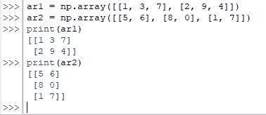
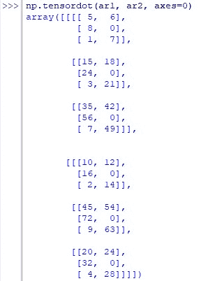

# Numpy . tensordot()–如何使用 Numpy 计算 Tensordot 乘积？

> 原文：<https://www.askpython.com/python-modules/numpy/numpy-tensordot>

这篇文章将帮助你理解如何使用 *numpy* 库中的 *tensordot( )* 函数计算张量点积。一旦一对要求点积的张量以数组的形式作为输入，函数 *tensordot( )* 对指定轴上 a 和 b 元素的乘积求和。

***也读:[Numpy Trace:Python 中使用 Numpy 计算 Trace 的指南](https://www.askpython.com/python-modules/numpy/numpy-trace)***

让我们开始理解这个函数，首先使用下面的代码导入 *numpy* 库。

```
import numpy as np

```

我们将在以下各节中进一步探讨 *tensordot( )* 函数。

*   **tensordot()函数**的语法
*   **计算张量点积**
*   **相似之处&不同之处*numpy . dot()***

* * *

## tensordot()函数的语法

下面是有效运行 *tensordot( )* 函数所需的构造。

```
numpy.tensordot(a, b, axes)

```

在哪里，

*   ***a—***作为第一张量的阵列状物体
*   ***b—***作为第二张量的阵列状物体
*   ***轴-***可以是一个标量或类似数组的对象，指定计算点积所沿的轴

* * *

## 计算张量点积

在这一节中，让我们找出以 N 维数组形式给出的一对张量的张量点积，如下所示。

```
ar1 = np.array([[1, 3, 7], [2, 9, 4]])
ar2 = np.array([[5, 6], [8, 0], [1, 7]])

```

现在让我们部署 *tensordot( )* 函数，将轴的方向指定为‘1’。

```
np.tensordot(ar1, ar2, axes=1)

```

一旦上面的代码运行，下面的计算将在后端发生，用于计算以数组形式返回的结果。

*   第一个张量第一行的第一个元素乘以第二个张量第一列的第一个元素(即 1×5 = 5)。
*   第一个张量第一行的第二个元素乘以第二个张量第一列的第二个元素(即 3×8 = 24)。
*   第一和第二张量(即 7×1 = 7)中随后的第三元素也是如此。为了让读者更好地理解，这里打印了一些输入。



Input Tensors Printed As Arrays

*   一旦完成，将上面推导的所有元素的乘积相加，得到张量点积第一行的第一个元素(即 5+24+7 = 36)。
*   对输入张量的后续行和列重复相同的过程，以找到张量点积的其他元素。
    *   张量点积第一行的第二个元素是从(1×6) + (3×0) + (7×7) = 55 中检索的
    *   张量点积第二行的第一个元素是从(2×5) + (9×8) + (4×1) = 86 中检索的
    *   张量点积第二行的第二个元素是从(2×6) + (9×0) + (4×7) = 40 中检索的

下面是代码运行后我们得到的结果，我们可以发现上面详细描述的元素推理与下面显示的有惊人的相似之处。


Tensor Dot Product Calculated With Axes=1

* * *

## 与 numpy.dot()的异同

当相同的输入通过 *numpy.dot( )* 函数运行时，得到的结果可能会有惊人的相似之处。

```
np.dot(ar1, ar2)

```


Results Of *numpy.dot( )*

这是因为在运行 *tensordot( )* 函数时将轴设置为“1”会产生传统的矩阵点积，这解释了上述相似性。然而，将轴设置更改为零(0)会指示 *tensordot( )* 需要计算的方向，从而产生不同的结果。

```
np.tensordot(ar1, ar2, axes=0)

```



Tensor Dot Product Calculated With Axes=0

计算上述结果背后的基本逻辑是将整个数组“ar2”乘以“ar1”的每个元素。第一个子数组是“ar2”与“ar1”的第一个元素相乘的结果~ 1！

* * *

## 结论

现在我们已经到了本文的结尾，希望它已经详细说明了如何使用来自 *numpy* 库中的 *tensordot( )* 函数来计算给定张量对的 tensordot 乘积。这里有另一篇文章解释了 Python 中 *numpy* 的[trace()函数。AskPython](https://www.askpython.com/python/how-to-use-numpy-trace-in-python) 中还有许多其他有趣且信息量大的文章，可能会对那些希望提高 Python 水平的人有很大帮助。当你享受这些的时候，再见！