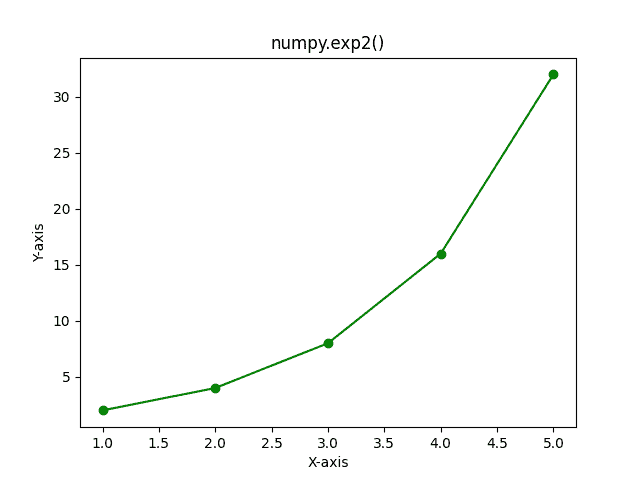

# NumPy exp2–完整指南

> 原文:# t0]https://www . aspython . com/python-modules/num py/num py-exp 2

嘿各位，你们都计算过类似于 **2 的 4 次方**或者 **2 的 1 次方**之类的东西吗？例如，为了计算 2 的 4 次方，我们通常将 2 乘以 4 次。那是一个乏味的任务，对吗？所有这些乘法过程花费了大量的时间。嗯，我们可以在几分之一秒内得到输出，甚至不需要经历很长的过程，听起来很令人兴奋🙂

这就是 [**Python NumPy**](https://www.askpython.com/python-modules/numpy/python-numpy-module) 库发挥作用的地方。在本文中，我们将了解如何使用 NumPy exp2 函数来计算 2 的不同次方。

没有别的事了，让我们开始吧。

***也读作:[NumPy angle——返回一个复杂自变量的角度](https://www.askpython.com/python-modules/numpy/numpy-angle)***

## 什么是 NumPy exp2？

**NumPy exp2** 是 NumPy 库的一个**数学函数**，它计算 2 <sup>x</sup> ，其中 x 是传递给函数的输入数。简单的定义！现在，让我们深入研究一下如何在 Python 程序中使用这个函数。让我们从函数的语法开始。

***也读作:[NumPy exp-完整指南](https://www.askpython.com/python-modules/numpy/numpy-exp)***

## NumPy exp2 的语法

```py
numpy.exp2(a)

```

始终关注 NumPy 库的任何函数的语法，因为这将使您更容易编写代码。在语法中，输入 **`a`** 可以是单个数字，也可以是数字的 NumPy 数组。

## 使用 NumPy exp2

现在，让我们写一些代码来更好地理解它。

### 具有单一编号的 NumPy exp2

```py
import numpy as np

print("2**3 is :",np.exp2(3))

print("2**7 is :",np.exp2(7))

print("2**10 is :",np.exp2(10))

print("2**(-2) is :",np.exp2(-2))

```

**输出**

```py
2**3 is : 8.0
2**7 is : 128.0
2**10 is : 1024.0
2**(-2) is : 0.25

```

在上面的例子中，我们将一个数字作为输入传递给了 **`np.exp2()`** 函数。该函数的输出是一个**浮点数**。

看看使用函数计算 2 的幂有多简单🙂

### 带有 NumPy 数组的 NumPy exp2

现在让我们传递一个 NumPy 数组作为函数的输入。

```py
import numpy as np

a = np.array((-2 , 0 , 4 ))

exp2_values = np.exp2(a)

print("Input Array :\n",a)
print("Exp2 Values for each element of the Array :\n",exp2_values)

```

**输出**

```py
Input Array :
 [-2  0  4]
Exp2 Values for each element of the Array :
 [ 0.25  1\.   16\.  ]

```

*注意:*函数 **`np.exp2()`** 返回一个与输入数组维数相同的 NumPy 数组。

在上面的例子中，NumPy 数组 **a** 作为参数传递给 **`np.exp2()`** 函数。使用`**np.exp2()**`函数计算输入数组中每个元素的 exp2 值。该函数的输出也是一个 NumPy 数组，它存储在变量 **exp2_values** 中。

在接下来的几行中，我们使用了 print 语句来分别打印输入数组和输出数组。

到目前为止，您已经学会了如何使用单个数字和 NumPy 数字数组的函数。现在，让我们看看如何使用 Python [Matplotlib 库](https://matplotlib.org/)绘制函数。

## NumPy exp2 的图表

```py
import numpy as np
import matplotlib.pyplot as plt

a = np.array((1 , 2 , 3 , 4 , 5))

b = np.exp2(a)

plt.plot(a , b , color = "green" , marker = "o")
plt.title("numpy.exp2()")
plt.xlabel("X-axis")
plt.ylabel("Y-axis")
plt.show()

```

**输出**



**NumPy Exp2 Graph**

在上面的代码中，在前两行，我们导入了 NumPy 和 Matplotlib 库，这样我们就可以使用它们的功能。

接下来，我们创建了一个变量 **`a`** 来存储 NumPy 数组，该数组作为输入传递给 np.exp2()函数。类似地，变量`**b**`存储 **np.exp2()** 函数的输出数组。

在接下来的几行中，我们使用了 Matplotlib 库的函数来绘制函数的图形。让我们理解每一行及其目的。

`**plt.plot()**`函数使用[来绘制](https://www.askpython.com/python/examples/plot-mathematical-functions)带四个参数的 **`np.exp2()`** 函数。

*   第**个**参数是数字的 **[NumPy 数组](https://www.askpython.com/python-modules/numpy/python-numpy-arrays)，绘制在 X 轴(横轴)上。**
*   第二个参数**是`**np.exp2()**`函数的输出，绘制在 Y 轴(垂直轴)上。**
*   第三个参数是绘图的颜色。
*   **第四个**参数是标记值，用指定的标记强调每个点。有不同类型的标记可用于表示曲线上的点。

*   **`plt.title()`** 为剧情设置**标题**的值。这里的标题是 numpy.exp2()。
*   **`plt.xlabel()`** 和 **`plt.ylabel()`** 分别设置横轴和纵轴的名称。
*   **`plt.show()`** 用于显示剧情。

就这样，我们完成了示例以及 NumPy exp2 函数的图形。

## 摘要

在本文中，我们学习了如何使用 NumPy exp2 函数计算 2 的幂。我们使用了单个数字和 NumPy 数字数组的函数。我们还绘制了 NumPy exp2 函数的图形。

请务必查看参考资料部分给出的链接。继续学习，继续探索更多话题[这里](https://www.askpython.com/)。

## 参考

[num py documentation–num py exp 2](https://numpy.org/doc/stable/reference/generated/numpy.exp2.html)