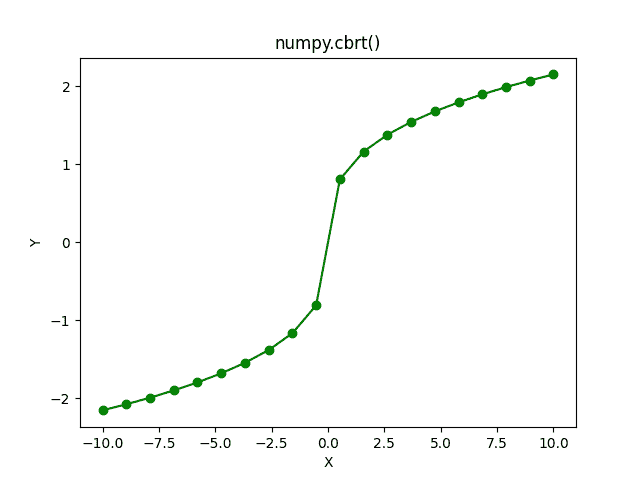

# numpy。cbrt()–返回元素的立方根

> 原文:# t0]https://www . aspython . com/python-modules/num py/num py-cbrt

读者你好！欢迎来到另一个关于 NumPy 数学函数的教程。在本教程中，我们将通过各种例子详细介绍 NumPy Cuberoot 函数。

没有别的事了，我们开始吧。

## 立方根函数–快速概述

让我们快速修改立方根函数。

它是一个数的第三个根。这意味着，如果我们将一个数的立方根值乘以 3，那么我们将得到原来的数。例如，125 的立方根是 5，这意味着将 5 本身乘以三次，结果是 125。

## 什么是 NumPy cbrt？

NumPy **`cbrt`** 是 NumPy 库提供的数学函数之一。它计算输入数字的立方根(3 次方根)。

让我们看看这个函数的语法。

```
numpy.cbrt(input)

```

这里，输入可以是单个数字、数字的 NumPy 数组以及复数。

## 使用 NumPy cbrt

这就是函数的语法。现在让我们编写代码来更好地理解这个函数。

### 单个数的 NumPy cbrt

```
import numpy as np

print("Cube root of 1 is :",np.cbrt(1))

print("Cube root of 125 is :",np.cbrt(125))

print("Cube root of 1024 is :",np.cbrt(1024))

print("Cube root of 27000 is :",np.cbrt(27000))

```

**输出**

```
Cube root of 1 is : 1.0
Cube root of 125 is : 5.0
Cube root of 1024 is : 10.079368399158984
Cube root of 27000 is : 30.0

```

输出非常明显且易于理解。

### 带有 NumPy 数组的 NumPy cbrt

```
import numpy as np

a = np.array((1 , 1000 , -27 , -99))

print("Input Array:\n",a)
print("Cube root Values:\n",np.cbrt(a))

b = np.array((1024 , 216))

print("Input Array:\n",b)
print("Cube root Values:\n",np.cbrt(b))

```

**输出**

```
Input Array:
 [   1 1000  -27  -99]
Cube root Values:
 [ 1\.         10\.         -3\.         -4.62606501]
Input Array:
 [1024  216]
Cube root Values:
 [10.0793684  6\.       ]

```

现在，让我们看看当我们将一个复数作为输入传递给 NumPy cbrt 函数时会发生什么。

### 复数的 NumPy cbrt

```
import numpy as np

print(np.cbrt(1+4j))

print(np.cbrt(2-5j))

```

**输出**

```
TypeError: ufunc 'cbrt' not supported for the input types, and the inputs could not be safely coerced to any supported types according to the casting rule ''safe''

```

从上面的输出中，我们可以清楚地理解，复数不能作为输入传递给 NumPy cbrt 函数。

让我们使用 Matplotlib 库来绘制 NumPy cbrt 函数。

## 数字 cbrt 的图形表示

```
import numpy as np

import matplotlib.pyplot as plt

a = np.linspace(-10 , 10 , 20)

b = np.cbrt(a)

plt.plot(a , b , color = "green" , marker = "o")
plt.title("numpy.cbrt()")
plt.xlabel("X")
plt.ylabel("Y")
plt.show()

```

**输出**



**cbrt Plot**

这就是关于 NumPy cbrt 函数的全部内容。快乐学习🙂

## 参考

[num py documentation–num py cbrt](https://numpy.org/doc/stable/reference/generated/numpy.cbrt.html)