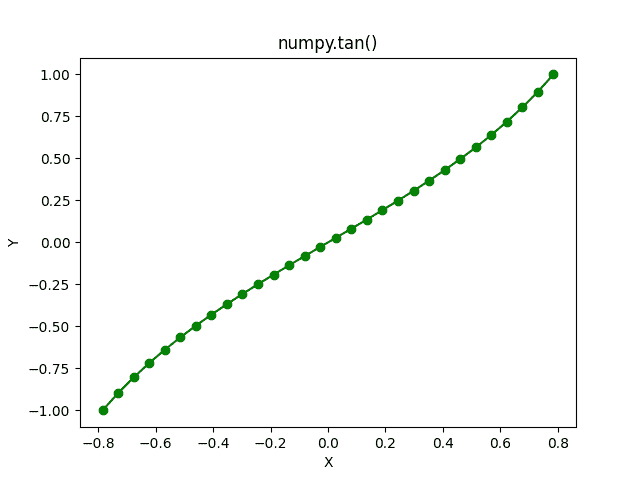

# NumPy Tan 完整指南

> 原文:# t0]https://www . aspython . com/python-modules/num py/num py-tan

欢迎来到系列 [NumPy 三角函数](https://www.askpython.com/python/numpy-trigonometric-functions)的第三篇教程。在本教程中，我们将了解 NumPy Tan 函数。**切线**是**切线**的简称。

与[正弦](https://www.askpython.com/python-modules/numpy/numpy-sin)和[余弦函数](https://www.askpython.com/python-modules/numpy/numpy-cos)不同，正切函数的输出包含所有实数。

*   当给定的输入是 pi/2 的奇数倍时，即 pi/2、-pi/2、3pi/2、-3pi/2 等，Tan 未定义。
*   有一个有趣的关系是: **tan(x) = sin(x)/cos(x)** 。

我们将练习不同类型的示例，并使用 Python 的 [**Matplotlib 库**绘制 NumPy Tan 的图形。](https://www.askpython.com/python-modules/matplotlib/python-matplotlib)

## 什么是 NumPy Tan？

*   NumPy Tan 也是 NumPy 库提供的三角函数之一，它计算单个数字和角度的 NumPy 数组的三角正切值。
*   NumPy Tan 在元素方面相当于`np.sin(x)/np.cos(x)`。
*   NumPy Tan 函数可以作为`numpy.tan`访问。

## 数字谭的语法

**语法:** `numpy.tan(input)`其中输入可以是单个角度，也可以是角度的 NumPy 数组。

## 与 Numpy Tan 一起处理不同类型的值

让我们尝试一些 NumPy Tan 函数的例子来帮助我们更好地理解它。

### Pi 值上的 NumPy Tan

```
import numpy as np

print("Tan of 0 is :",np.tan(0))

print("Tan of pi/6 is :",np.tan(np.pi/6))

print("Tan of pi/4 is :",np.tan(np.pi/4))

print("Tan of pi/3 is :",np.tan(np.pi/3))

print("Tan of pi is :",np.tan(np.pi))

```

**输出**

```
Tan of 0 is : 0.0
Tan of pi/6 is : 0.5773502691896257
Tan of pi/4 is : 0.9999999999999999
Tan of pi/3 is : 1.7320508075688767
Tan of pi is : -1.2246467991473532e-16

```

*   **π的 NumPy 正切**提供了不同的输出——该输出采用科学记数法，等于 0。

**任务:**计算`np.tan(np.pi/2)`、`np.tan(3*np.pi/2)`并观察输出。

现在，让我们看看如何将角度作为参数传递给 numpy.tan 函数。

### 带 Deg2Rad 功能的 NumPy Tan

为了计算正切函数的自变量为**度的角的正切值，使用了**函数`deg2rad`。

```
import numpy as np

print("Tangent of 30 degrees is :",np.sin(np.deg2rad(30)))

print("Tangent of 45 degrees is :",np.sin(np.deg2rad(45)))

print("Tangent of 60 degrees is :",np.sin(np.deg2rad(60)))

print("Tangent of 180 degrees is :",np.sin(np.deg2rad(180)))

```

**输出**

```
Tangent of 30 degrees is : 0.49999999999999994
Tangent of 45 degrees is : 0.7071067811865476
Tangent of 60 degrees is : 0.8660254037844386
Tangent of 180 degrees is : 1.2246467991473532e-16

```

**注意:**一个类似的函数是`**rad2deg**`，它以弧度为单位获取一个角度，并将其转换为度数。该函数可与NumPy 库的三角函数一起使用。尝试使用具有不同输入值的函数，并观察输出🙂

现在，让我们看看如何计算一组角度的正切值。

### 角度数组上的 NumPy Tan

tan 函数也接受一个 NumPy 数组作为参数，但是我们必须确保角度被转换成弧度。

```
import numpy as np

# A NumPy array with all the angles in degrees
a = np.array((0 , 30 , 45 , 60 , 180))

print("Tangent Values :\n",np.tan(a*np.pi/180))

# A NumPy array with all the angles is radians
b = np.array((0 , np.pi/2 , np.pi/3 , np.pi))

print("Tangent Values :\n",np.tan(b))

```

**输出**

```
Tangent Values :
 [ 0.00000000e+00  5.77350269e-01  1.00000000e+00  1.73205081e+00
 -1.22464680e-16]
Tangent Values :
 [ 0.00000000e+00  1.63312394e+16  1.73205081e+00 -1.22464680e-16]

```

在上面的代码片段中，输出是一个 NumPy 数组，值采用科学记数法。

### 均匀间隔的 NumPy 阵列上的 NumPy Tan

在这个例子中，我们将使用`numpy.linspace`创建一个由 30 个均匀分布的值组成的 NumPy 数组。

```
import numpy as np

a = np.linspace(-(np.pi/4) , np.pi/4 , 30)

print("Tangent Values: ",np.tan(a))

```

输出

```
Tangent Values:  [-1\.         -0.89714006 -0.80382248 -0.71829915 -0.63918754 -0.5653756
 -0.49595431 -0.43016871 -0.36738181 -0.30704735 -0.24868885 -0.19188316
 -0.13624728 -0.08142734 -0.02708932  0.02708932  0.08142734  0.13624728
  0.19188316  0.24868885  0.30704735  0.36738181  0.43016871  0.49595431
  0.5653756   0.63918754  0.71829915  0.80382248  0.89714006  1\.        ]

```

*   这里，我们使用`numpy.linspace`创建了一个 NumPy 数组，它有 30 个均匀间隔的弧度角，范围从**-π/4**到**π/4**。

*   输出也是一个 NumPy 数组，它是数组元素的正切。

现在，让我们使用 **Matplotlib 库**来可视化 Tan 函数的实际外观。

## 可视化 Numpy Tan 函数

```
import numpy as np

# Importing the Matplotlib Library
import matplotlib.pyplot as plt

# Creating a NumPy Array of 30 evenly-spaced elements
a = np.linspace((-np.pi/4),(np.pi/4),30)

# Storing the tangent values in a NumPy Array
b = np.tan(a)

plt.plot(a, b, color = "green", marker = "o")
plt.title("numpy.tan()")
plt.xlabel("X")
plt.ylabel("Y")
plt.show()

```

**输出**



**Tangent Plot**

这就对了，你已经成功地绘制了切线曲线。

## 摘要

这就是关于 NumPy Tan 函数的内容，在阅读教程的同时练习这些代码将有助于更好地理解 NumPy Tan 函数。别忘了做教程里给的**任务**。

在下一个教程中，我们将从反三角函数开始。在那之前请继续关注。

## 参考

num py 文档–num py tan

[Matplotlib–开始使用](https://matplotlib.org/stable/users/getting_started/)

[Matplotlib 文件](https://matplotlib.org/stable/index.html)