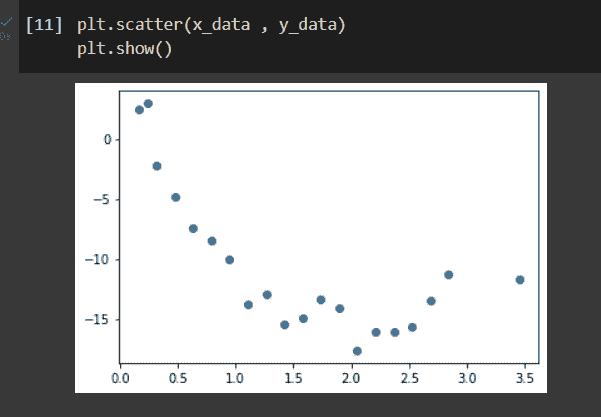
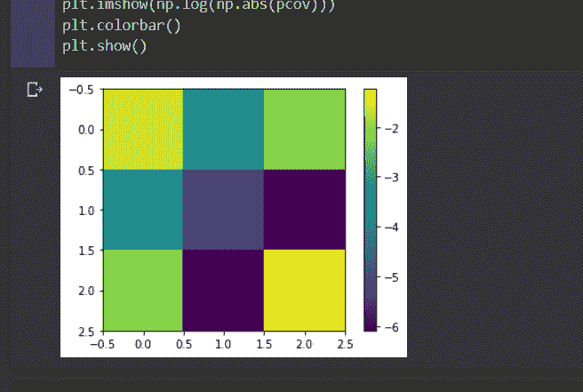
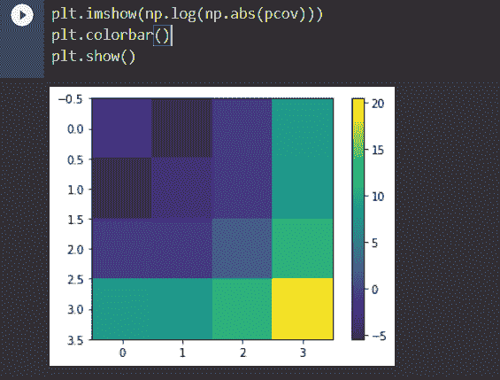

# Python 中的曲线拟合:完全指南

> 原文：<https://www.askpython.com/python/examples/curve-fitting-in-python>

在本文中，我们将学习 python 中针对给定数据集的不同方法的曲线拟合。但是在开始之前，让我们先了解一下曲线拟合的目的是什么。

**曲线拟合的目的是查看数据集并提取参数的优化值，以模拟给定函数的数据集。为此，我们将使用一个名为`curve_fit().`** 的函数

在开始我们的代码片段之前，让我们导入一些我们需要在开始之前导入的重要模块。

```
#importing modules
import numpy as np
import pandas as pd
import matplotlib.pyplot as plt
from scipy.optimize import curve_fit

```

## Python 中的曲线拟合是什么？

给定数据集 **x = {x <sub>1</sub> ，x <sub>2</sub> ，x <sub>3</sub> …}** 和 **y= {y <sub>1</sub> ，y <sub>2</sub> ，y <sub>3</sub> …}** 和一个函数 f，取决于一个未知参数 **z** 。我们需要为这个未知参数 z 找到一个最佳值，使得函数 **y = f(x，z)** 与函数和给定数据集最相似。这个过程称为**曲线拟合。**

为此，我们还需要应用两种不同的方法来进行曲线拟合。

*   最小二乘法
*   最大似然估计

### 最小二乘法

在这个方法中，我们将通过调整 **z** 中的值来最小化一个函数 **∑ <sub>i</sub> (f(x <sub>i</sub> ，z)–y<sub>I</sub>)<sup>2</sup>**。

我们可以在最高最小化之后找到优化值。

### 最大似然估计

当我们的数据集中有一些错误时，我们可以使用这种方法。那就是 **σ。**

我们需要最小化函数 **∑ <sub>i</sub> (f(x <sub>i</sub> ，z)-y<sub>I</sub>)<sup>2</sup>/σ<sup>2</sup>**。在上述函数的最高最小化之后，它给出了 z 的最佳值。

让我们看看下面的**样本数据集**。

```
x_data = np.array([ 0.23547456, 0.15789474, 0.31578947, 0.47368421, 0.63157895, 
                   0.78947368, 0.94736842, 1.10526316, 1.26315789, 1.42105263, 
                   1.57894737, 1.73684211, 1.89473684, 2.05263158, 2.21052632, 
                   2.36842105, 2.52631579, 2.68421053, 2.84210526, 3.45454545 ])
y_data = np.array([ 2.95258285, 2.49719803, -2.1984975, -4.88744346, -7.41326345, 
                   -8.44574157, -10.01878504, -13.83743553, -12.91548145, -15.41149046, 
                   -14.93516299, -13.42514157, -14.12110495, -17.6412464 , -16.1275509 , 
                   -16.11533771, -15.66076021, -13.48938865, -11.33918701, -11.70467566])

plt.scatter(x_data , y_data)
plt.show()

```

上面的代码片段将给出示例数据集的输出，如下所示。



Plotting For Sample Datasets

## 曲线拟合示例 1

为了描述未知参数 z，我们在模型中取三个不同的变量 a，b 和 c。为了确定 z 的最佳值，我们需要分别确定 a、b 和 c 的值。即 **z= (a，b，c)** 。以及函数 **y = f (x，z) = f (x，a，b，c) = a(x-b) <sup>2</sup> + c** 。让我们一步一步来。

### 步骤 1:定义模型函数

```
def model_f(x,a,b,c):
  return a*(x-b)**2+c

```

### 步骤 2:使用 curve_fit()函数

```
popt, pcov = curve_fit(model_f, x_data, y_data, p0=[3,2,-16])

```

在上面的函数中，我们为`a, b and c`提供初始值作为`p0=[3,2,-16]`。

上述函数将分别返回两个值 popt、pcov。

```
popt
array([  4.34571181,   2.16288856, -16.22482919])

pcov
array([[ 0.19937578, -0.02405734, -0.1215353 ],
       [-0.02405734,  0.00517302,  0.00226607],
       [-0.1215353 ,  0.00226607,  0.29163784]])

```

*   popt:a、b、c 的估计优化值
*   pcov:协方差矩阵或误差

现在，让我们为 a、b 和 c 绘制相同的函数。在这种情况下，我们将只解释我们的 popt 值**(最小二乘法)**，在下一个代码片段中，我们将解释我们的 pcov 值(即解释错误值)。

```
a_opt, b_opt, c_opt = popt
x_model = np.linspace(min(x_data), max(y_data), 100)
y_model = model_f(x_model, a_opt, b_opt, c_opt) 

plt.scatter(x_data, y_data)
plt.plot(x_model, y_model, color='r')
plt.show()

```

上面的代码片段将给出如下所示的输出。


现在解释 pcov 值，我们可以更好地拟合给定函数(**最大似然估计**)。让我们快速看一下下面的代码片段。

```
plt.imshow(np.log(np.abs(pcov)))
plt.colorbar()
plt.show()

```

上面的代码片段将给出如下输出。



## 示例 2

让我们用另一个例子(不同的函数)来理解给定的数据集，并尝试两种不同的方法。在本例中，为了描述未知参数`z`，我们在模型中采用了四个不同的变量，分别命名为 a、b、c 和 d。为了确定 z 的最佳值，我们需要分别确定 a、b、c 和 d 的值。让我们快速看一下下面的代码片段。

### 步骤 1:定义模型函数

```
#Defining our function
def fit_f(x,a,b,c,d):
  return a*(x-b)**2+c+d*0.0001*np.cos(x)

```

### 步骤 2:使用 curve_fit()函数

```
#using our curve_fit() function
popt, pcov = curve_fit(fit_f,x_data,y_data,p0=[1,2,-16,1])

```

在上面的函数中，我们为`a, b, c and d`提供初始值作为`p0=[1,2,-16,1]`。

我们可以通过打印相同的内容来查看 popt 和 pcov 的值。

```
popt

array([ 5.00494014e+00,  2.75689923e+00, -2.21559741e+01, -8.97724662e+04])

pcov

array([[ 1.71072218e-01,  4.21450805e-03, -4.30580853e-01,
        -5.74603933e+03],
       [ 4.21450805e-03,  3.33701247e-02, -3.97891468e-01,
        -4.49561407e+03],
       [-4.30580853e-01, -3.97891468e-01,  5.68973874e+00,
         6.50631130e+04],
       [-5.74603933e+03, -4.49561407e+03,  6.50631130e+04,
         7.82484767e+08]])

```

现在，让我们为 a、b 和 c 的优化值绘制相同的函数。在这种情况下，我们将只解释我们的 popt 值(**最小二乘法**)，在下一个代码片段中，我们将解释我们的 pcov 值(即解释错误值)。

```
a_opt, b_opt, c_opt, d_opt = popt
x_model = np.linspace(min(x_data), max(y_data), 100)
y_model = fit_f(x_model, a_opt, b_opt, c_opt,d_opt) 

plt.scatter(x_data, y_data)
plt.plot(x_model, y_model, color='r')
plt.show()

```

上面的代码片段将给出如下输出。


现在解释 pcov(协方差误差矩阵)值，我们可以更好地拟合给定函数(**最大似然估计)**。让我们快速看一下下面的代码片段。

```
plt.imshow(np.log(np.abs(pcov)))
plt.colorbar()
plt.show()

```



## 摘要

今天，我们学习了 Python 曲线拟合。我们已经看到了如何使用`curve_fit()` 方法为给定的数据集优化给定的函数。除了我们的例子之外，您还可以使用任何其他数据集来做同样的事情，并尝试上面的代码片段。

您可以尝试获取不同数据集的 CSV 文件，并提取相同数据集的优化值。

我希望你会发现这一个更有帮助。我们必须带着一些更令人兴奋的话题再次访问。