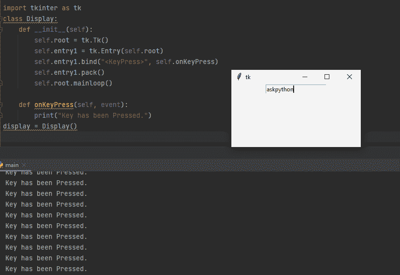
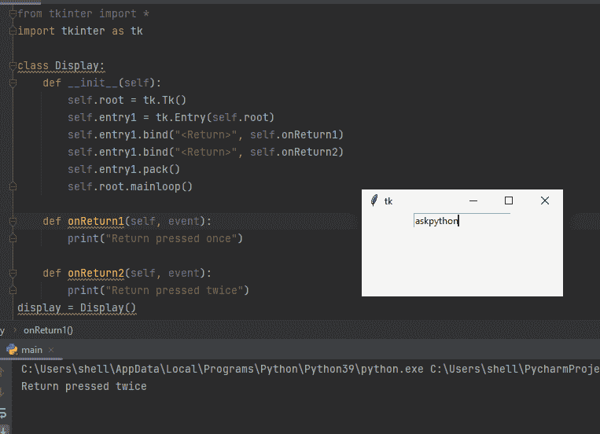
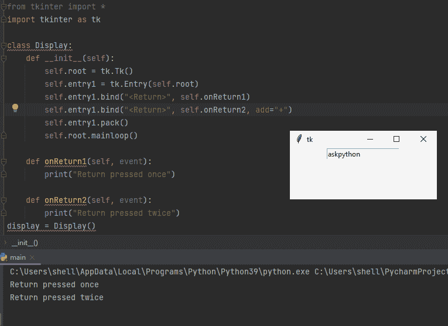
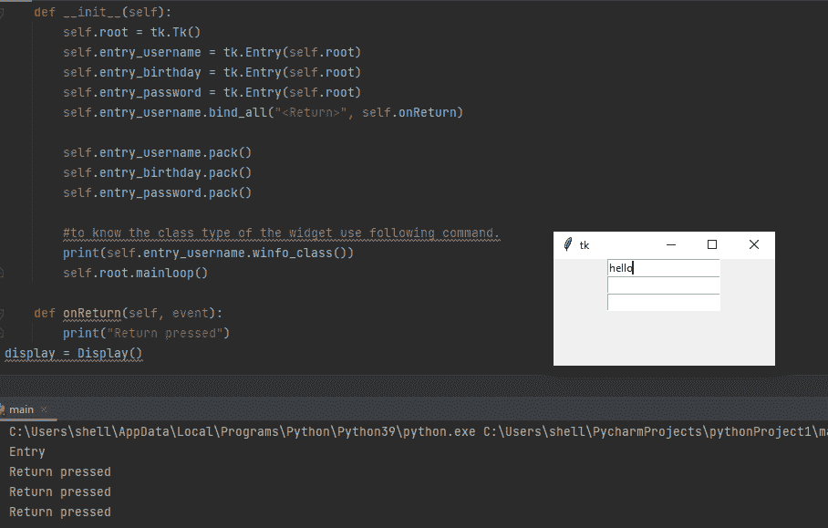

# Tkinter 中的绑定:完全指南

> 原文：<https://www.askpython.com/python-modules/tkinter/bind-in-tkinter>

在本文中，让我们试着理解 Tkinter 中使用的 bind 概念。在开始这个主题之前，我们必须记住 Python 的 Tkinter 包是用来设计基于 GUI 的界面的。Tkinter 具有多种内置功能和扩展，可用于增强应用程序的功能和性能。

## bind 是什么？

单词 bind 的基本定义是粘在一起或使粘在一起成为一个整体。类似地，Tkinter bind 用于连接小部件中传递的事件和事件处理程序。事件处理程序是在事件发生时被调用的函数。

```
widget.bind(sequence=None, func=None, add=None)

```

`*`sequence`*` 参数描述了我们期望的事件，而 *func* 参数是当事件发生在小部件上时要调用的函数。如果这个小部件的那个事件已经有一个绑定，通常旧的回调会被替换为 *func* ，但是您可以通过传递`add='+'`来保留这两个回调。

可以使用不同级别的绑定函数将事件绑定到事件处理程序。

## 1.实例级绑定

人们可以将一个事件绑定到一个特定的小部件。要绑定小部件的事件，调用小部件上的`.bind()`方法。

```
widget.bind(event, event handler)
```

*   **事件**–由用户引起的可能反映变化的事件。
*   **事件处理器**–事件发生时应用程序中被调用的函数。
*   **Bind**–配置一个事件处理程序(python 函数)，当一个事件发生在一个小部件上时，调用这个事件处理程序。

以下是如何将事件绑定到小部件的特定实例的示例。

```
import tkinter as tk
class Display:
    def __init__(self):
        self.root = tk.Tk()
        self.entry1 = tk.Entry(self.root)
        self.entry1.bind("<KeyPress>", self.onKeyPress)
        self.entry1.pack()
        self.root.mainloop()

    def onKeyPress(self, event):
        print("Key has been Pressed.")
display = Display()

```

### 输出



Implementation

## 多重绑定

如果我们需要将一个以上的功能绑定到一个特定的小部件，该怎么办？传递两个包含 `bind the` 函数的语句肯定是行不通的，因为第二个语句会覆盖第一个语句，因此只有第二个函数会被调用，如下所示



Implementation

这个问题可以通过向使用`bind`函数的第二条语句添加一个额外的参数`**add**`来解决。另外，不要忘记分配 add="+"。这将调用两个函数。因此，我们可以在 Tkinter 中启用多重绑定。



Implementation

## 2.类级绑定

可以将一个事件绑定到一个类的所有小部件。例如，您可以通过在英语和日语标签之间来回切换来设置所有的`Button`小部件来响应鼠标中键的点击。要将一个事件绑定到一个类的所有小部件，调用任何小部件上的`.bind_class()`方法。

`bind_class`中提到的“类”是指 tk 库使用的内部类名，而不是 python 类名。`bind_class`是一个对所有小部件都可用的方法，它简单地再次调用 Tk bind 命令，但是不是用实例名，而是用小部件类名。

```
w.bind_class(className, sequence=None, func=None, add=None)

```

`.bind_class`的基本工作与`.bind`功能相同。

例如，假设你有同一个类的几个小部件，这里我们假设我们有多个入口小部件，我们需要把它们都设置成同一个函数。您不必为每一个都调用`.bind()`,而是可以像这样用一个调用来设置它们:

```
from tkinter import *
import tkinter as tk

class Display:
    def __init__(self):
        self.root = tk.Tk()
        self.entry_username = tk.Entry(self.root)
        self.entry_birthday = tk.Entry(self.root)
        self.entry_password= tk.Entry(self.root)
        self.entry_username.bind_class("Entry", "<Return>", self.onReturn)

        self.entry_username.pack()
        self.entry_birthday.pack()
        self.entry_password.pack()

        #to know the class type of the widget use following command.
        #print(self.entry_username.winfo_class())
        self.root.mainloop()

    def onReturn(self, event):
        print("Return pressed")
display = Display()

```

## 输出


Implementation

## 3.应用程序级绑定

我们可以设置一个绑定，这样不管什么小部件有焦点或者在鼠标下面，某个事件都会调用一个处理程序。

```
w.bind_all(sequence=None,  func=None,  add=None)

```

类似于`.bind()`，但是适用于整个应用程序中的所有小部件。

例如，在整个程序中可能有多个相同类型的小部件，它们属于不同的类。要在应用程序级别绑定事件，请在任何小部件上调用`.bind_all()`方法。一边用。bind_all 您不需要提及类名，因为绑定应用于应用程序的每个事件。下面是实现它的方法，

```
from tkinter import *
import tkinter as tk

class Display:
    def __init__(self):
        self.root = tk.Tk()
        self.entry_username = tk.Entry(self.root)
        self.entry_birthday = tk.Entry(self.root)
        self.entry_password = tk.Entry(self.root)
        self.entry_username.bind_all("<Return>", self.onReturn)

        self.entry_username.pack()
        self.entry_birthday.pack()
        self.entry_password.pack()

        #to know the class type of the widget use following command.
        print(self.entry_username.winfo_class())
        self.root.mainloop()

    def onReturn(self, event):
        print("Return pressed")
display = Display()

```

## 输出



Implementation

## 摘要

在本文中，我们已经了解到，绑定是 Tkinter 中使用的函数，用于将事件与小部件的特定函数(称为事件处理程序)连接或关联。此外，Tkinter 支持三种级别的绑定:实例级绑定、类级绑定和应用程序级绑定。

## 参考

[https://web . archive . org/web/20190514010732 id _/http://info host . NMT . edu/TCC/help/pubs/tkinter/web/index . html](https://web.archive.org/web/20190514010732id_/http://infohost.nmt.edu/tcc/help/pubs/tkinter/web/index.html)