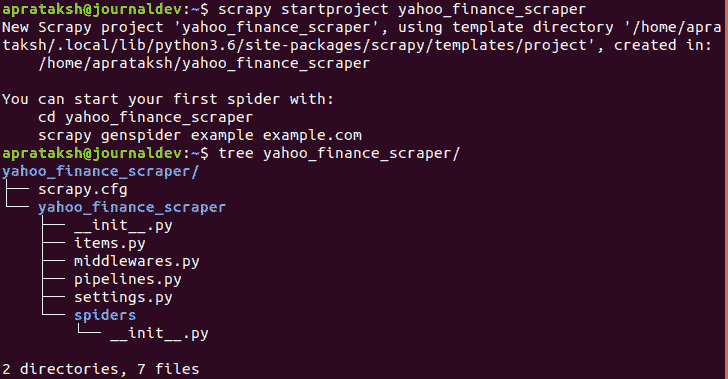
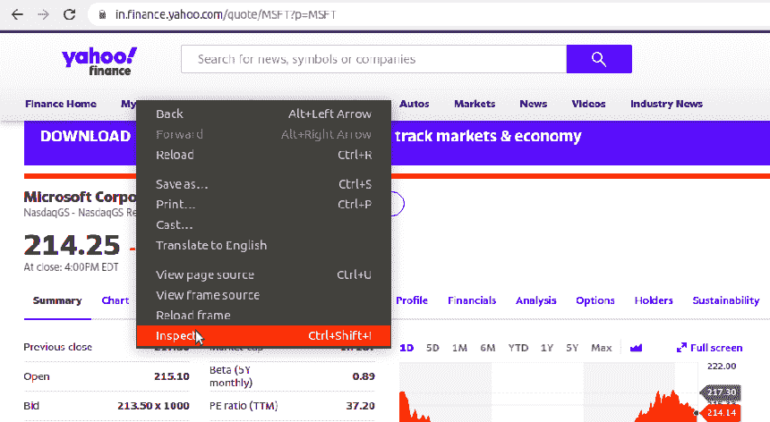
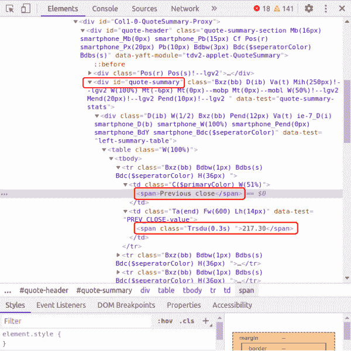

# 如何使用 Scrapy 在 Python 中抓取雅虎财经数据

> 原文：<https://www.askpython.com/python/scrape-yahoo-finance-python-scrapy>

Yahoo Finance 是一个成熟的网站，包含各种领域的金融数据，如股票价格、金融新闻和报告。它有自己的 Yahoo Finance API 来提取历史股票价格和市场摘要。

在本文中，我们将删除原始的雅虎财经网站，而不是依赖 API。网页抓取是通过一个名为 **Scrapy** 的开源网页抓取框架实现的。

## 批量刮擦要求？

大多数流行的网站使用防火墙来阻止流量过大的 IP。在这种情况下，你可以使用 [Zenscrape](https://zenscrape.com/) ，这是一个网页抓取 API，可以解决大规模抓取的问题。除了 web 抓取 API 之外，它还提供了一个常驻代理服务，可以访问代理本身，并为您的用例提供最大的灵活性。

## 卷筒纸刮刀要求

在我们进入细节之前，我们必须满足某些技术要求:

*   **Python**–我们将在这个特定的项目中使用 Python。它庞大的库和简单的脚本使它成为网络抓取的最佳选择。
*   这个由 Python 支持的网络爬行框架是从网站中提取数据的最有用的技术之一。
*   **HTML 基础知识**——抓取包括处理 HTML 标签和属性。然而，如果读者不了解 HTML 基础知识，这个网站会有所帮助。
*   web 浏览器–常用的 Web 浏览器，如 Google Chrome 和 Mozilla Firefox，都有检查底层 HTML 数据的规定。

* * *

## Scrapy 的安装和设置

我们将回顾 Scrapy 的快速安装过程。首先，与其他 Python 库类似，Scrapy 是使用 [pip](https://www.askpython.com/python-modules/python-pip) 安装的。

```
pip install Scrapy

```

安装完成后，我们需要为 Web Scraper 创建一个项目。我们输入希望存储项目的目录，然后运行:

```
scrapy startproject <PROJECT_NAME>

```



Project Structure using Scrapy

从上面的终端片段中可以看出，Scrapy 创建了几个文件来支持这个项目。我们不会深入讨论目录中每个文件的本质细节。相反，我们将致力于学习使用 Scrapy 创建我们的第一个刮刀。

如果读者有与安装相关的问题，详细过程在此解释[。](https://docs.scrapy.org/en/latest/intro/install.html)

* * *

## 使用 Scrapy 创建我们的第一个刮刀

我们在 Scrapy 项目的`spiders`目录中创建一个 python 文件。必须记住的一点是，Python 类必须继承`Scrapy.Spider`类。

```
import scrapy

class yahooSpider(scrapy.Spider):
        ....
        ....

```

这将遵循我们将要创建的爬虫的名称和 URL。

```
class yahooSpider(scrapy.Spider):

	# Name of the crawler
	name = "yahoo"

	# The URLs we will scrape one by one
	start_urls = ["https://in.finance.yahoo.com/quote/MSFT?p=MSFT",
	"https://in.finance.yahoo.com/quote/MSFT/key-statistics?p=MSFT",
	"https://in.finance.yahoo.com/quote/MSFT/holders?p=MSFT"]

```

考虑中的股票是微软(MSFT)的股票。我们设计的 scraper 将从以下三个网页中检索重要信息:

*   微软股票的股票摘要
*   库存统计
*   微软金融

`start_urls`列表包含上述每个网页的 URL。

* * *

## 解析抓取的内容

提供的 URL 被一个一个地抓取，HTML 文档被发送到`parse()`函数。

```
import scrapy
import csv

class yahooSpider(scrapy.Spider):

	# Name of the crawler
	name = "yahoo"

	# The URLs we will scrape one by one
	start_urls = ["https://in.finance.yahoo.com/quote/MSFT?p=MSFT",
	"https://in.finance.yahoo.com/quote/MSFT/key-statistics?p=MSFT",
	"https://in.finance.yahoo.com/quote/MSFT/holders?p=MSFT"]

	# Parsing function
	def parse(self, response):
                ....
                ....

```

`parse()`函数将包含从雅虎财经网页提取数据背后的逻辑。

* * *

## 发现用于提取相关数据的标签

从 HTML 内容中发现标签是通过使用 Web 浏览器检查网页来完成的。



Inspecting the Yahoo Finance Webpage

在我们按下`Inspect`按钮后，一个包含大量 HTML 的面板出现在屏幕的右侧。我们的工作是搜索标签的名称及其包含我们想要提取的数据的属性。

例如，如果我们想从包含“Previous Close”的表中提取值，我们需要存储数据的标签的名称和属性。



HTML document behind the Webpage

一旦我们掌握了存储我们感兴趣的信息的 HTML 标签背后的知识，我们就可以使用 Scrapy 定义的函数提取它们。

* * *

## 用于数据提取的 Scrapy 选择器

我们将在这个项目中使用的两个选择器函数是`xpath()`和`css()`。

**XPATH** 独立来说，是一种从 XML 或 HTML 文档中选择数据的查询语言。XPATH 代表 XML 路径语言。

**CSS** ，独立来说，是 HTML 语言的一种样式语言。

关于这些选择器功能的更多信息可以从他们的官方网站获得。

```
# Parsing function
def parse(self, response):

	# Using xpath to extract all the table rows
	data = response.xpath('//div[@id="quote-summary"]/div/table/tbody/tr')

	# If data is not empty
	if data:

		# Extracting all the text within HTML tags
		values = data.css('*::text').getall()

```

作为参数接收的`response`值包含网站内的全部数据。正如在 HTML 文档中看到的，该表存储在一个具有作为`quote-summary`的`id`属性的`div`标签中。

我们将上述信息转换成一个`xpath`函数，并提取指定的`div`标签中的所有`tr`标签。然后，我们从所有标签中获取文本，不考虑它们的名字`(*)`，放入一个名为`values`的列表中。

该组值如下所示:

```
['Previous close', '217.30', 'Open', '215.10', 'Bid', '213.50 x 1000', 'Ask', '213.60 x 800' ...  'Forward dividend & yield', '2.04 (0.88%)', 'Ex-dividend date', '19-Aug-2020', '1y target est', '228.22']

```

必须注意的一点是，标签的名称和属性可能会随着时间的推移而改变，从而使上述代码变得毫无价值。因此，读者必须了解提取这些信息的方法。

我们可能会从 HTML 文档中获得不相关的信息。因此，程序员必须实现适当的健全性检查来纠正这种异常。

本文后面提供的完整代码包含了另外两个从大量 HTML 行话中获取重要信息的例子。

* * *

## 将检索到的数据写入 CSV 文件

该项目的最终任务是将检索到的数据存储到某种持久存储中，如 CSV 文件。Python 有一个`csv`库，可以更容易地实现对. csv 文件的写入。

```
# Parsing function
def parse(self, response):

	# Using xpath to extract all the table rows
	data = response.xpath('//div[@id="quote-summary"]/div/table/tbody/tr')

	# If data is not empty
	if data:

		# Extracting all the text within HTML tags
		values = data.css('*::text').getall()

		# CSV Filename
		filename = 'quote.csv'

		# If data to be written is not empty
		if len(values) != 0:

			# Open the CSV File
			with open(filename, 'a+', newline='') as file:

				# Writing in the CSV file
				f = csv.writer(file)
				for i in range(0, len(values[:24]), 2):
					f.writerow([values[i], values[i+1]])

```

上面的代码打开一个`quote.csv`文件，并使用 Python 的`csv`库写入 scraper 获得的值。

> **注意:**`csv`库不是内置的 Python 库，因此需要安装。用户可以通过运行-`pip install csv`来安装。

* * *

## 管理整个 Scrapy 项目

保存所有进度后，我们移到最初创建的项目的最顶层目录，并运行:

```
scrapy crawler <CRAWLER-NAME>

```

在我们的例子中，我们运行`scrapy crawler yahoo`，Python 脚本将所有指定的信息抓取并存储到一个 CSV 文件中。

* * *

## 刮刀的完整代码

```
import scrapy
import csv

class yahooSpider(scrapy.Spider):

	# Name of the crawler
	name = "yahoo"

	# The URLs we will scrape one by one
	start_urls = ["https://in.finance.yahoo.com/quote/MSFT?p=MSFT",
	"https://in.finance.yahoo.com/quote/MSFT/key-statistics?p=MSFT",
	"https://in.finance.yahoo.com/quote/MSFT/holders?p=MSFT"]

	# Parsing function
	def parse(self, response):

		# Using xpath to extract all the table rows
		data = response.xpath('//div[@id="quote-summary"]/div/table/tbody/tr')

		# If data is not empty
		if data:

			# Extracting all the text within HTML tags
			values = data.css('*::text').getall()

			# CSV Filename
			filename = 'quote.csv'

			# If data to be written is not empty
			if len(values) != 0:

				# Open the CSV File
				with open(filename, 'a+', newline='') as file:

					# Writing in the CSV file
					f = csv.writer(file)
					for i in range(0, len(values[:24]), 2):
						f.writerow([values[i], values[i+1]])

		# Using xpath to extract all the table rows
		data = response.xpath('//section[@data-test="qsp-statistics"]//table/tbody/tr')

		if data:

			# Extracting all the table names
			values = data.css('span::text').getall()

			# Extracting all the table values 
			values1 = data.css('td::text').getall()

			# Cleaning the received vales
			values1 = [value for value in values1 if value != ' ' and (value[0] != '(' or value[-1] != ')')]

			# Opening and writing in a CSV file
			filename = 'stats.csv'

			if len(values) != 0:
				with open(filename, 'a+', newline='') as file:
					f = csv.writer(file)
					for i in range(9):
						f.writerow([values[i], values1[i]])

		# Using xpath to extract all the table rows
		data = response.xpath('//div[@data-test="holder-summary"]//table')

		if data:
			# Extracting all the table names
			values = data.css('span::text').getall()

			# Extracting all the table values 
			values1 = data.css('td::text').getall()

			# Opening and writing in a CSV file
			filename = 'holders.csv'

			if len(values) != 0:
				with open(filename, 'a+', newline='') as file:
					f = csv.writer(file)
					for i in range(len(values)):
						f.writerow([values[i], values1[i]])

```

* * *

## 结论

与其他抓取库相比，Scrapy 框架可能看起来不直观，但对 Scrapy 的深入学习证明了它的优势。

我们希望这篇文章能帮助读者理解使用 Scrapy 的网络抓取。您可以查看我们的另一篇网络抓取文章，该文章涉及使用 Beautiful Soup 提取亚马逊产品细节。

感谢阅读。如有疑问或建议，欢迎在下面发表评论。