# Python Matplotlib 教程

> 原文:# t0]https://www . aspython . com/python-modules/matplot lib/python-matplot lib

Python Matplotlib 是一个基本服务于**数据可视化**目的的库。Matplotlib 库的构建块是二维 NumPy 数组。

因此，使用 Python Matplotlib 可以通过图形、图表等来处理和表示相对大量的信息/数据。

* * *

## Python Matplotlib 入门

为了使用 Matplotlib 库进行数据可视化，我们需要通过`pip`命令安装它。

```py
pip install matplotlib

```

接下来，每当我们希望使用它的内置函数时，我们都需要导入这个库。

```py
from matplotlib import pyplot

```

`matplotlib.pyplot`基本上是一个接口，用于向使用 Matplotlib 包创建的图形、图表等添加样式函数。

* * *

## 使用 Python Matplotlib 绘图

Python Matplotlib 提供了各种类型的图表来表示和可视化数据。

使用 Python Matplotlib，可以使用以下类型的图形/图表来可视化数据:

*   **线图**
*   **散点图**
*   **直方图**
*   **条形图**
*   **饼状图**

* * *

### 1.线形图

```py
from matplotlib import pyplot 

# x-axis values 
roll_num = [1, 2, 3, 4, 5, 6, 7, 8, 9] 

# y-axis values 
marks = [55,75,96,75,36,45,87,99,100] 

pyplot.plot(roll_num, marks) 

pyplot.show() 

```

在上面的代码片段中，我们使用了两个 [Python 列表](https://www.askpython.com/python/list/python-list) (roll_num，marks)作为输入数据点。

`pyplot.plot()`功能用于绘制代表数据的直线。它接受 **x 轴**和 **y 轴**值作为参数。

`pyplot.show()`函数用于**显示****py plot . plot()函数绘制的**值。

**输出:**

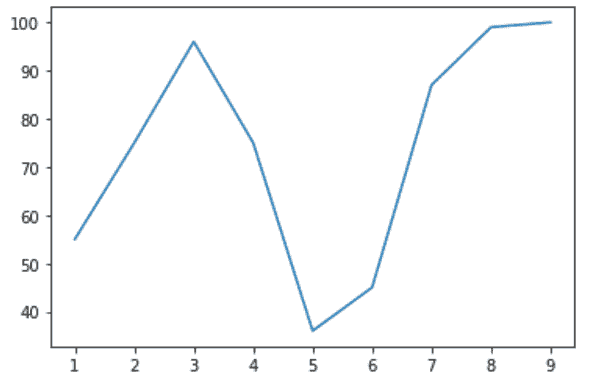

Line Plot

* * *

### 2.散点图

```py
from matplotlib import pyplot 

# x-axis values 
roll_num = [1, 2, 3, 4, 5, 6, 7, 8, 9] 

# y-axis values 
marks = [55,75,96,75,36,45,87,99,100] 

pyplot.scatter(roll_num, marks) 

pyplot.show() 

```

`pyplot.scatter(x-axis, y-axis)`用于以分散的方式绘制数据。

**输出:**

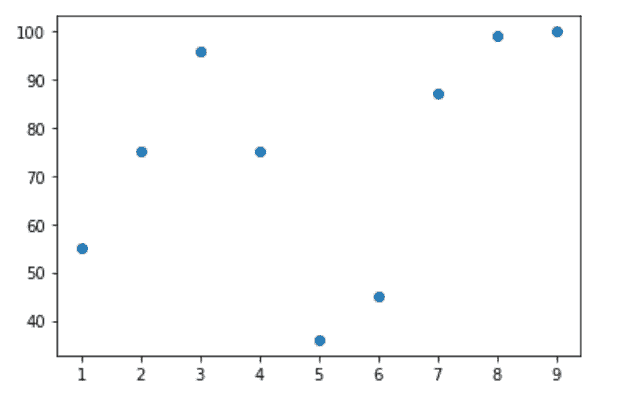

Scatter Plot

* * *

### 3.柱状图

```py
from matplotlib import pyplot 

marks = [55,75,96,75,36,45,87,99,100] 

pyplot.hist(marks, bins = 7) 

pyplot.show() 

```

`pyplot.hist()`函数用于通过直方图来表示数据点。它接受两个参数:

*   **要绘制的数据列表**
*   **划分和显示数据的范围(箱)数量。**

在上面的代码片段中，pyplot.hist()接受一个参数 bin，该参数 bin 基本上表示分配和显示输入列表值(数据)的分段数。

**输出:**

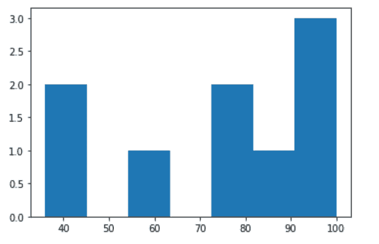

Histogram

* * *

### 4.条形图

```py
import numpy as np
import matplotlib.pyplot

city = ('Pune', 'Satara', 'Mumbai', 'Kanpur', 'Bhopal', 'Assam')
y_val = np.arange(len(city))
rank = [4, 7, 1, 3, 2, 5]

pyplot.bar(y_val, rank, align='center')
pyplot.xticks(y_val, city)
pyplot.ylabel('Rank')
pyplot.title('City')

pyplot.show()

```

`pyplot.bar()`函数以矩形条的形式表示数据。该函数接受一个参数`y-val`，它是代表 x 坐标的标量值。参数`align`用于将柱状图数值设置为左/右/中。

`pyplot.xticks()`用于设置 x 轴的刻度位置。

`pyplot.ylabel()`用于给 **y 轴**的数据设置一个标签文本值。

`pyplot.title()`设置条形图的标题值。

**输出:**


Bar Plot

* * *

### 5.饼图

```py
import numpy as np
import matplotlib.pyplot

city = ('Pune', 'Satara', 'Mumbai', 'Kanpur', 'Bhopal', 'Assam')

rank = [4, 7, 1, 3, 2, 5]
explode = (0.2, 0, 0, 0, 0, 0)  
colors = ['yellowgreen', 'pink', 'purple', 'grey', 'red', 'orange']

pyplot.pie(rank, explode=explode, labels=city, colors=colors,
        autopct='%1.1f%%', shadow=True, startangle=120)

pyplot.axis('equal')

pyplot.show()

```

`pyplot.pie()`功能用来以饼状图的形式表示数据。

pyplot.pie()的这些参数提供以下功能:

*   `explode`:提供一个标量值来设置饼图的一部分。
*   `labels`:提供文本值来表示图表的各个部分。
*   `colors`:提供图表各部分的颜色设置。
*   `autopct`:用数值标注图表的楔形或分数。
*   `shadow`:接受布尔值。如果设置为 TRUE，它会在饼图的分数下方创建阴影。
*   `startangle`:将图表的起点从 x 轴旋转特定角度。

`pyplot.axis('equal')`功能可实现等比例缩放，并创建缩放的圆形图表。

**输出:**

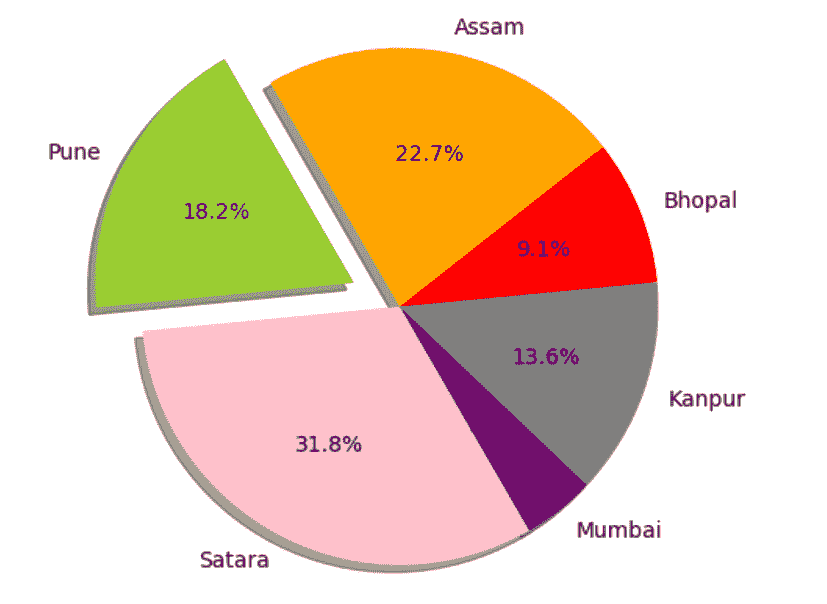

Pie Chart

* * *

## 向 Matplotlib 中的图表添加要素

```py
from matplotlib import pyplot 

# x-axis values 
roll_num = [1, 2, 3, 4, 5, 6, 7, 8, 9] 

# y-axis values 
marks = [55,75,96,75,36,45,87,99,100] 
attendance = [25, 75, 86, 74, 85, 25, 35, 63, 29] 
pyplot.plot(roll_num, marks, color = 'green', label = 'Marks')
pyplot.plot(roll_num, attendance, color = 'blue', label = 'Attendance')
pyplot.legend(loc='upper left', frameon=True)

pyplot.show() 

```

在上面的代码片段中，我们添加了属性，如**颜色**和**标签**。

`label`属性设置文本，以非常简化的方式表示绘制的值。

`pyplot.legend()`将标签和信息放置在绘制的图表上。

参数`loc`用于设置要显示的标签的位置。

参数`frameon`接受布尔值。如果设置为 true，它会在通过 loc 参数设置的位置放置的标签周围创建一个类似矩形框的边框。

**输出:**

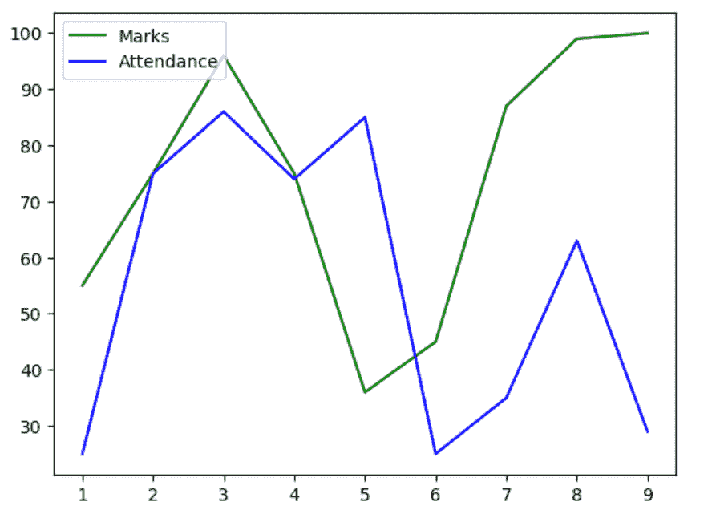

**Line Plot with attributes**

* * *

## 在 Matplotlib 中使用面向对象的 API 绘图

Python 中的数据可视化也可以使用面向对象的 API 来完成。

**语法:**

```py
Class_Name, Object_Name = matplotlib.pyplot.subplots(‘rows’, ‘columns’)

```

**举例:**

```py
# importing the matplotlib library 
import matplotlib.pyplot as plt 

# x-axis values
roll_num = [1, 2, 3, 4, 5, 6, 7, 8, 9] 

# y-axis values 
marks = [55,75,96,75,36,45,87,99,100] 

# creating the graph with class 'img' 
# and it's object 'obj' with '1' row 
# and '1' column 
img, obj = plt.subplots(1, 1) 

# plotting the values 
obj.plot(roll_num, marks) 

# assigning the layout to the values
img.tight_layout() 

```

**img** 表示类的名称， **obj** 表示对象的名称。

`pyplot.subplots(no of rows, no of columns)`函数允许在一次函数调用中创建通用和多个布局/图形。

它接受**行数**和**列数**作为强制参数，以创建用于绘制值的子部分。默认值是 **pyplot.subplots(1，1)** ，它只创建输入数据的一种布局。

`class_name.tight.layout()`调整 pyplot.subplots()的参数以适合图表的图形区域。

**输出:**

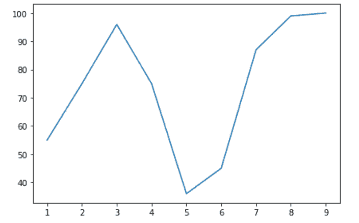

Object Oriented API With Matplotlib

* * *

## 用 Matplotlib 处理 PNG 图像

Python Matplotlib 也提供了处理 PNG 图像文件的函数。

我们借助一个例子来理解一下。

**举例:**

```py
# importing pyplot and image from matplotlib 
import matplotlib.pyplot as plt 
import matplotlib.image as img 

# reading png image file 
img = img.imread('C:\\Users\\HP\\Desktop\\Pie Chart.png') 
color_img = img[:, :, 0]  #applying default colormap
# show image 
plt.imshow(color_img) 

```

在上面的代码片段中，`matplotlib.image.imread(image path)`用于读取输入图像。

**color_img = img[:，:，0]** 用于设置图像的默认色彩映射表，使其高亮显示。

`pyplot.imshow()`用于显示图像。

**原始图像:**


Input Image

**输出** **图像**:

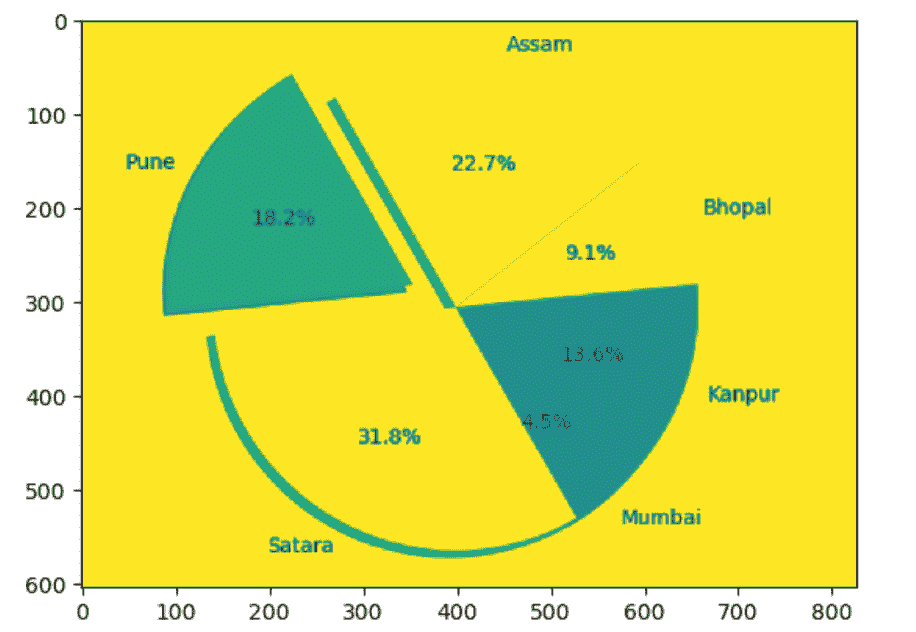

Working With Images In Matplotlib

* * *

## 用熊猫和 Matplotlib 绘图

Python Matplotlib 也可以使用 Pandas 模块通过生动的绘图技术来表示数据。

为此，我们需要安装并导入 [Python Pandas 模块](https://www.askpython.com/python-modules/pandas/python-pandas-module-tutorial)。我们可以进一步创建数据框架来绘制数据。

以下是使用 Pandas 模块在 Matplotlib 中绘制数据时使用的不同类型的图形/图表:

*   **直方图**
*   **箱线图**
*   **密度图**
*   **六边形面元图**
*   **散点图**
*   **面积图**
*   **饼状图**

* * *

### 1.柱状图

```py

import matplotlib.pyplot as p
import pandas as pd 
import numpy as np 

val = pd.DataFrame({'v1': np.random.randn(500) + 1, 
'v2': np.random.randn(500), 
'v3': np.random.randn(500) - 1}, 
columns =['v1', 'v2', 'v3']) 

p.figure() 

val.plot.hist(alpha = 0.5) 
p.show() 

```

`plot.hist()`功能用于绘制数据值。参数`alpha`基本上是一个浮点值，用于混合绘制图形的色阶。

`pyplot.figure()`功能是创建出输入值的图。

在上面的代码片段中，我们使用 Python NumPy 模块的 numpy.random.randn()函数为输入值生成了随机数据。

**输出:**

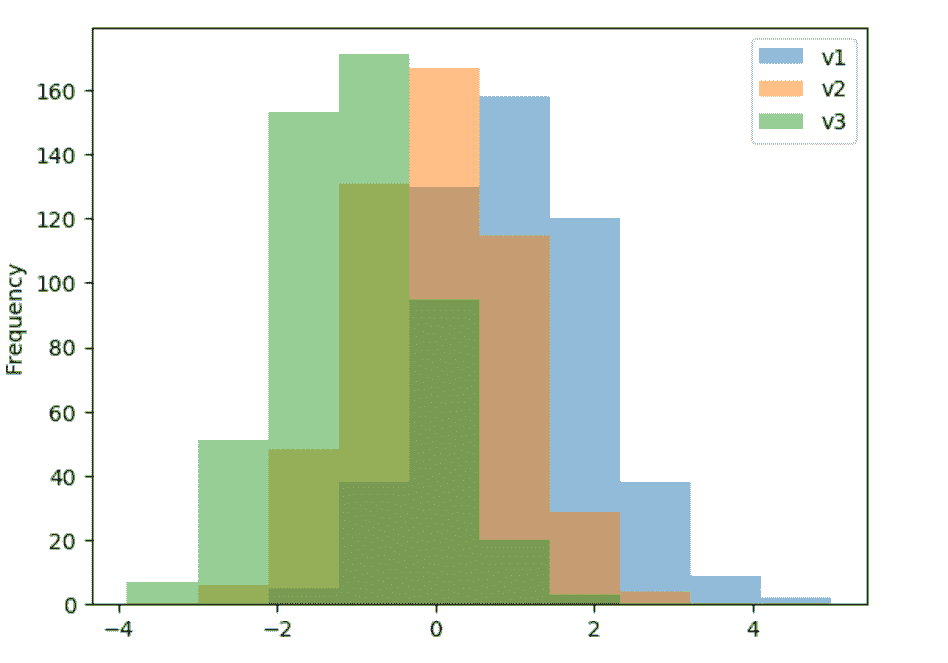

Matplotlib With Pandas Histogram

* * *

### 2.箱形图

```py
from matplotlib import pyplot
import pandas as pd 
import numpy as np 

val = pd.DataFrame(np.random.randn(500,6), 
columns =['P', 'Q', 'R', 'S', 'T', 'W']) 

val.plot.box() 
pyplot.show() 

```

`plot.box()`函数用于通过四分位数表示一组标量数据。

此外，我们通过向它传递六列值绘制了六个四分位数。

**输出:**

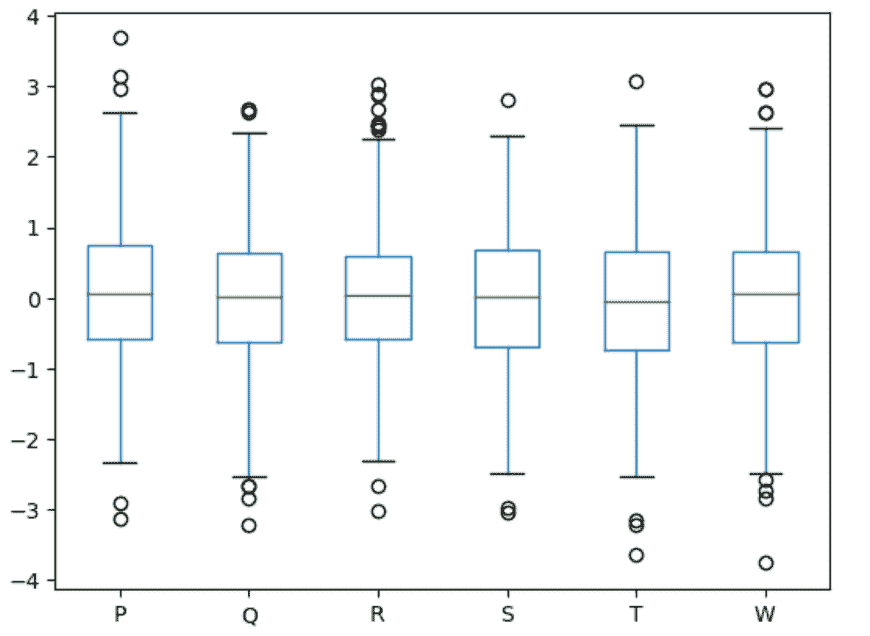

Matplotlib With Pandas Box Plot

* * *

### 3.密度图

这基本上是一个内核密度估计(KDE)图。它提供输入值的**概率密度函数**。

```py
from matplotlib import pyplot
import pandas as pd 
import numpy as np 

val = pd.DataFrame(np.random.randn(500,2), 
columns =['P', 'Q',]) 

val.plot.kde() 
pyplot.show() 

```

`plot.kde()`函数用于绘制随机生成值的概率密度。

**输出:**

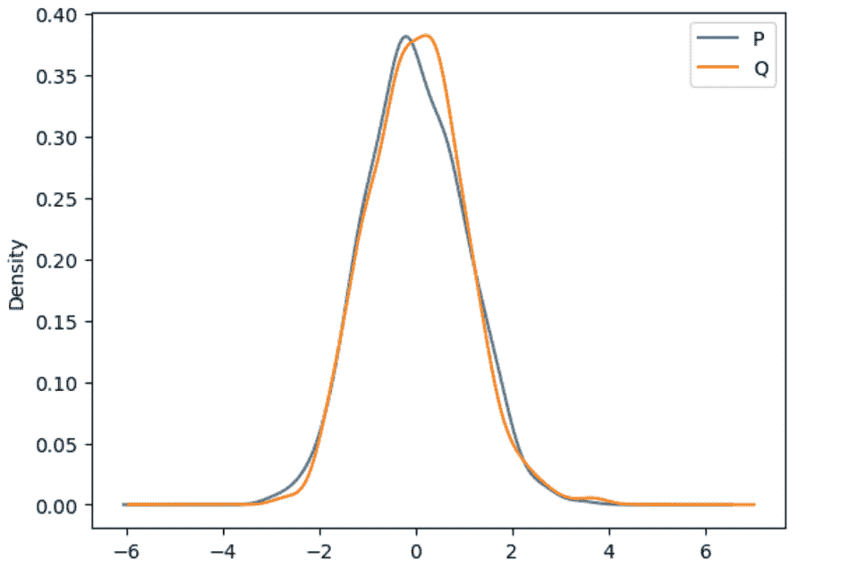

Matplotlib With Pandas Density Plot

* * *

### 4.六边形箱线图

六边形二进制图用于**估计一大组数据值中两个标量值**之间的关系。

```py
from matplotlib import pyplot
import matplotlib.pyplot
import pandas as pd 
import numpy as np 

val = pd.DataFrame(np.random.randn(500,2), 
columns =['Temperature', 'Fire-Intensity',]) 
val.plot.hexbin(x ='Temperature', y ='Fire-Intensity', gridsize = 30) 

pyplot.show() 

```

`plot.hexbin()`函数绘制了传递值(即温度和火灾强度)之间的数值关系。

参数`gridsize`用于设置 x 方向上六边形的数量，表示传递值之间的关系。

**输出:**

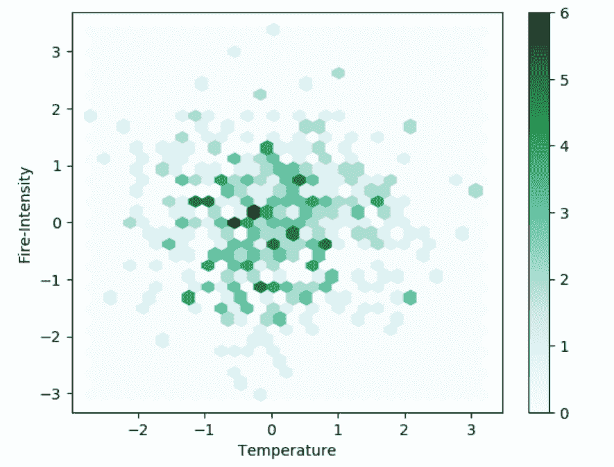

Matplotlib With Pandas Hexagonal Bin Plot

* * *

### 5.散点图

```py

import matplotlib.pyplot
import pandas as pd 
import numpy as np 

val = pd.DataFrame(np.random.randn(300,5), 
columns =['A', 'Z', 'W', 'Y', 'S']) 
val.plot.scatter(x='Z', y='Y') 
pyplot.show() 

```

**输出:**


Matplotlib With Pandas -Scatter Plot

* * *

### 6.面积图

```py

import matplotlib.pyplot as plt 
import pandas as pd 
import numpy as np 

val = pd.DataFrame(np.random.rand(9, 5), columns =['A', 'B', 'C', 'D', 'E']) 

val.plot.area() 
plt.show() 

```

`plot.area()`用于绘制相应的输入数据。通过此函数，作为输入传递到 DataFrame 的所有列都被绘制为图表中区域的一部分。

**输出:**

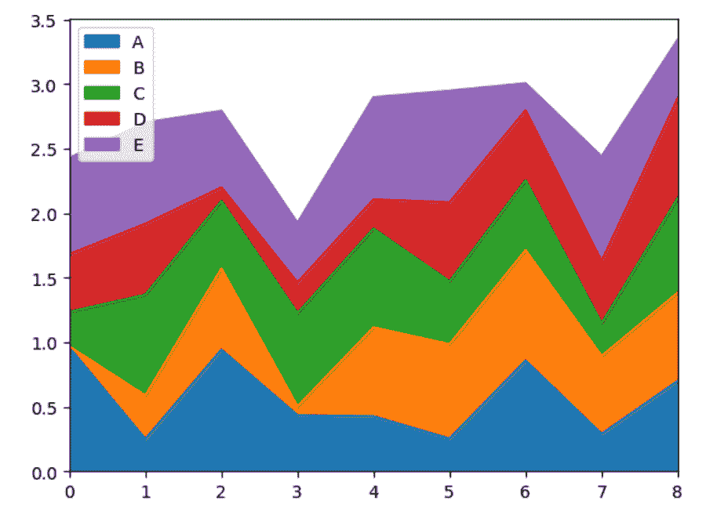

Matplotlib With Pandas Area Plot

* * *

### 7.饼图

```py

import matplotlib.pyplot as plt 
import pandas as pd 
import numpy as np 

val = pd.Series(np.random.rand(5), 
index =['w','f', 'e', 'b', 'a'], name ='Pie-Chart') 

val.plot.pie(figsize =(5, 5)) 
plt.show() 

```

`plot.pie()`功能用来以饼状图的形式表示输入的数据。

参数`figsize`用于设置绘制图形的宽度和高度。

**输出:**


Matplotlib With Pandas Pie Chart

* * *

## 结论

因此，在本文中，我们已经理解了 Python 的 Matplotlib 库所提供的功能。

* * *

## 参考

*   Python Matplotlib 教程
*   [Python Matplotlib 文档](https://matplotlib.org/contents.html)