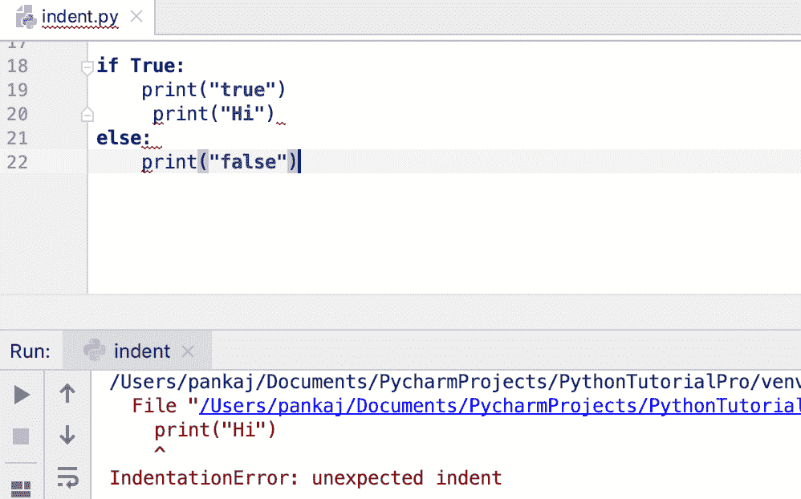
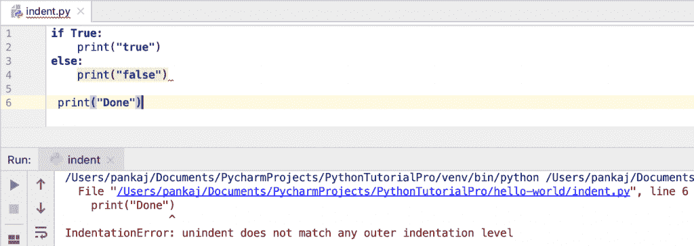

# Python 中的缩进

> 原文：<https://www.askpython.com/python/python-indentation>

Python 中缩进是用来创建一组语句的。很多流行的语言比如 C，Java 都用大括号({ })来定义代码块，Python 用缩进。

* * *

## Python 中的缩进是什么？

Python 中的缩进指的是行首的空白。我们可以使用空格或制表符来创建缩进。在编写 Python 代码时，我们必须为函数和循环定义一组语句。这是通过适当缩进该块的语句来实现的。

行首的前导空格(空格和制表符)用于确定该行的缩进级别。我们必须增加缩进级别来对该代码块的语句进行分组。同样，减少缩进以关闭分组。

四个空格或一个制表符用于创建或增加代码的缩进级别。让我们看一个例子来理解代码缩进和语句分组。

```
def foo():
    print("Hi")

    if True:
        print("true")
    else:
        print("false")

print("Done")

```


Python Indentation

* * *

## Python 缩进规则

*   我们不能使用反斜杠将缩进分成多行。
*   Python 代码第一行不能有缩进，会抛出`IndentationError`。
*   你应该避免混合制表符和空格来创建缩进。这是因为非 Unix 系统中的文本编辑器行为不同，混合它们会导致错误的缩进。
*   最好使用空格进行缩进，而不是制表符。
*   最佳实践是在第一次缩进时使用 4 个空格，然后不断添加额外的 4 个空格来增加缩进。

* * *

## Python 中缩进的好处

*   在大多数编程语言中，缩进被用来恰当地组织代码。在 Python 中，它用于分组，使代码自动变漂亮。
*   Python 缩进规则非常简单。大多数 Python IDEs 会自动为您缩进代码，因此编写适当缩进的代码非常容易。

* * *

## Python 中缩进的缺点

*   因为空格是用于缩进的，如果代码很大并且缩进被破坏了，那么修复它真的很繁琐。这主要是通过从在线资源、Word 文档或 PDF 文件中复制代码来实现的。
*   大多数流行的编程语言都使用大括号进行缩进，所以任何来自不同编程世界的人一开始都会发现很难适应使用空格进行缩进的想法。

* * *

## Python for 循环中的缩进

我们必须增加 for 循环中的缩进量，以便将代码组合在一起。让我们看一个在 [python for 循环](https://www.askpython.com/python/python-for-loop)中缩进的例子。

```
def print_numbers(x, y):
    for i in range(x, y):
        print(i)

```

## IndentationError 错误示例

让我们看看 Python 代码中 IndentationError 的一些例子。

```
>>>     x = 10
  File "<stdin>", line 1
    x = 10
    ^
IndentationError: unexpected indent
>>> 

```

代码的第一行不能有缩进。这就是抛出 IndentationError 的原因。

* * *

```
if True:
    print("true")
     print("Hi")
else:
    print("false")

```



Python IndentationError

if 块中的代码行具有不同的缩进级别，因此产生了 IndentationError。

* * *

```
if True:
    print("true")
else:
    print("false")

 print("Done")

```



Python Indentation Level Error Unindent

这里，最后一个 print 语句有一些缩进，但是没有附加它的语句，因此抛出了缩进错误。

* * *

```
if True:
print("true")
else:
print("false")

```

**输出:**

```
File "/Users/pankaj/Documents/PycharmProjects/PythonTutorialPro/hello-world/indent.py", line 2
    print("true")
        ^
IndentationError: expected an indented block

```

* * *

## 摘要

Python 缩进让我们的代码很漂亮。它还用于将语句分组到一个代码块中。这导致了总是编写漂亮代码的习惯，因为这不是一个必须具备的特性，而是代码必须具备的要求。

* * *

## 下一步是什么？

*   [Python 数据类型](https://www.askpython.com/python/python-data-types)
*   [Python if-else 语句](https://www.askpython.com/python/python-if-else-elif-statement)
*   [Python 异常处理](https://www.askpython.com/python/python-exception-handling)
*   [Python 中的列表](https://www.askpython.com/python/list/python-list)
*   [Python 中的元组](https://www.askpython.com/python/tuple/python-tuple)

## 参考资料:

*   [Python.org 文件](https://docs.python.org/2.0/ref/indentation.html)