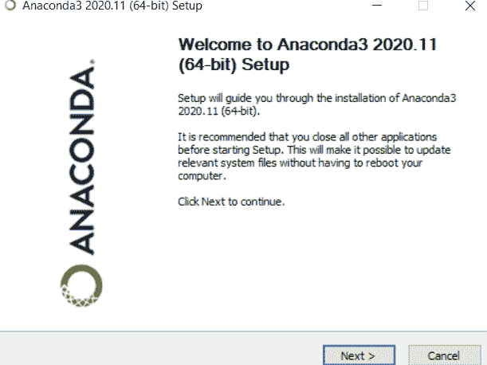
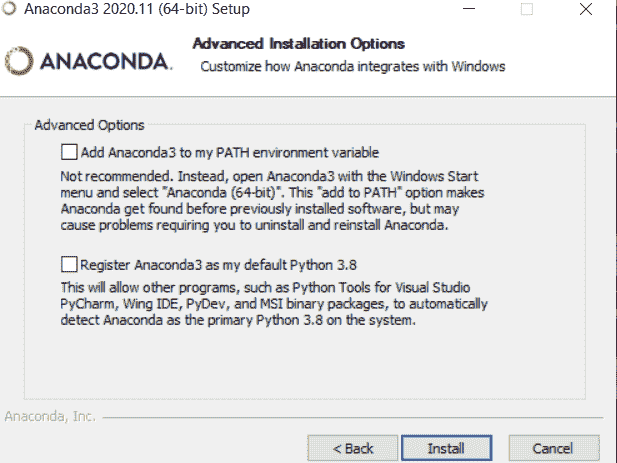
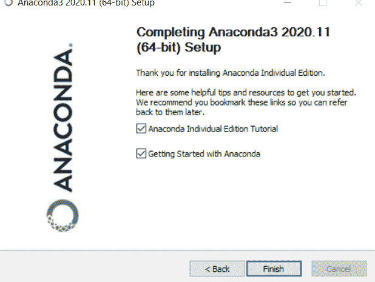

# Python Anaconda 教程–Anaconda 入门

> 原文：<https://www.askpython.com/python-modules/python-anaconda-tutorial>

嘿，伙计们！在本文中，我们将在这个完整的 Anaconda 教程中学习如何开始使用 Python Anaconda。让我们马上开始吧！

## Python 中的 Anaconda 是什么？


Anaconda 是针对数据科学和机器学习应用程序的 Python 和 R 编程的免费开源发行版。它有超过 1500 个 Python/R 数据科学包。

它附带了 Spyder 和 Jupyter notebook 等工具，初学者可以使用这些工具来学习 Python，因为它们使用起来非常简单和方便。

Anaconda 简化了包的管理和部署。它创建了一个虚拟环境，使得部署任何项目都很容易。

* * *

## 在 Windows 上安装最新版 Anaconda 的步骤

转到这个链接，下载适合您的计算机的 anaconda 的最新版本。[https://www.anaconda.com/products/individual](https://www.anaconda.com/products/distribution)

### 1.运行安装程序，然后单击下一步



### 2.选择文件位置


请记住，要将 anaconda 安装到不包含空格或 Unicode 字符的目录路径中。

### 3.完成设置



您可以选择是否将 Anaconda 添加到 PATH 环境变量中。建议不要将 Anaconda 添加到 PATH 环境变量中，因为这会干扰其他软件。

您可以将 Anaconda 注册为默认 Python，除非您计划安装和运行多个版本的 Anaconda 或多个版本的 Python。

在我的例子中，我将继续使用默认设置来演示安装。



现在，进入 Anaconda 命令提示符并输入‘jupyter notebook’。它将为您打开 jupyter 笔记本仪表盘。

## 向 Python Anaconda 添加包

Anaconda 自动安装了超过 250 个包，并且可以使用 *conda install* 命令额外安装超过 75，000 个开源包。

### 1.使用康达锻造

要使用 *conda-forge* 命令安装软件包，请在 anaconda 命令提示符下运行以下语法:

```
conda install -c conda-forge PACKAGENAME

```

示例:

```
conda install -c conda-forge numpy

```

### 2.使用画中画命令

要使用 [pip 命令](https://www.askpython.com/python-modules/python-pip)安装软件包，请在 anaconda 命令提示符下运行以下语法:

```
pip install PACKAGENAME

```

示例:

```
pip install pandas

```

## 了解虚拟环境

Python 是一种通用语言，可以用于任何事情。例如数据分析、机器学习、人工智能或 Web 开发等。这些任务中的每一个都需要不同的包和 Python 版本。

为了有效地使用这些包和版本，我们使用了虚拟环境。

它允许每个项目都有自己的依赖关系，我们可以轻松地在应用程序之间切换，而不管它们有什么依赖关系和需求。

Conda 就是 anaconda 中包含的一个这样的包管理器和环境管理器。

现在，让我们使用 conda 接口设置虚拟环境。

### 1.检查 conda 是否安装在您的路径中

打开 Anaconda 命令提示符并输入以下代码:

```
conda -V

```

### 2.更新 conda 环境

运行以下命令来更新 Python Anaconda 环境。

```
conda update conda

```

### 3.创建虚拟环境

```
conda create -n envname python=x.x anaconda

```

将 *envname* 替换为您想要给虚拟环境起的名字，将 *x.x* 替换为您想要使用的 Python 版本。

*输入 y 继续*

您可以通过输入以下代码来搜索可用 python 版本的列表:

```
^python$

```

### 4.激活虚拟环境

在 anaconda 命令提示符下输入给定的命令

```
conda activate envname

```

用给定的环境名替换 *envname* 。

要查看可用环境列表，输入 *conda info -e* 命令

### 5.安装附加软件包的步骤

在将 *envname* 替换为您给定的环境名称，将 *PACKAGENAME* 替换为您想要安装的软件包之后，输入给定的命令。

```
conda install -n envname PACKAGENAME

```

### 6.停用虚拟环境的步骤

要结束会话并退出环境，请执行以下操作:

```
conda deactivate

```

### 7.删除虚拟环境的步骤

用您的名字替换 *envname* 并删除虚拟环境。

```
conda remove -n envname -all

```

## 结论

在本教程中，我们学习了如何为 python 下载和设置 anaconda。我们知道安装软件包和设置虚拟环境是多么容易。通过大量的包，anaconda 提供了主要的支持和高效的结果。希望大家喜欢，敬请期待！

## 参考

*   [蟒蛇官方文件](https://docs.anaconda.com/anaconda/#)
*   [蟒蛇备忘单](https://docs.conda.io/projects/conda/en/4.6.0/_downloads/52a95608c49671267e40c689e0bc00ca/conda-cheatsheet.pdf)