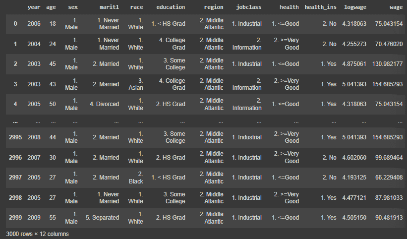
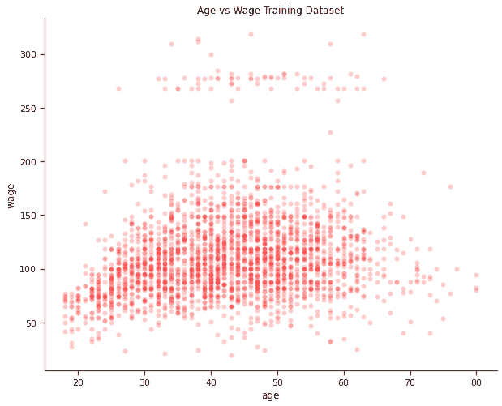
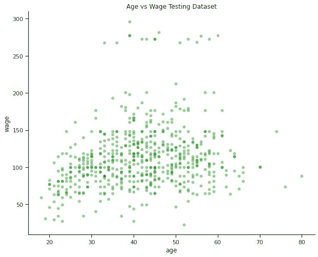
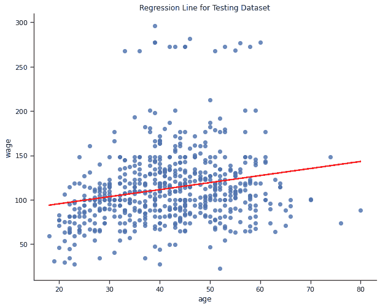
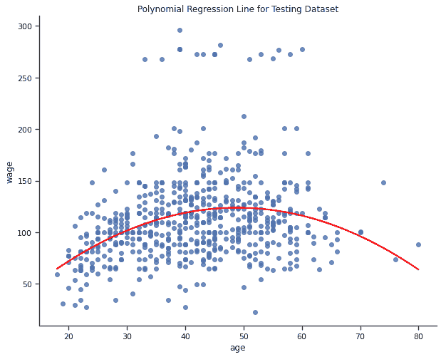
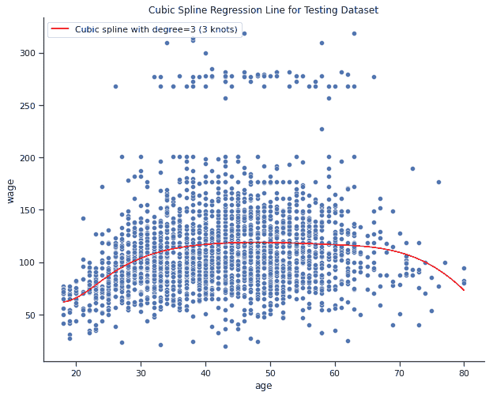

# Python 中的回归样条——初学者入门

> 原文：<https://www.askpython.com/python/examples/regression-splines>

这篇文章是对 Python 中回归样条的介绍。它应该可以帮助你开始，并为进一步的学习和研究奠定基础。

嘿编码器！我相信你已经听说过[线性回归](https://www.askpython.com/python/examples/linear-regression-from-scratch)，这是最简单的算法之一，它教授了很多关于因变量和非因变量之间关系的知识。

结果通常是一条直线。问题是在实际场景中，直线并不总是可行的。

为了克服这一点，我们有了多项式曲线([平滑曲线](https://www.askpython.com/python-modules/matplotlib/smooth-curves))。但是多项式曲线会变得非常复杂，因此需要避免。

为了克服这个缺点，在本教程中，我将向您介绍 Python 中可用的回归样条。

***也读作:[逻辑回归——简单实用实现](https://www.askpython.com/python/examples/logistic-regression)***

为了创建样条回归，整个数据集被分成更小的箱。并且为每个箱预测回归线，并且单独的线通过结连接在一起。

既然我们已经清楚了回归样条是如何工作的，那么让我们转到 Python 编程语言中的代码实现。

## **在 Python 中实现回归样条**

让我们首先下载教程的数据集。数据集可以从[这里](https://raw.githubusercontent.com/selva86/datasets/master/Wage.csv)下载。该数据集是关于人们的工资以及关于人们获得报酬的大量信息。

### 1.加载数据集

我们将使用 Python 中 pandas 模块的`read_csv`函数加载数据集。

```
import pandas as pd
df = pd.read_csv('Wage.csv')
df

```

让我们看看下图中数据集的样子。



Wage Dataset

### 2.创建 X 和 Y 值

为了更好地理解样条曲线，我们将看一下两个没有任何直接关系的列。让我们来看看一个人的年龄和工资之间的关系。

年龄不会直接影响一个人的工资，因此会帮助我们更好地理解它的实施。

```
X = df[['age']]
y = df[['wage']]

```

### 3.将数据分为训练和测试数据

下一步是使用 80:20 规则将数据分为训练和测试数据集，其中 80%的数据用于训练，其余 20%用于测试模型。

```
from sklearn.model_selection import train_test_split
X_train, X_test, y_train, y_test = train_test_split(X, y, test_size=0.2, random_state = 1)

```

### 4.数据可视化

在这一步中，让我们用下面的代码可视化我们刚刚创建的初始数据集。我们将可视化测试和训练数据集。

```
import matplotlib.pyplot as plt
import seaborn as sns  
sns.set_theme(style="ticks", rc={"axes.spines.right": False, "axes.spines.top": False})

plt.figure(figsize=(10,8))
sns.scatterplot(x=X_train['age'], y=y_train['wage'], color="red",alpha=0.2)
plt.title("Age vs Wage Training Dataset")

plt.figure(figsize=(10,8))
sns.scatterplot(x=X_test['age'], y=y_test['wage'], color="green",alpha=0.4)
plt.title("Age vs Wage Testing Dataset")

plt.show()

```

结果图如下所示。



Wage And Age Train Visualization



Wage And Age Test Visualization

### 5.对数据集应用线性回归

如果您以前实现过线性回归，那么对数据集应用线性回归就很简单。我们还将使用训练数据集计算模型的均方误差。

```
from sklearn.linear_model import LinearRegression
lm = LinearRegression()
lm.fit(X_train,y_train)

print("Slope of the Regression Line is : ", lm.coef_)
print("Intercept of Regression Line is : ",lm.intercept_)

from sklearn.metrics import mean_squared_error
pred_test = lm.predict(X_test)
rmse_test =mean_squared_error(y_test, pred_test, squared=False)

print("Accuracy of Linear Regression on testing data is : ",rmse_test)

```

模型的结果如下。

```
Slope of the Regression Line is :  [[0.68904221]]
Intercept of Regression Line is :  [82.09009765]
Accuracy of Linear Regression on testing data is :  40.68927607250081

```

现在，让我们使用下面的代码绘制数据集的回归线。

```
plt.figure(figsize=(10,8))
sns.regplot(x=X_test['age'], y=y_test['wage'], ci=None, line_kws={"color": "red"})
plt.title("Regression Line for Testing Dataset")
plt.show()

```



Regression Line For Testing Dataset

### 6.应用多项式回归

让我们尝试使用下面的代码将多项式回归拟合到数据集中，看看我们是否可以在某种程度上提高精确度。

```
from sklearn.preprocessing import PolynomialFeatures
poly = PolynomialFeatures(2)

X_train_poly = poly.fit_transform(X_train)
X_test_poly = poly.fit_transform(X_test)
pm = LinearRegression()
pm.fit(X_train_poly,y_train)

pred_test = pm.predict(X_test_poly)
rmse_test =mean_squared_error(y_test,pred_test,squared=False)

print("Accuracy of Polynomial Regression on testing data is : ",rmse_test)

```

我们也可以使用下面的代码绘制多项式回归线。

```
plt.figure(figsize=(10,8))
sns.regplot(x=X_test['age'], y=y_test['wage'], ci=None, line_kws={"color": "red"},order=2)
plt.title("Polynomial Regression Line for Testing Dataset")
plt.show()

```



Polynomial Regression Line For Testing Dataset

### 7.三次样条的实现

三次样条的实现和绘制与前面的实现非常相似。理解下面的代码不会很难。

```
from patsy import dmatrix
transformed_x = dmatrix("bs(train, knots=(25,40,60), degree=3, include_intercept=False)",
                        {"train": X_train},return_type='dataframe')
import statsmodels.api as sm
cs = sm.GLM(y_train, transformed_x).fit()
pred_test = cs.predict(dmatrix("bs(test, knots=(25,40,60), include_intercept=False)",
                               {"test": X_test}, return_type='dataframe'))
rmse_test =mean_squared_error(y_test, pred_test, squared=False)
print("Accuracy for Cubic Spline on testing data is : ",rmse_test)

import numpy as np
plt.figure(figsize=(10,8))
xp = np.linspace(X_test.min(),X_test.max(), 100)
pred = cs.predict(dmatrix("bs(xp, knots=(25,40,60), include_intercept=False)", 
                          {"xp": xp}, return_type='dataframe'))
sns.scatterplot(x=X_train['age'], y=y_train['wage'])
plt.plot(xp, pred, label='Cubic spline with degree=3 (3 knots)', color='red')
plt.legend()
plt.title("Cubic Spline Regression Line for Testing Dataset")
plt.show()

```

结果如下所示。



Cubic Spline Regression Line For Testing Dataset

恭喜你！您已经到达教程的末尾。如果你喜欢这个教程，我相信你也会喜欢下面的:

1.  [Python 中的岭回归](https://www.askpython.com/python/examples/ridge-regression)
2.  [Python 中的套索回归](https://www.askpython.com/python/examples/lasso-regression)
3.  [Python 中的相关回归分析——两种简单的方法！](https://www.askpython.com/python/examples/correlation-regression-analysis)
4.  [随机森林回归:完整参考](https://www.askpython.com/python/examples/random-forest-regression)
5.  [Python 中的多项式回归–Python 中的完整实现](https://www.askpython.com/python/examples/polynomial-regression-in-python)