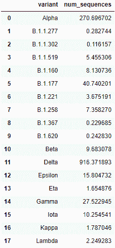
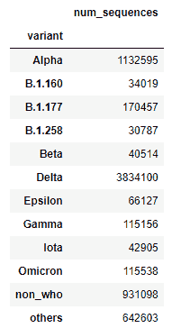
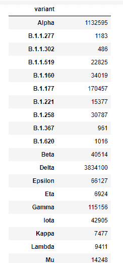
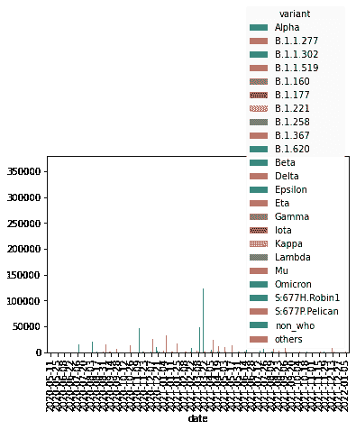

# Python 中从一个数据集到另一个数据集的数据透视表

> 原文：<https://www.askpython.com/python/examples/pivot-table-in-python>

有时，我们希望只对大型数据集中的一部分数据进行快速分析。Python 中的 Pivot table 在这种情况下就派上了用场，它帮助我们提取我们需要的数据，并从新数据中获得洞察力。今天我们将使用 Pandas 中的数据透视表功能。本文将全面概述如何在 python 中将一个数据集的数据透视表转换为另一个数据集。

***也读:[如何在 Sqlite3 数据库中插入多条记录](https://www.askpython.com/python/examples/insert-multiple-records-sqlite3)***

## 什么是数据透视表，如何制作数据透视表？

数据透视表是帮助从更大的表或数据集中提取数据的表。换句话说，我们从更大的数据集中“透视”数据。让我们来看看数据透视表的语法:

```
pandas.pivot_table(data, values=None, index=None, columns=None, aggfunc='mean', fill_value=None)

```

数据透视表函数将返回一个数据帧。现在我们知道了数据透视表的基础，让我们开始旋转吧！

### 加载数据集

让我们从在我们的环境中加载数据集开始。

```
import pandas as pd
df= pd.read_csv("C://Users//Intel//Documents//covid-variants.csv")
df.head()

```


现在我们将开始构建一个数据透视表。

### 用 Python 生成数据透视表

```
num_sequences_by_variant = pd.pivot_table(df, index = 'variant', values = 'num_sequences',aggfunc='mean') 
print(num_sequences_by_variant)

```

```
                      num_sequences
variant                      
Alpha              270.696702
B.1.1.277            0.282744
B.1.1.302            0.116157
B.1.1.519            5.455306
B.1.160              8.130736
B.1.177             40.740201
B.1.221              3.675191
B.1.258              7.358270
B.1.367              0.229685
B.1.620              0.242830
Beta                 9.683078
Delta              916.371893
Epsilon             15.804732
Eta                  1.654876
Gamma               27.522945
Iota                10.254541
Kappa                1.787046
Lambda               2.249283
Mu                   3.405354
Omicron             27.614245
S:677H.Robin1        1.564771
S:677P.Pelican       1.156071
non_who            222.537763
others             153.585803

```

如您所见，我们用变量 num_sequences 和 variants 创建了一个数据透视表。因为我们已经将 aggfunc 函数作为 mean 传递，所以 num_sequences 实际上是所有 num_sequences 的平均值。

如果想要所有 num_sequences 的总和，可以将总和传递给 aggfunc 参数。

```
total_by_variant = pd.pivot_table(df, index = 'variant', values = 'num_sequences',aggfunc='sum') 
print(total_by_variant)

```

输出

```
                 num_sequences
variant                      
Alpha                 1132595
B.1.1.277                1183
B.1.1.302                 486
B.1.1.519               22825
B.1.160                 34019
B.1.177                170457
B.1.221                 15377
B.1.258                 30787
B.1.367                   961
B.1.620                  1016
Beta                    40514
Delta                 3834100
Epsilon                 66127
Eta                      6924
Gamma                  115156
Iota                    42905
Kappa                    7477
Lambda                   9411
Mu                      14248
Omicron                115538
S:677H.Robin1            6547
S:677P.Pelican           4837
non_who                931098
others                 642603

```

### 在 Python 中设置数据透视表的索引

借助以下命令，我们可以非常简单地重置上述数据帧的索引。

```
num_sequences_by_variant.reset_index()

```



### 在 Python 中选择/过滤数据透视表中的数据

现在假设，我们想要查看序列总数大于 30000 的变体，我们必须传递以下命令。

```
total_by_variant[total_by_variant['num_sequences'] > 30000]

```



现在，让我们再一次假设我们希望看到只有 30000 到 70000 个序列的变体。然后我们必须传递下面的命令。

```
total_by_variant[(total_by_variant['num_sequences'] > 30000) | (total_by_variant['num_sequences'] < 70000)]

```



现在让我们开始学习多索引数据透视表。

### Python 中的多索引数据透视表

到目前为止，我们只了解了具有单一索引的透视表。但是我们也可以用多个指数来构建数据透视表，这可以帮助你从数据中获得更多的洞察力。

在下表中，我们将变量类型和日期设置为索引。

```
multi_index_table= pd.pivot_table(df, index = ['variant', 'date'], values = 'num_sequences', aggfunc = 'sum') 
print(multi_index_table)

```

**输出**

```
                               num_sequences
variant date                     
Alpha   2020-05-11              0
        2020-05-25              0
        2020-06-08              0
        2020-06-22              0
        2020-07-06              0
...                           ...
others  2021-11-15            928
        2021-11-29            928
        2021-12-13            619
        2021-12-27            603
        2022-01-05              2

[1080 rows x 1 columns]

```

### 具有多种功能的多索引数据透视表

除了设置多个索引，我们还可以为数据透视表的 aggfunc 参数设置多个函数。

**例如:**

```
multi_functions_table = pd.pivot_table(df, index = ['variant', 'date'], values = 'num_sequences', aggfunc = ['sum',len])
print(multi_functions_table)

```

**输出**

```
              sum                                               len
                   num_sequences num_sequences
variant date                                  
Alpha   2020-05-11             0            78
        2020-05-25             0            72
        2020-06-08             0            78
        2020-06-22             0            79
        2020-07-06             0            74
...                          ...           ...
others  2021-11-15           928            89
        2021-11-29           928            85
        2021-12-13           619            86
        2021-12-27           603            64
        2022-01-05             2            12

[1080 rows x 2 columns]

```

### 在 Python 中向数据透视表添加新列

在这一步中，我们将变量特性添加为一列，并将日期设置为索引。这将使你的数据更有组织性和可读性。

```
add_columns=pd.pivot_table(df, index = 'date', columns = 'variant', values = 'num_sequences', aggfunc = 'sum') 
print(add_columns)

```

输出

```
variant      Alpha  B.1.1.277  B.1.1.302  B.1.1.519  B.1.160  B.1.177  \
date                                                                    
2020-05-11       0          0          0          0        0        2   
2020-05-25       0          0          0          0        0        0   
2020-06-08       0          0          0          0        0        2   
2020-06-22       0          0          0          0        0        8   
2020-07-06       0          0          0          0        0       72   
2020-07-20       0          7          3          0        8       88   
2020-08-03       0         12          8          0       22      172   
2020-08-17       0         43         12          0       89      499   
2020-08-31       0         94         24          0      386     1400   
2020-09-14       0        143         32          0     1017     2923   
2020-09-28       3        178         27          0     1049     6225   
2020-10-12      15        120         31          0     1188     8693   
2020-10-26      47        155         21          1     2017    13008   
2020-11-09     381        180         21          5     2773    15723   
2020-11-23    1450         72         27         17     2274    15622   
2020-12-07    1128         42         29         34     2029    10489   
2020-12-21    9061         28         42         82     3110    19350   
2021-01-04   14002         29         21        184     2934    14161   

```

### 用 Python 可视化数据透视表

在本节中，我们将为表格创建条形图。这将有助于您更清楚地可视化数据。

```
add_columns.plot(kind='bar')

```



虽然剧情看起来很笨拙，但正如我们常说的，你可以使用 Python 中的 matplotlib 库或 Seaborn 库，让剧情更像样。

## 使用缺失值

在本节中，我们将学习如何处理数据透视表数据中的缺失值。首先，让我们检查数据集中是否存在任何缺失值。

```
print(df.info())

```

```
<class 'pandas.core.frame.DataFrame'>
RangeIndex: 100416 entries, 0 to 100415
Data columns (total 6 columns):
 #   Column               Non-Null Count   Dtype  
---  ------               --------------   -----  
 0   location             100416 non-null  object 
 1   date                 100416 non-null  object 
 2   variant              100416 non-null  object 
 3   num_sequences        100416 non-null  int64  
 4   perc_sequences       100416 non-null  float64
 5   num_sequences_total  100416 non-null  int64  
dtypes: float64(1), int64(2), object(3)
memory usage: 4.6+ MB
None

```

正如我们所看到的，我们的数据集中没有任何缺失值，所以我们不需要对数据做任何事情。

如果数据中有任何缺失值，可以在数据透视表函数中将 fill_value 参数作为 N/A 进行传递。

## 结论

在本文中，我们学习了如何从给定的数据集生成数据透视表，并将其转换为另一个数据框架。当您分析任何具有大量特征或变量的数据集时，数据透视表将非常方便。熟记以上所有的数据透视表功能，对你的数据分析项目会有很大帮助。