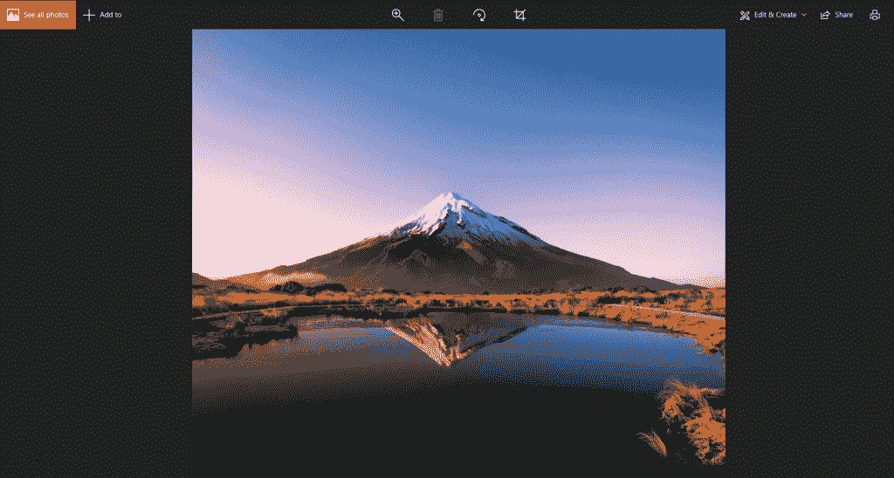

# 使用 Python Pillow 调整图像大小(PIL)

> 原文：<https://www.askpython.com/python-modules/resize-image-pillow-pil>

调整图像大小可能很棘手，但幸运的是 Python 为我们提供了 [Pillow](https://www.askpython.com/python-modules/pillow-module) ，这是 Python 图像库(PIL)的一个分支。Python Pillow 支持以下文件格式:JPEG、PNG、TIFF、PPM、GIF 和 BMP。

Pillow 是一个用于图像操作和处理的开源 Python 库。它旨在改进 PIL，并提供一种快速简单的方法来开发 Python 图像应用程序。

太好了，我们快到了！让我们开始学习如何使用 pillow 库在 python 中调整图像大小。

## 如何使用枕头调整图像大小(PIL)

首先，我们使用 PIL 库中的 resize 方法

语法: Image.resize(size，resample=0)

**方法参数**:

*   **Size:** 应以像素为单位，作为一个元组(宽度，高度)。
*   **重采样:**可选。可以成为 PIL 的一员。图像。双线性(线性插值)，PIL。图像。最近的(使用最近的邻居)，PIL。Image.LANCZOS(高质量下采样滤镜)，或 PIL。双三次(三次样条插值)。
*   **返回值:**输入图像大小调整后的副本。

### 1.安装枕头

```
pip install Pillow

```

虽然对您来说可能不太常见，但是枕头库是使用“导入 PIL”导入的。

### 2.导入模块

我们从导入枕头模块开始，使用代码:

```
from PIL import Image

```

### 3.选择并打开图像

现在我们需要传递图像，我们想在 PIL 模块的 Image.open 对象中调整它的大小。

这里,“img_sample.jpg”使用的图像样本存储在 python 代码文件的相同位置，如果不是，那么您需要指定文件名及其位置，如img/sample . jpg '

这一步为我们的图像创建一个对象，并将它加载到 Pillow 库中。

```
# Creating Image Object

img = Image.open('img_sample.jpg')

```

作为一个可选部分，我们使用 show()方法显示我们刚刚传递给 open 方法的图像，如下所示:

```
# Display original image

img.show()

```

我们代码中 show 方法的结果产生了下面的示例图像(原始图像)–



Original Image

### 4.调整图像大小

我们对上一步中创建的图像对象使用 resize()方法，并根据–width x height 传递图像的所需尺寸(大小)。宽度和高度的值可以是用户选择的任何值。

```
res_img = img.resize((400,300))

```

为了查看调整后的图像，我们再次使用 show()方法，如下所示:

```
# Display resized image

res_img.show()

```

为了**保存**我们调整过大小的图像，我们对调整过大小的图像对象使用 save()方法。

为此，我们还需要将重新调整大小的图像文件的新名称作为参数传递给 save()方法。

```
res_img.save('resized_img.jpg')

```

使用 show 方法为调整大小后的图像显示的最终输出图像是


Resized Image

### 使用 PIL 调整图像大小的完整代码

```
from PIL import Image

# Creating Image Object
img = Image.open('img_sample.png')

# Display original image
img.show()

res_img = img.resize((400,300)) #size can be anything of our choice

# Display resized image
res_img.show()

# To save the resized image
res_img.save('resized_img.png')

```

### 5.作物图像

如果你想裁剪一个图像，那么你可以使用 PIL 库的 crop()方法，它以同样的顺序接受 4 个参数:左、上、右、下。

```
cropped_img = img_sample.crop((left, top, right, bottom))

```

用此处的图像坐标替换放样、顶部、右侧、底部占位符。

## 结论

教程到此为止！希望你已经很好地学习了如何使用 pillow (PIL)库在 python 中调整图像的大小，并且可以很容易地在你的代码中实现它来调整图像的大小。