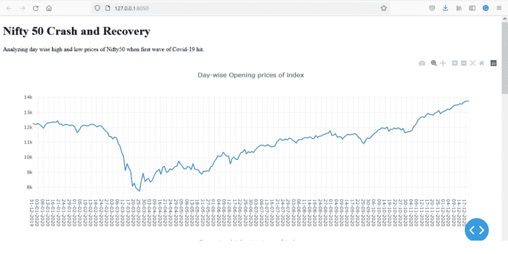
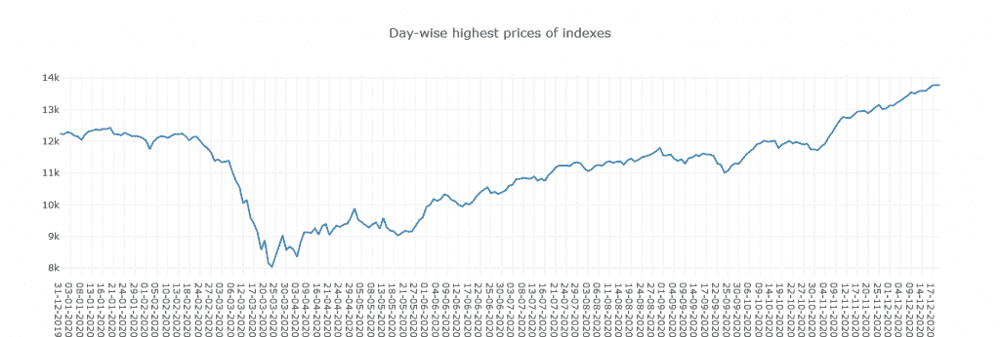
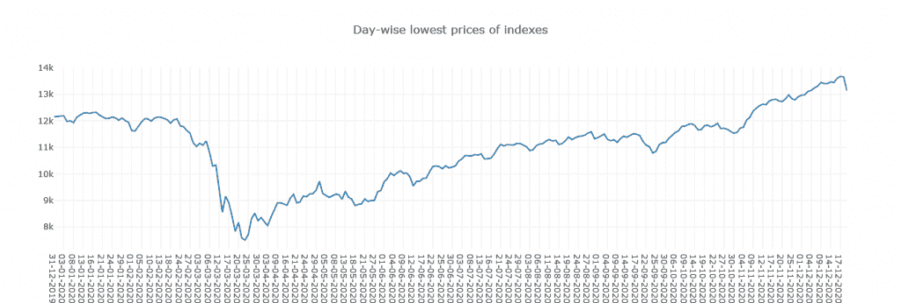

# 使用 Plotly Dash 的 Python 仪表板[已实现]

> 原文：<https://www.askpython.com/python-modules/plotly-dash-dashboard>

Python 中的仪表盘是在一个地方显示的图表集合，以便更好地理解所分析的数据。绘图集包括但不限于条形图、直方图、饼图、折线图、等高线图、阴影图等。仪表板可以包括显示在一个屏幕上的不同图形的组合，也可以包括多个同类图形。

Python 提供了多个库来创建情节和支线情节，但在本文中，我们将严格使用为制作仪表板而创建的库——Plotly Dash。

***也读:[巨蟒精雕细琢完整教程](https://www.askpython.com/python-modules/python-plotly-tutorial)***

## Dash 是什么？

Dash 是一个 Plotly 产品，用于创建绘图并通过基于 web 的 API 进行渲染。Plotly 网站表示，Dash 应用可以轻松实现 Tableau 和 PowerBI 难以实现的任务结果。这使得我们选择 Dash 作为我们在 Python 中创建仪表板的首选工具。

## 创建仪表板

在这篇文章中，我们将创建一个仪表板，分析 2020 年股票市场的崩溃及其复苏所造成的新冠肺炎。这里使用的例子采用了特定于索引的方法。我们使用每日时间段内 Nifty50 的 OHLC 数据。一旦绘制了仪表板，我们将讨论通过绘图观察到的见解。

在 Python 中创建仪表板有三个主要步骤:

*   导入必要的包
*   获取将被绘制的原始数据
*   初始化应用程序

### 安装必要的库

创建仪表板图需要主仪表板包及其子包。本文中的示例需要 3 个 dash 子包和一个 Numpy 包来呈现原始数据。让我们看看如何安装和配置这些包。要安装它们，请在终端中键入以下命令。

```
pip install dash

```

另一个需要的主要包装是熊猫。数据框的数学计算需要此 python 库。要安装它，请键入以下命令:

```
pip install pandas

```

注意:创建仪表板需要另外三个 dash 子包——dash html 组件、dash 渲染器和 dash 核心组件(dcc)。

手动安装它们很麻烦，所以我们建议在 Pycharm 或 [Jupyter Notebooks](https://www.askpython.com/python/jupyter-notebook-for-python) 这样的 IDE 上执行这个例子。为了便于使用，我们将继续使用 Pycharm。在 Pycharm 中安装这些子包很简单，按照下面的步骤操作:

*   创建新项目。

*   进入文件>设置>项目:'项目名称' > Python 解释器。


单击“+”号。(如果“+”号无效，从上面的下拉列表中选择基本解释器，然后单击“+”号添加新的解释器。

将打开一个新窗口，显示解释器列表。在搜索框中键入解释器，然后单击安装包。您要查找的关键字是(“dash-html-components”、“dash-core-components”和“dash-renderer”)

## 为仪表板创建地块

一旦安装和配置了所有必要的库，我们将转移到编码部分。

### 导入数据

下面的库是我们在整个项目中需要的。

```
import dash
from dash import dcc
from dash import html
import pandas as pd

```

### 初始化和操作数据

对于这个例子，我们获取了 2020-2021 年 12 月 Nifty 50 指数的 OHLC(开盘-盘高-盘低-收盘)数据。我们将数据加载到数据框架——“数据”中。第二行将“日期”格式从缩写改为数字。

```
data = pd.read_csv("nifty 2020 crash.csv")

data['Date'] = pd.to_datetime(data['Date']).dt.strftime('%d-%m-%Y')

```

### 初始化应用程序

离线 API 的 dash 应用程序在这里初始化。当该应用程序运行时，绘图将被渲染并广播到本地服务器端口，可通过本地浏览器访问。下面的示例代码在服务器中绘制了一个图表，即指数的每日最高价格。

```
app = dash.Dash(__name__)

app.layout=html.Div(
    children=[
        html.H1(children="Nifty 50 Crash and Recovery",),
        html.P(
            children="Analyzing day wise high and low prices of Nifty50 when first wave of Covid-19 hit.",
        ),
        dcc.Graph(
            figure={
                "data":[
                    {
                        "x":data["Date"],
                        "y":data["High"],
                        "type":"lines",
                    },
                ],
                "layout":{"title":"Day-wise highest prices of index"},
                    },
        ),
]
if __name__ == "__main__":
    app.run_server(debug=True)

```


到目前为止，您一定已经理解了如何使用您想要的数据部署 dash 应用程序。现在，让我们将所有部分放在一个程序中，创建一个 Nifty50 崩溃和恢复分析仪表板。

**代码如下:**

```
# importing packages
import dash
from dash import dcc
from dash import html
import pandas as pd

# initialisation and manipulation of data
data = pd.read_csv("nifty 2020 crash.csv")
data['Date'] = pd.to_datetime(data['Date']).dt.strftime('%d-%m-%Y')
app = dash.Dash(__name__)

# Initialising the application.
app.layout=html.Div(
    children=[
        html.H1(children="Nifty 50 Crash and Recovery",),
        html.P(
            children="Analyzing day wise high and low prices of Nifty50 when first wave of Covid-19 hit.",
        ),
        dcc.Graph(
            figure={
                "data":[
                    {
                        "x":data["Date"],
                        "y":data["High"],
                        "type":"lines",
                    },
                ],
                "layout":{"title":"Day-wise highest prices of index"},
                   },
        ),
        dcc.Graph(
            figure={
                "data":[
                    {
                        "x":data["Date"],
                        "y":data["Low"],
                        "type":"lines",
                    },
                ],
                "layout": {"title": "Day-wise lowest prices of index"},
            },
        ),
        dcc.Graph(
            figure={
                "data": [
                    {
                        "x": data["Date"],
                        "y": data["Close"],
                        "type": "lines",
                    },
                ],
                "layout": {"title": "Day-wise closing prices of index"},
            },
        ),
        dcc.Graph(
            figure={
                "data": [
                    {
                        "x": data["Date"],
                        "y": data["Open"],
                        "type": "lines",
                    },
                ],
                "layout": {"title": "Day-wise opening prices of index"},
            },
        ),
] )

# deploying server
if __name__ == "__main__":
    app.run_server(debug=True)

```

输出:



### 洞察力

所有发生在新冠肺炎之前的股市崩盘都见证了一个持续多年的缓慢经济复苏过程。但在上面的图表中，我们可以观察到反弹比预期更快，在短短几个月的时间里，整个市场飙升至新高。这使得得出一个结论:

*   市场参与者愿意在市场上收回他们的钱。
*   从复苏的速度来看，很明显，即使是大型金融机构也准备在崩盘后重新投资市场。
*   它为相信逢低买入的投资者提供了一个学习的例子。

## 结论

总之，我们可以从这个例子中学到一些重要的东西。观察 dash 是多么强大和高效，这个工具可以帮助轻松地创建复杂的数据密集型图表。您可以在仪表板中创建图形、图表，甚至它们的组合，甚至可以通过这个平台在基于 web 的 API 上广播。

从这篇文章中，我们了解了使用 Dash 创建仪表板的基本知识，Dash 既可以轻松实现，也可以作为一个很好的学习工具。希望这篇文章能为你学习 Dash 的高级概念提供一个足智多谋的学习工具。

## 参考

[https://plotly.com/python/line-charts/#line-charts-in-dash](https://plotly.com/python/line-charts/#line-charts-in-dash)

[https://plotly.com/dash/](https://plotly.com/dash/)