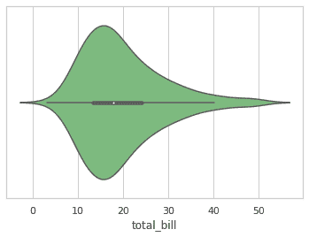
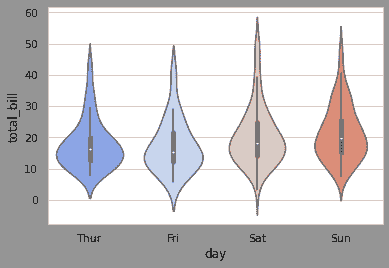
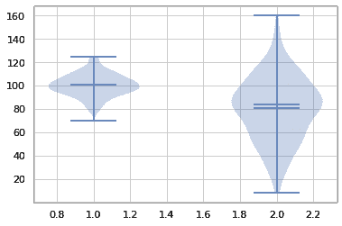

# Python 中的小提琴图——简单指南

> 原文：<https://www.askpython.com/python/examples/violin-plots-in-python>

小提琴图是箱线图和显示数据峰值的核密度图的结合。它用来显示数字数据是如何分布的。与只能提供汇总统计数据的箱线图不同，violin 图显示汇总统计数据和每个变量的密度。

Violin 图用于检查数字数据的分布，对于比较不同组之间的分布尤其有效。可以比较每组密度曲线的波峰、波谷和尾部，以确定分组的相似之处和不同之处。


Violin Plot Demonstration

### 为什么要使用小提琴的情节？

1.  小提琴图类似于箱线图和密度图，但更胜一筹！
2.  这幅小提琴图很有美感。
3.  即使你的数据不符合正态分布，小提琴图也是完全可以接受的。它们在可视化定量和定性数据方面都很有效。
4.  读取小提琴形状类似于读取密度图:较厚的部分表示小提琴该区域的值具有较大的频率。相比之下，较薄的部分表示频率较低。

* * *

## **用 Python 绘制小提琴图**

在开始代码实现之前，让我们先看看 Python 中的库，这些库可用于在 Python 中实现 Violin 情节。

* * *

### Python 中的库，可用于制作小提琴图

#### [Seaborn](https://www.askpython.com/python-modules/python-seaborn-tutorial)

Seaborn 是在 Python 的基础可视化工具包 Matplotlib 之上开发的。它应该是一种补充，而不是替代。另一方面，Seaborn 有几个极其重要的特征。

***了解更多关于 seaborn @ [Python Seaborn 教程](https://www.askpython.com/python-modules/python-seaborn-tutorial)***

#### [Matplotlib](https://www.askpython.com/python-modules/matplotlib/python-matplotlib)

Matploitlib 是一个用于绘图的 Python 库。它提供了面向对象的 API，用于将情节集成到程序中。这是一个跨平台的工具包，用于从数组数据创建 2D 图表。它提供了一个面向对象的 API，用于在基于 Python GUI 工具包的应用程序中嵌入图表。

***了解更多关于 seaborn @[Python Matplotlib 教程](https://www.askpython.com/python-modules/matplotlib/python-matplotlib)***

#### [阴谋地](https://www.askpython.com/python-modules/python-plotly-tutorial)

Python Plotly Toolkit 是一个开源库，可以轻松地可视化和理解数据。Plotly 提供了多种绘图类型，如折线图、散点图、直方图、cox 图等。

***阅读更多关于 seaborn @[Python Plotly 教程](https://www.askpython.com/python-modules/python-plotly-tutorial)***

* * *

### 使用 Seaborn 库可视化小提琴情节

下面显示的第一个代码展示了如何在 Seaborn 中创建一个水平的 violin 情节。我们正在利用来自 seaborn 图书馆的**提示数据集**。我们将**‘total bill’**列发送给`sns.violinplot()`方法，并利用调色板使其变为绿色**。**

```
import seaborn as sns
sns.set_theme(style="whitegrid")
T  = sns.load_dataset("tips")
Ax = sns.violinplot(x=T["total_bill"], palette="Greens") 
```

**

Violin Plot Seaborn 1** 

**第二段代码演示了如何组合两个变量来创建一个垂直的小提琴图。我们将可视化数据和调色板作为“冷色调”传递**

```
Ax = sns.violinplot(x="day", y="total_bill", data=T, palette="coolwarm") 
```

**

Violin Plot Seaborn 2** 

* * *

### **使用 Matplotlib 库可视化小提琴情节**

**为了使用 matplotlib 绘制 violin 图，我们将创建一个正态分布，并将数据和 Violin 图的一些其他属性一起传递给`plt.violinplot`函数。**

```
import matplotlib.pyplot as plt
import numpy as np

np.random.seed(10)
D1 = np.random.normal(100, 10, 200)
D2 = np.random.normal(80, 30, 200)
data_to_plot = [D1, D2,]
fig = plt.figure()
plt.violinplot(data_to_plot,showmeans=True, showextrema=True, showmedians=True)
plt.show() 
```

**

Violin Plot Matplotlib** 

* * *

### **使用 Plotly 库可视化小提琴情节**

**violin 图是使用 **tips 数据集**绘制的，该数据集在下面提到的代码中演示:**

```
import plotly.express as px

df = px.data.tips()
fig = px.violin(df, y="total_bill")
fig.show() 
```

**

Violin Plot Plotly** 

* * *

## **结论**

**恭喜你！您刚刚学习了如何用 Python 编程语言绘制小提琴图。希望你喜欢它！😇**

**喜欢这个教程吗？无论如何，我建议你看一下下面提到的教程:**

1.  **[3 个 Matplotlib 绘图技巧使绘图有效](https://www.askpython.com/python-modules/matplotlib/matplotlib-plotting-tips)**
2.  **[Python:绘制平滑曲线](https://www.askpython.com/python-modules/matplotlib/smooth-curves)**
3.  **[Python 情节:在 Python 中创建动画情节](https://www.askpython.com/python-modules/matplotlib/animated-plots)**
4.  **[使用 Matplotlib 的 Python 三维绘图](https://www.askpython.com/python-modules/matplotlib/3-dimensional-plots-in-python)**

**感谢您抽出时间！希望你学到了新的东西！！😄**

* * *