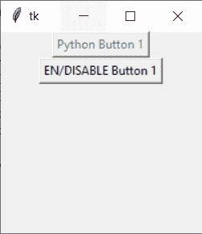
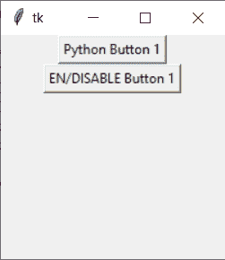

# python Tkinter–更改按钮的状态

> 原文：<https://www.askpython.com/python-modules/tkinter/change-button-state>

在本 Python 教程中，我们将学习如何使用 Tkinter 来检查和改变按钮的状态。

首先，我们必须首先在我们的 Python 环境中安装 Tkinter。我们将看到一个图形用户界面窗口，在这里我们可以通过按下 Tkinter 按钮来修改它的状态。

首先，我们必须掌握 Python Tkinter 中的状态是什么。

Tkinter 是一个 Python 包，允许我们设计自己的图形用户界面(GUI)。Tkinter 按钮有两种状态:正常和禁用。在常规状态下，我们可以按下按钮；但是，在禁用状态下，我们不能单击该按钮。

因此，在本教程中，我们将学习 Tkinter 按钮状态。

* * *

## 实现按钮状态

让我们从所提供的挑战的编码部分开始。首先，导入 Tkinter 包。现在，我们将创建一个 app 对象，并将窗口大小设置为 200 x 200。

```
import tkinter as tk
app = tk.Tk()
app.geometry("200x200")

```

我们将再添加两个按钮，按钮 1 和按钮 2。我们将提供一个参数作为应用程序，它将显示在应用程序窗口中，我们将通过将文本属性设置为“Python Button 1”来给它命名

通过向按钮 1 的状态提供值 tk，我们将指示它被禁用。已禁用。

类似地，在按钮 2 中，我们将提供关于某个函数名称的指令，以便当我们点击该按钮时，将执行下面的函数。

作为一个功能，我们为它们提供了 switchButtonState。该功能将在后面定义。我们还将使用包来放置这两个按钮。

```
button1 = tk.Button(app, text="Python Button 1",state=tk.DISABLED)
button2 = tk.Button(app, text="EN/DISABLE Button 1",command = switchButtonState)
button1.pack()
button2.pack()

```

下面的功能将改变按钮的状态。点击按钮，如果按钮 1 的状态为正常，则变为禁用状态；否则，它将保持正常。

```
def switchButtonState():
    if (button1['state'] == tk.NORMAL):
        button1['state'] = tk.DISABLED
    else:
        button1['state'] = tk.NORMAL

```

最后，我们必须使用 app.mainloop()来执行应用程序。

```
app.mainloop()

```

通过单击按钮 2，您现在可以修改按钮 1 的状态。

* * *

## 使用 Python tkinter 更改按钮的状态

```
import tkinter as tk

def switchButtonState():
    if (button1['state'] == tk.NORMAL):
        button1['state'] = tk.DISABLED
    else:
        button1['state'] = tk.NORMAL

app = tk.Tk()
app.geometry("200x200")
button1 = tk.Button(app, text="Python Button 1",state=tk.DISABLED)
button2 = tk.Button(app, text="EN/DISABLE Button 1",command = switchButtonState)
button1.pack()
button2.pack()

app.mainloop()

```

* * *

**输出屏幕**



Change Btn States Output 1



Change Btn States Output 2

* * *

## 结论

恭喜你！您刚刚学习了如何更改按钮的状态。希望你喜欢它！😇

喜欢这个教程吗？无论如何，我建议你看一下下面提到的教程:

1.  [Python Tkinter 教程:了解 Tkinter 字体类](https://www.askpython.com/python-modules/tkinter/tkinter-font-class)
2.  [Python Tkinter 项目:随机移动号码生成器](https://www.askpython.com/python-modules/tkinter/random-mobile-number-generator)
3.  [Tkinter StringVar 示例–Tkinter 教程](https://www.askpython.com/python-modules/tkinter/stringvar-with-examples)
4.  [Tkinter int var–带示例的 Tkinter 教程](https://www.askpython.com/python-modules/tkinter/tkinter-intvar)

感谢您抽出时间！希望你学到了新的东西！！😄

* * *