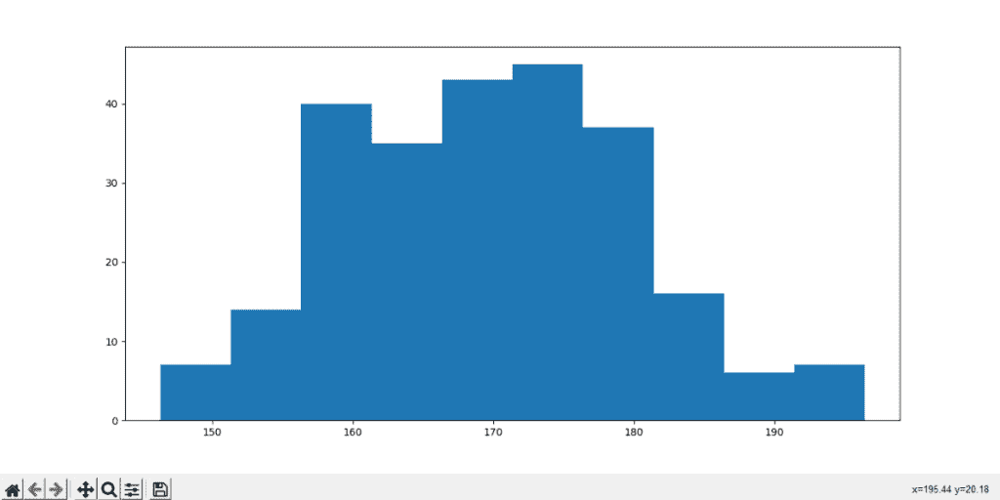
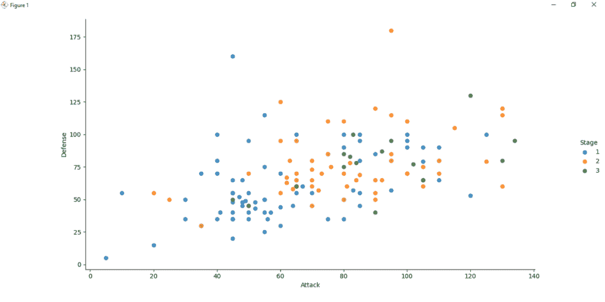
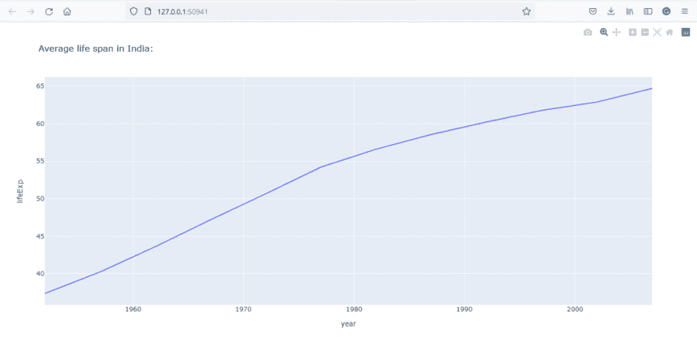
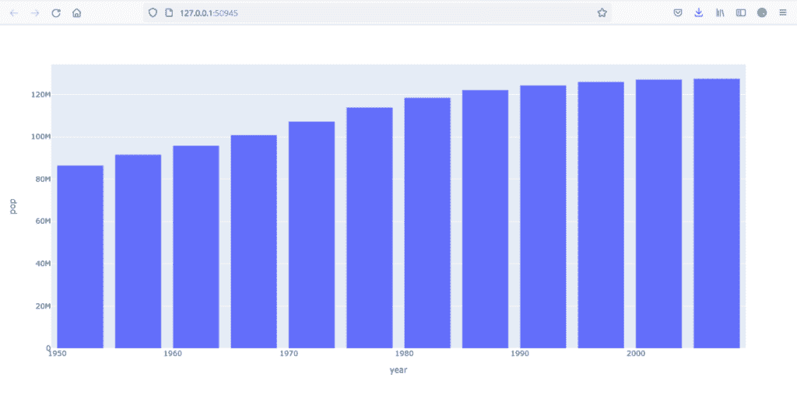
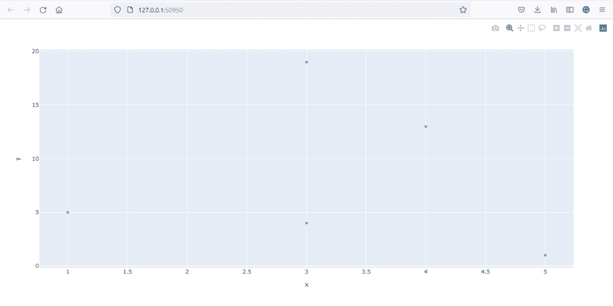
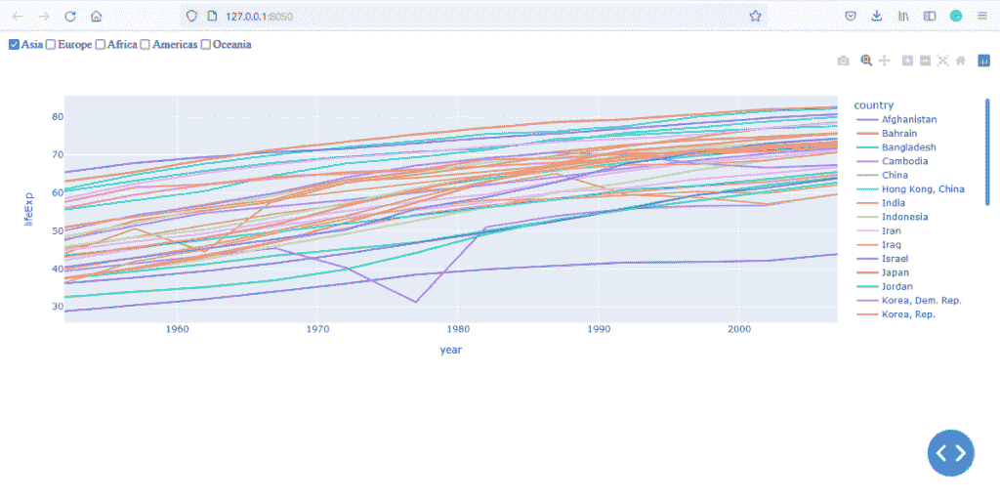
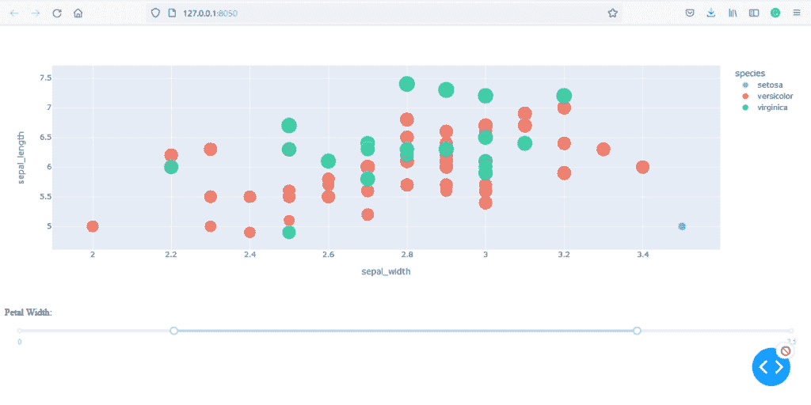

# 4 个简单的 Python 绘图库及示例

> 原文：<https://www.askpython.com/python-modules/plotting-libraries-python>

Python 提供了许多交互式绘图包，通过它们我们可以制作出一些最漂亮、最可定制的图形和图表。在本文中，我们将了解一些用于绘图的 python 模块，以及如何用它们编写基本图表。这些是一些最广泛使用的 python 包，可用于所有平台(如 Windows、Linux Mac)。

## 1.matplotlib–最早的绘图库

如果你习惯了 Python，你一定听说过 Matplotlib。它是用于绘图的最古老的 python 库之一，由 Michael Droettboom 在 18 年前构建，最初由 John D. Hunter 编写，但在 Python 学习者和数据分析师中仍然非常流行。它提供了一个面向对象的应用程序接口，使 matplotlib 绘图更容易在各种应用程序上运行。

**让我们看一些使用 matplotlib 绘制图表的代码:**

### [折线图](https://www.askpython.com/python/plot-customize-pie-chart-in-python)

```
import matplotlib.pyplot as plt
from numpy import random

var1=random.randint(100, size=(100))
var2=random.randint(100, size=(100))
var1.sort()
var2.sort()

plt.plot(var1,var2)
plt.show()

```


Line chart

### [直方图](https://www.askpython.com/python/examples/animated-histograms)

```
import matplotlib.pyplot as plt
import numpy as np
from numpy import random
hist_var = np.random.normal(170, 10, 250)
plt.hist(hist_var)
plt.show()

```



Histogram

## 2.希伯恩

它是一个基于 matplotlib 的子模块，用于从统计数据中创建图表。Seaborn 允许程序员直接从数组和数据框中提取数据，并让他们将统计数据可视化成图形。为了允许可视化，它在 Matplotlib 框架下工作，并且对于数据集成，它非常依赖 pandas。

为了理解 seaborn 是如何工作的，我们将研究一个示例代码。

### 分散

```
import pandas as pand
from matplotlib import pyplot as plt
import seaborn as sns

scores = pand.read_csv('scores.csv', encoding='unicode_escape', index_col=0)

def scatter_plot():
    sns.lmplot(x='Attack', y='Defense', data=scores,
           fit_reg=False,  # It removes a diagonal line that remains by default
           hue='Stage'
           )
    plt.show()

scatter_plot()

```



Seaborn Scatter

上面的代码绘制了我们从数据框“scores.csv”中获取的攻击和防御值的散点图。方法“scatter_plot()”包含 seaborn 函数“sns.lmplot”，该函数通过将“攻击”作为 x 轴，将“防御”作为 y 轴来绘制散点图。

让我们看看另一个示例代码。我们将使用 seaborn 绘制一个箱线图，使用与上一个示例中相同的一组值。

### [箱式打印](https://www.askpython.com/python/examples/boxplots)

```
import pandas as pand
from matplotlib import pyplot as plt
import seaborn as sns

scores = pand.read_csv('scores.csv', encoding='unicode_escape', index_col=0)
sns.boxplot(data=scores)
plt.show()

```


Seaborn Boxplot

## 3.Plotly

Plotly 是 2012 年创建的数据可视化工具。在本文中，我们将学习 Plotly 的一个子模块，称为 **Plotly Express** 。这个子模块是一个 Python 库，目的是通过一个函数调用来创建图形可视化。另一方面，它也提供了一个很好的基础来为媒体和通信创建定制的图形。

让我们看一个 Plotly 代码示例，演示如何通过单个函数调用创建简单的图表。

```
import plotly.express as px

def linechart():
    df_india = px.data.gapminder().query("country=='India'")
    fig = px.line(df_india, x="year", y="lifeExp", title='Average life span in India:')
    fig.show()

def scatter():
    # x and y given as array_like objects
    import plotly.express as px
    fig = px.scatter(x=[5, 1, 3, 4, 3], y=[1, 5, 4, 13, 19])
    fig.show()

def barplot():
    import plotly.express as px
    data_Japan = px.data.gapminder().query("country == 'Japan'")
    fig = px.bar(data_Japan, x='year', y='pop')
    fig.show()

linechart()
barplot()
scatter()

```

在上面的代码中，程序有三个不同的方法函数被一起调用。每个方法函数在被调用时都会为用户绘制一个图表。如果我们仔细观察，每个方法函数都有不同的输入方法。第一个函数从 Plotly express 数据库加载数据。第二个函数可视化了从两个不同数组中获取的值的散点图。第三个函数类似于第一个函数，它从 Plotly express 数据库加载数据，然后绘制条形图。



Plotly Line chart



Plotly Barchart



Plotly Scatter chart

## 4.破折号

Dash 是一个 Plotly 框架，允许我们制作 web 应用程序，并允许我们将图形、文本和控件链接在一起。这个子模块主要帮助管理应用程序前端的各个方面，比如它的布局和样式。最终的结果是一个 flask 应用程序，它可以很容易地部署到各种 web 托管平台上。

让我们看一些它的代码来加深理解。第一个程序从 Plotly gapminder 数据库绘制预期寿命线图。它描绘了所选大陆上所有国家的预期寿命。

### 折线图

```
import dash
from dash import dcc
from dash import html
from dash.dependencies import Input, Output
import plotly.express as px

frame_data = px.data.gapminder()
every_continent = frame_data.continent.unique()

app = dash.Dash(__name__)

app.layout = html.Div([
    dcc.Checklist(
        id="checklist",
        options=[{"label": x, "value": x}
                 for x in every_continent],
        value=every_continent[3:],
        labelStyle={'display': 'inline-block'}
    ),
    dcc.Graph(id="lineChart"),
])

@app.callback(
    Output("lineChart", "figure"),
    [Input("checklist", "value")])
def update_line_chart(continents):
    data_mask = frame_data.continent.isin(continents)
    figure = px.line(frame_data[data_mask],
        x="year", y="lifeExp", color='country')
    return figure

app.run_server(debug=True)

```



Dash – Line chart

### 散点图

下面的代码演示了如何在 Python 中使用 dash 绘制散点图。这里，我们使用 iris 数据库作为输入数据框架。虹膜数据库是一个模式识别数据集，包含三种不同种类的花的花瓣大小。这个程序将绘制一个散点图的花瓣大小的数据作为输入。

```
import dash
from dash import dcc
from dash import html
from dash.dependencies import Input, Output
import plotly.express as px

frame_data = px.data.iris()

app = dash.Dash(__name__)

app.layout = html.Div([
    dcc.Graph(id="plotis_scatter"),
    html.P("Width of Petal:"),
    dcc.RangeSlider(
        id='range-slider',
        min=0, max=2.5, step=0.1,
        marks={0: '0', 2.5: '2.5'},
        value=[0.5, 2]
    ),
])

@app.callback(
    Output("plotis_scatter", "figure"),
    [Input("range-slider", "value")])
def update_bar_chart(slider_range):
    low, high = slider_range
    damask = (frame_data['petal_width'] > low) & (frame_data['petal_width'] < high)
    figure = px.scatter(
        frame_data[damask], x="sepal_width", y="sepal_length",
        color="species", size='petal_length',
        hover_data=['petal_width'])
    return figure

app.run_server(debug=True)

```



Dash Scatter chart

## 结论

本文旨在解释 Python 可用的重要绘图工具。虽然这些 python 库在数据科学领域得到了广泛的应用，但我们试图以一种简单易学的方式提供概念和代码，这样即使是初学者也能掌握它们。希望本文能够帮助您理解本文中解释的所有库的基本概念——Matplotlib、Seaborn、Plotly、Dash。