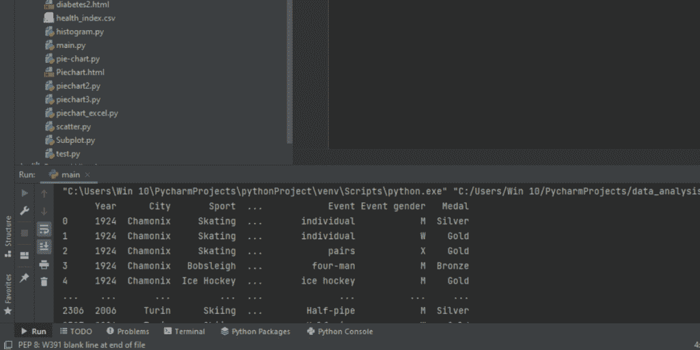
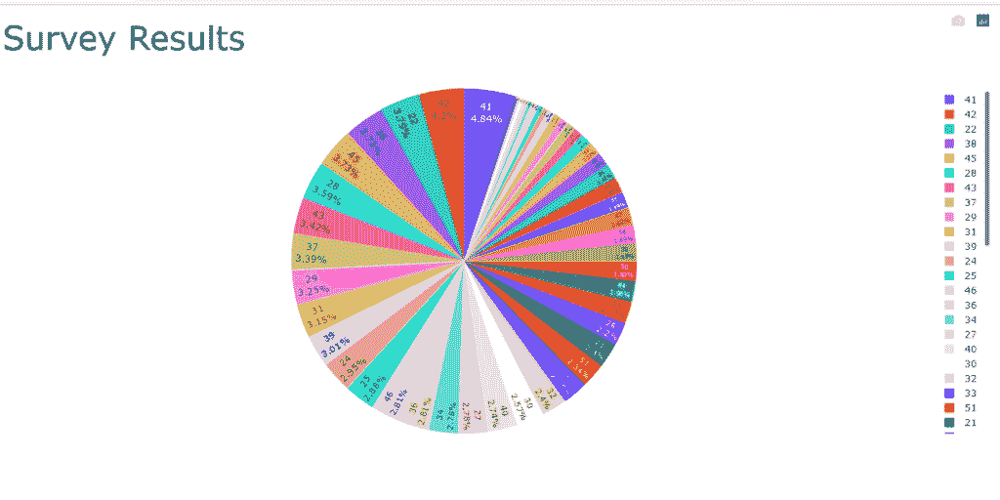
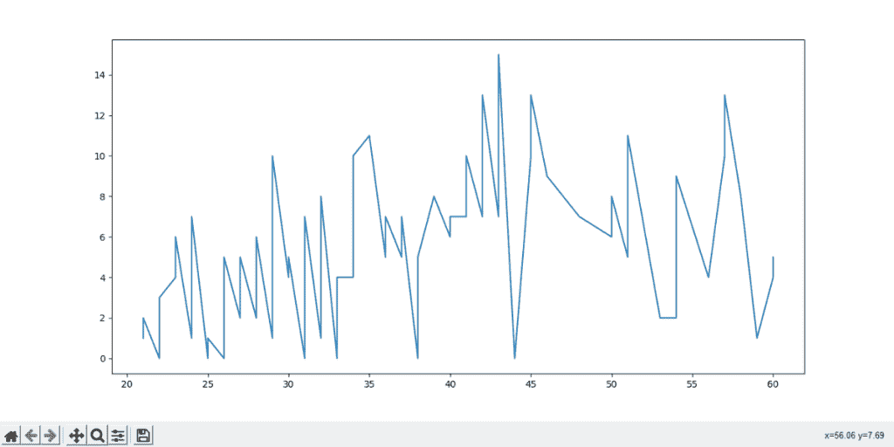
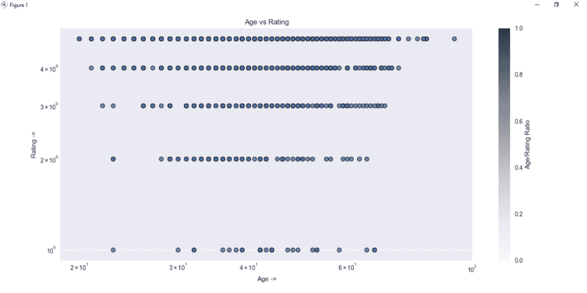
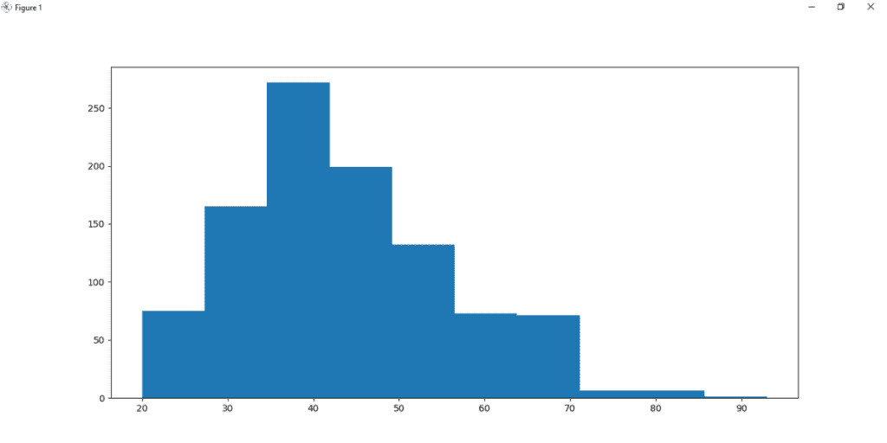
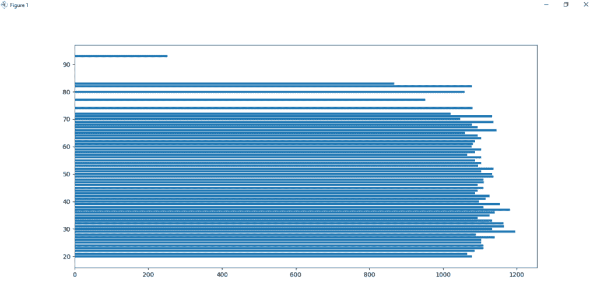

# Python 中的数据分析——快速介绍

> 原文：<https://www.askpython.com/python/examples/data-analysis-in-python>

让我们了解更多关于 Python 中的数据分析。如果你掌握了 Python，分析数据是相当容易的。有很多相同的软件包可供选择。

在这篇文章中，我们将看看不同的 python 包、工具和方法，它们帮助我们进行数据分析。我们将从了解如何将不同形式的数据文件——从 excel 表格到在线数据库——导入 python 源代码开始，然后我们将了解将这些数据实现为不同类型的图表的方法。

## 使用 Python 进行数据分析

在我们阅读任何数据之前，首先我们需要掌握如何在 python 中加载不同类型文件的知识，然后我们才能继续。

### 在 Python 中加载本地数据集

在此示例中，程序加载。运行 python 脚本的同一目录中的 csv 文件。

```
import pandas as pd
df=pd.read_csv('health_index.csv')

```

### 在 Python 中从 URL 加载数据集

从下面的代码可以清楚地看出,“pd.read”语法很容易加载。csv 文件。

```
import pandas as pd
df=pd.read_csv('http://winterolympicsmedals.com/medals.csv')
print(df)

```



Output 1.1

### 在 Python 中加载 Excel 数据

“pd.read_excel”语法类似于之前使用的“pd.read”语法，它用于将 excel 表加载到我们的 python 程序中。我们使用了一个 excel 表(“data.xlsx ”,它位于运行 python 代码的同一目录中，我们还使用了“openpyxl”引擎，这是 python 的一个 excel 解释器。

```
import pandas as pd
df = pd.read_excel('data.xlsx', engine='openpyxl')

```

## 如何在 Python 中使用不同的图表分析数据？

自从数字的概念产生以来，人类已经创造了多种方法来使计数变得更容易。但是从来没有比图形和图表更容易理解数字。在数据分析中，我们也将看到 python 模块，这些模块有助于使用我们加载的数据文件创建图形和图表。

***也读: [Python Seaborn 教程](https://www.askpython.com/python-modules/python-seaborn-tutorial)***

### 1.饼图

饼图是两组不同数据的 360 度图形表示，显示在一起以显示汇合点。在下面的代码中，程序将绘制一个包含两组值的饼图——“年龄”、“怀孕”。

**代码:**

```
# import statements
import plotly.express as fpx
import pandas as pd

# loading health_index file
fdf = pd.read_csv('health_index.csv')
preg_stats = fdf['Pregnancies']
age_stats = fdf['Age']

fig = fpx.pie(fdf,
            values=preg_stats,
            names=age_stats,
            title='Survey Results'
            )

fig.update_traces(
            textposition='inside',
            textinfo='percent+label'
            )

fig.update_layout(
            title_font_size = 42,
            )

fig.show()

```



Output 1.2

### 2.折线图

绘制折线图是为了理解两组值之间的关系。在下面的代码中，程序绘制折线图并显示输出。

**代码:**

```
# import statements
import matplotlib.pyplot as plt
import pandas as pd

# loading 10 rows of the file
fdf= pd.read_csv("health_index.csv", nrows=10)

#Sorting the two columns in ascending order
fdf.sort_values(["Age", "Pregnancies"],
                    axis=0,
                    inplace=True)

preg_stats = fdf['Pregnancies']
age_stats = fdf['Age']

plt.plot(age_stats,preg_stats)
plt.show()

```



Output 1.3

***也读作:[用 Python 从 Excel 表中绘制数据](https://www.askpython.com/python/examples/plot-data-from-excel-sheet)***

### 3.分散

[matplotlib](https://www.askpython.com/python-modules/matplotlib/python-matplotlib) 中的[散点图](https://www.askpython.com/python-modules/matplotlib/matplotlib-subplots)函数将数值分布在一个二维平面中，并可视化其图形表示。这种表示适用于分析一组值的密度、随机分布等属性。也可以对一个以上的变量进行表示。

在本例中，消费者记录数据库用于编辑结果并生成散点图。下面的代码可视化了数据库中一组两个变量的散点图。

**代码:**

```
import pandas as pd
import matplotlib.pyplot as plt

plt.style.use('seaborn')

data = pd.read_csv('clothing_data.csv', nrows=1000)
cid = data['Clothing ID']
age = data['Age']
rating = data['Rating']

plt.scatter(age, rating, cmap='summer',
            edgecolor='black', linewidth=1, alpha=0.75)

cbar = plt.colorbar()
cbar.set_label('Age/Rating Ratio')

plt.xscale('log')
plt.yscale('log')

plt.title('Age vs Rating')
plt.xlabel('Age ->')
plt.ylabel('Rating ->')

plt.tight_layout()

plt.show()

```



Output 1.4

### 4.柱状图

直方图是频率分布的图形表示，用相邻的条形显示。直方图函数直方图是频率分布的图形图像，用相邻的条形表示。matplotlib 的直方图函数从单个变量中绘制频率点，并在输出中展示它们。

**代码**:

```
import matplotlib.pyplot as plt
import pandas as pd

data = pd.read_csv('clothing_data.csv', nrows=1000)

age = data['Age']

plt.hist(age)
plt.show()

```



Output 1.5

### 5.条形图

水平和垂直表示的两组变量的矩形表示。

**代码:**

```
import matplotlib.pyplot as plt
import pandas as pd

data = pd.read_csv('clothing_data.csv', nrows=1000)
cid = data['Clothing ID']
age = data['Age']

plt.barh(age, cid)
plt.show()
```



Output 1.6

### 结论

我希望您现在已经理解了数据分析的基础知识，并且能够将数据库导入到您的 python 代码中，并在 matplotlib 的帮助下创建理想的图表。我们学习了如何导入数据文件类型，如-。我们还学习了如何可视化不同的 matplotlib 图形，如直方图、条形图、散点图等。要了解更多信息，请查看参考资料部分。

### 参考

要使用的数据库:[点击此处](https://www.kaggle.com/uciml/pima-indians-diabetes-database)