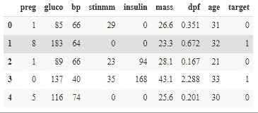
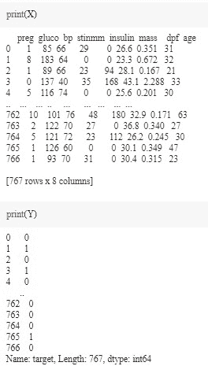

# Python 中的糖尿病预测——简单指南

> 原文：<https://www.askpython.com/python/examples/diabetes-prediction-in-python>

嘿伙计们！在本教程中，我们将学习如何使用深度学习技术在 Python 中使用 Keras 的深度学习 API 来构建糖尿病预测。

## 用 Python 实现糖尿病预测

为此，我们将利用一个可用的数据集，并构建一个深度神经网络架构。数据集可在 [***这里***](https://www.kaggle.com/kumargh/pimaindiansdiabetescsv) 下载。

您可以在下载数据集后研究它，您会注意到它被分为 0 和 1。让我们继续用 TensorFlow 和 Keras 在 Python 中实现我们的模型。

我希望您已经在本地系统上安装了所有的库。如果没有，不用担心，你可以打开 Google Colab，和我一起练习这一课。

* * *

### 步骤 1–导入模块

现在，让我们将必要的 Python 库导入到笔记本中。

Keras API 已经包括 Python 的 TensorFlow 深度学习包，这在糖尿病预测挑战中至关重要。

```
import numpy as np
import pandas as pd
import tensorflow as tf
from keras.layers import Dense,Dropout
from sklearn.model_selection import train_test_split
import matplotlib as mlp
import matplotlib.pyplot as plt
%matplotlib inline
from sklearn.preprocessing import StandardScaler

```

### 步骤 2–加载数据集

我们现在准备开始导入数据集。在下一段代码中，我们导入数据集并使用 head()方法获取前五个数据点。

```
data=pd.read_csv("pima-indians-diabetes.csv")
data.head()

```


Diabetes Dataset Top5

### 步骤 3–重命名列

你可能已经意识到这些专栏毫无意义，对吗？现在让我们重命名列名。

又念:[头()在熊猫](https://www.askpython.com/python-modules/pandas/head-and-tail-of-dataframe-series)

```
data = data.rename(index=str, columns={"6":"preg"})
data = data.rename(index=str, columns={"148":"gluco"})
data = data.rename(index=str, columns={"72":"bp"})
data = data.rename(index=str, columns={"35":"stinmm"})
data = data.rename(index=str, columns={"0":"insulin"})
data = data.rename(index=str, columns={"33.6":"mass"})
data =data.rename(index=str, columns={"0.627":"dpf"})
data = data.rename(index=str, columns={"50":"age"})
data = data.rename(index=str, columns={"1":"target"})

data.head()

```



Renamed Columns Diabetes Dataset Top5

### 步骤 4–分离输入和输出

```
X = data.iloc[:, :-1]
Y = data.iloc[:,8]

```

X 和 Y 值看起来有点像这样:



Input N Output Diabetes Dataset

我们将数据集分为输入数据集和目标数据集，这意味着前八列将作为模型的输入要素，最后一列将作为目标类。

### 步骤 5–训练-测试数据分割

下一步包括将训练和测试分成数据，然后将数据标准化，使以后的计算更简单。

```
X_train_full, X_test, y_train_full, y_test = train_test_split(X, Y, random_state=42)
X_train, X_valid, y_train, y_valid = train_test_split(X_train_full, y_train_full, random_state=42)

```

```
from sklearn.preprocessing import StandardScaler
scaler = StandardScaler()
X_train = scaler.fit_transform(X_train)
X_valid = scaler.transform(X_valid)
X_test = scaler.transform(X_test)

```

### 步骤 6–建立模型

我们从使用一个**随机种子**生成一个伪随机数并将其设置到 **tf 图**开始。然后，我们将使用顺序模型，以及模型中的一些丢弃层，以避免数据的过度拟合。

```
np.random.seed(42)
tf.random.set_seed(42)

model=Sequential()
model.add(Dense(15,input_dim=8, activation='relu'))
model.add(Dense(10,activation='relu'))
model.add(Dense(8,activation='relu'))
model.add(Dropout(0.25))
model.add(Dense(1, activation='sigmoid'))

```

### 步骤 7–模型的训练和测试

现在，让我们继续训练我们的模型，然后在测试数据集上拟合模型。

```
model.compile(loss="binary_crossentropy", optimizer="SGD", metrics=['accuracy'])
model_history = model.fit(X_train, y_train, epochs=200, validation_data=(X_valid, y_valid))

```

你会意识到，将训练 200 个时代的模型，并使用二元交叉熵损失函数和 SGD 优化器。

* * *

## 结论

恭喜你！您刚刚学习了如何使用 Python 编程语言构建糖尿病预测器。希望你喜欢它！😇

喜欢这个教程吗？无论如何，我建议你看一下下面提到的教程:

1.  [利用 Python 预测股价](https://www.askpython.com/python/examples/stock-price-prediction-python)
2.  [用 Python 进行加密价格预测](https://www.askpython.com/python/examples/crypto-price-prediction)
3.  [利用 Python 进行股票价格预测](https://www.askpython.com/python/examples/stock-price-prediction-python)
4.  [Python 中的票房收入预测——简单易行](https://www.askpython.com/python/examples/box-office-revenue-prediction)

感谢您抽出时间！希望你学到了新的东西！！😄

* * *