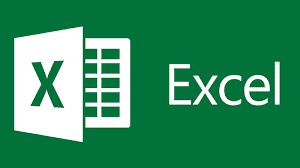

# xlrd 模块——如何用 Python 处理 Excel 文件？

> 原文：<https://www.askpython.com/python-modules/xlrd-module>

你有没有想过如何使用编程语言处理 MS-Excel 文件？在本教程中，我们将学习如何借助 Python 编程语言中的 xlrd 模块来处理 Excel 文件。

所以让我们开始吧！

* * *

## **MS-Excel 简介**

Microsoft Excel 是最重要的计算机应用程序之一，因为它在许多行业中发挥着关键作用。它是各种企业任务、课堂作业甚至个人数据管理中使用最广泛的电子表格应用程序。



Excel 最初是在 1985 年推出的。从那时起，它在基于公式的算术和计算中，以及其他可能需要数学计算的活动中发挥了重要作用。

Excel 已经被许多组织、个人和机构企业使用，因为它的可用性和作为许多应用程序的可视化基础的能力。

* * *

## **xlrd 模块介绍**

xlrd 模块可用于从电子表格中获取数据。例如，Python 可用于读取、写入或更改数据。

此外，用户可能需要遍历多个工作表并根据某些标准提取数据，以及编辑一些行和列并执行大量工作。要从电子表格中提取数据，请使用 xlrd 模块。

在实现 xlrd 模块之前，需要确保使用下面提到的命令行在您的系统上的 CMD 中将该模块导入到程序中。

```
pip install xlrd

```

* * *

## **使用 Python 中的 xlrd 模块**

我们将在 xlrd 模块的帮助下一个接一个地做一些事情。在做任何事情之前，让我们看看我们将使用的数据集。

您可以使用任何合适的数据集，也可以创建自己的自定义数据集。我下载了一个随机的金融数据集，可以在这里 下载 [*。*](https://www.google.com/url?sa=t&rct=j&q=&esrc=s&source=web&cd=&ved=2ahUKEwjM7Nz1w8nzAhUlqksFHaL_AaUQFnoECAMQAQ&url=https%3A%2F%2Fgo.microsoft.com%2Ffwlink%2F%3FLinkID%3D521962&usg=AOvVaw2vd06xWtIxQTTv-3KBpe8y)


Financial Data Xlrd Module

### 1.**将 Excel 文件加载到程序中**

最初，我们将导入 xlrd 模块，然后使用 xlrd 模块下的`open_workbook`函数来加载工作簿，该工作簿的路径在函数中被提及。

```
# Importing Module
import xlrd
# Loading Excel file
wb = xlrd.open_workbook('Financial Sample.xlsx')

```

* * *

### 2.**读取 Excel 文件**

现在，在一个 excel 文件中可以有多个工作簿，但是我们想要处理第一个工作簿，同样，我们将利用`sheet_by_index`函数并传递我们想要处理的工作表的索引。

```
# Storing the first sheet into a variable
sheet = wb.sheet_by_index(0)

```

#### **打印单元格的值**

加载某个工作簿后，我们想使用`cell_value`函数打印某个单元格的值，这需要我们要读取的单元格的行号和列号。

```
# Printing various cell values
print("Value of 0-0 cell: ",sheet.cell_value(0, 0))
print("Value of 20-4 cell: ",sheet.cell_value(20, 4))

```

执行后的输出是:

```
Value of 0-0 cell:  Segment
Value of 20-4 cell:  1006.0

```

#### **打印行数和列数**

为了打印 excel 文件中的行数和列数，我们将使用“nrows”和“ncols”函数。

```
# Get max no of rows and columns
print("Number of Rows: ", sheet.nrows)
print("Number of Columns: ",sheet.ncols)

```

执行后的输出是:

```
Number of Rows:  701
Number of Columns:  16

```

#### **打印所有列的名称**

这可以使用下面提到的代码来实现。我们只需要打印第一行中每个列单元格的值。

```
# Get all column names
print("ALL COLUMN NAMES ARE: ")
for i in range(sheet.ncols):
    print(sheet.cell_value(0,i))

```

执行后的输出如下所示:

```
ALL COLUMN NAMES ARE: 
Segment
Country
Product
Discount Band
Units Sold
Manufacturing Price
Sale Price
Gross Sales
Discounts
 Sales
COGS
Profit
Date
Month Number
Month Name
Year

```

#### **打印前 10 行 5 列**

这可以使用下面提到的代码来实现。如果愿意，您可以打印多行和多列。

```
# Get first 10 rows for 5 columns
for i in range(11):
    for j in range(5):
        print(sheet.cell_value(i,j), end="\t\t\t")
    print()

```

输出如下所示:

```
Segment			Country			Product			Discount Band			Units Sold			
Government			Canada			Carretera			None			1618.5			
Government			Germany			Carretera			None			1321.0			
Midmarket			France			Carretera			None			2178.0			
Midmarket			Germany			Carretera			None			888.0			
Midmarket			Mexico			Carretera			None			2470.0			
Government			Germany			Carretera			None			1513.0			
Midmarket			Germany			Montana			None			921.0			
Channel Partners			Canada			Montana			None			2518.0			
Government			France			Montana			None			1899.0			
Channel Partners			Germany			Montana			None			1545.0	

```

* * *

## **结论**

恭喜你！您刚刚学习了如何使用 xlrd 模块加载和读取 excel 文件。希望你喜欢它！😇

喜欢这个教程吗？无论如何，我建议你看一下下面提到的教程:

1.  [使用 Python 从 Excel 表格中绘制数据](https://www.askpython.com/python/examples/plot-data-from-excel-sheet)
2.  [使用熊猫阅读文本文件——简要参考](https://www.askpython.com/python-modules/pandas/read-text-file-pandas)

感谢您抽出时间！希望你学到了新的东西！！😄

* * *