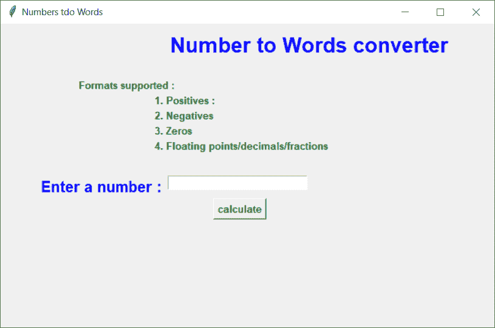
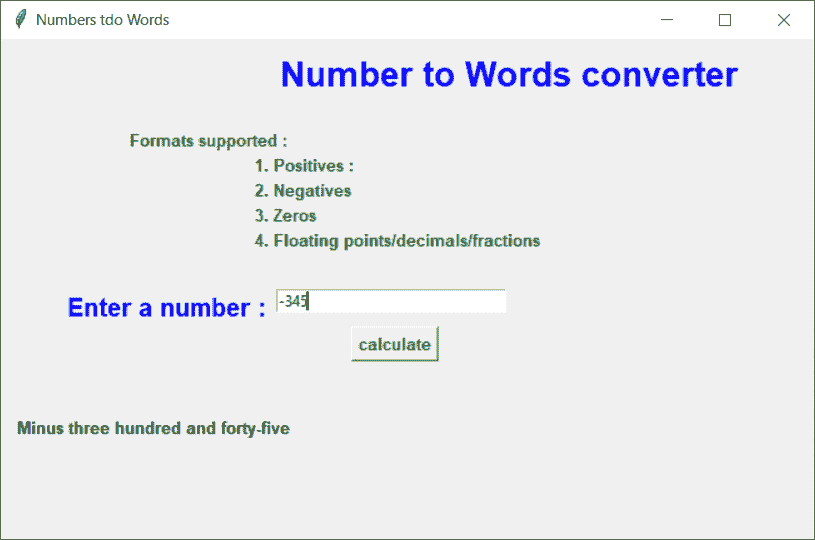

# Python:将数字转换成单词

> 原文：<https://www.askpython.com/python/python-convert-number-to-words>

大家好！在本文中，我们将研究如何创建一个 Python GUI 项目，将整数值转换为单词。

让我们马上开始这个项目吧！

* * *

## 步骤 1:导入模块

我们首先将所有必要的模块/库导入我们的程序。

我们将导入`tkinter`模块来创建 GUI 窗口。与此同时，我们将导入`num2words`模块，以实现数字到文字的功能。

```
import num2words as n2w
from tkinter import *

```

* * *

## 步骤 2:创建 GUI 窗口

现在，我们将使用基本函数创建基本的 [Tkinter](https://www.askpython.com/python-modules/tkinter/tkinter-canvas) 窗口，然后在屏幕上添加一些基本的小部件。其中一些包括标签、输入框和按钮。

如果你不知道 Tkinter widgets，看看下面提到的教程:

1.  [Tkinter GUI 部件–完整参考](https://www.askpython.com/python/tkinter-gui-widgets)
2.  [Tkinter 入口小工具](https://www.askpython.com/python-modules/tkinter/tkinter-entry-widget)
3.  [带 Tkinter 滚动条的 Tkinter 文本小工具](https://www.askpython.com/python-modules/tkinter/tkinter-text-widget-tkinter-scrollbar)
4.  [t 帧间和标签:简易参考](https://www.askpython.com/python-modules/tkinter/tkinter-frame-and-label)

```
root = Tk()
root.title("Numbers tdo Words")
root.geometry("650x400")
num = StringVar()
title = Label(root, text="Number to Words converter",fg="Blue", font=("Arial", 20, 'bold')).place(x=220, y=10)
formats_lable = Label(root, text="Formats supported :  ",fg="green", font=("Arial", 10, 'bold')).place(x=100, y=70)
pos_format_lable = Label(root, text="1\. Positives :  ",fg="green", font=("Arial", 10, 'bold')).place(x=200, y=90)
neg_format_lable = Label(root, text="2\. Negatives ",fg="green", font=("Arial", 10, 'bold')).place(x=200, y=110)
float_format_lable = Label(root, text="3\. Zeros  ",fg="green", font=("Arial", 10, 'bold')).place(x=200, y=130)
zero_format_lable = Label(root, text="4\. Floating points/decimals/fractions  ",fg="green", font=("Arial", 10, 'bold')).place(x=200, y=150)
num_entry_lable = Label(root, text="Enter a number :",fg="Blue", font=("Arial", 15, 'bold')).place(x=50, y=200)
num_entry = Entry(root,textvariable=num,width=30).place(x=220, y=200)
btn = Button(master=root, text="calculate",fg="green",
font=("Arial", 10, 'bold'),command=num_to_words).place(x=280,y=230)
display = Label(root, text="",fg="black", font=("Arial", 10, 'bold'))
display.place(x=10, y=300)
root.mainloop()

```

你可能注意到在`Line 21`中我们有按钮的`command`属性。属性被设置为`num_to_words`，但是我们还没有声明函数 yer。

* * *

## 第三步:字数函数

在该函数中，我们将首先读取用户给出的输入，然后使用`num2words`函数将读取的值转换为单词，最后将显示值更改为数字的计算单词形式。

```
def num_to_words():
    given_num = float(num.get())
    num_in_word = n2w.num2words(given_num)
    display.config(text=str(num_in_word).capitalize())

```

* * *

## 使用 Python Tkinter 将数字转换为单词

```
import num2words as n2w
from tkinter import *

def num_to_words():
    given_num = float(num.get())
    num_in_word = n2w.num2words(given_num)
    display.config(text=str(num_in_word).capitalize())

root = Tk()
root.title("Numbers tdo Words")
root.geometry("650x400")
num = StringVar()
title = Label(root, text="Number to Words converter",fg="Blue", font=("Arial", 20, 'bold')).place(x=220, y=10)
formats_lable = Label(root, text="Formats supported :  ",fg="green", font=("Arial", 10, 'bold')).place(x=100, y=70)
pos_format_lable = Label(root, text="1\. Positives :  ",fg="green", font=("Arial", 10, 'bold')).place(x=200, y=90)
neg_format_lable = Label(root, text="2\. Negatives ",fg="green", font=("Arial", 10, 'bold')).place(x=200, y=110)
float_format_lable = Label(root, text="3\. Zeros  ",fg="green", font=("Arial", 10, 'bold')).place(x=200, y=130)
zero_format_lable = Label(root, text="4\. Floating points/decimals/fractions  ",fg="green", font=("Arial", 10, 'bold')).place(x=200, y=150)
num_entry_lable = Label(root, text="Enter a number :",fg="Blue", font=("Arial", 15, 'bold')).place(x=50, y=200)
num_entry = Entry(root,textvariable=num,width=30).place(x=220, y=200)
btn = Button(master=root, text="calculate",fg="green",
    font=("Arial", 10, 'bold'),command=num_to_words).place(x=280,y=230)
display = Label(root, text="",fg="black", font=("Arial", 10, 'bold'))
display.place(x=10, y=300)
root.mainloop()

```



Initial Screen Number2Words

* * *

## 一些示例输出


Sample Output 1 Number 2 Words


Sample Output 2 Number 2 Words



Sample Output 3 Number 2 Words

* * *

## 结论

我希望你能很好地理解这个概念，并且喜欢它的输出。感谢您抽出时间阅读教程。

快乐学习！😇

* * *

## 另请参阅:

1.  [Python Tkinter 项目:随机移动号码生成器](https://www.askpython.com/python-modules/tkinter/random-mobile-number-generator)
2.  [使用 Python Tkinter 的 YouTube 视频下载器](https://www.askpython.com/python-modules/tkinter/youtube-video-downloader)
3.  [t inter 闹钟——逐步指南](https://www.askpython.com/python-modules/tkinter/tkinter-alarm-clock)
4.  [Python Tkinter:简单的储蓄计算器](https://www.askpython.com/python-modules/tkinter/savings-calculator)

* * *