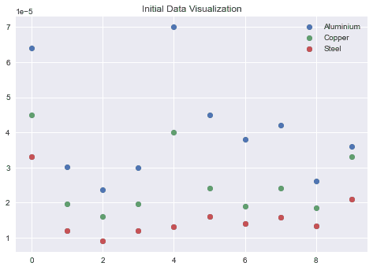
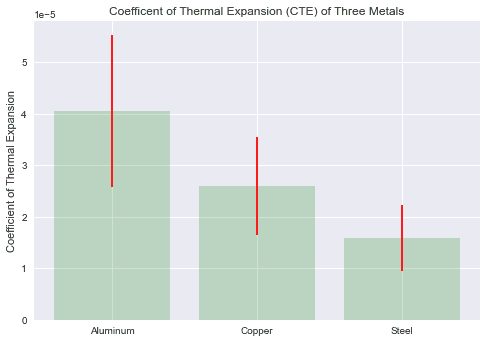
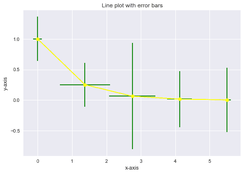

# Python 中误差线的介绍

> 原文：<https://www.askpython.com/python/examples/error-bars-in-python>

今天在本教程中，我们将了解误差线的概念，并学习如何在 Python 编程语言中将其可视化。

在跳到代码之前，让我先向您介绍 errorbars。

* * *

## Python 中的误差线是什么？

在数据科学研究中，在可视化中显示误差线是不可避免的，也是非常必要的。

误差线对于问题解决者来说非常有用，可以用来观察输出值的可信度。没有误差线的条形图给人一种错觉，认为测量值或计算值具有高精度或高可信度。

* * *

## 在 Python 中实现误差线

现在我们知道了什么是误差线，让我们学习使用基本的机器学习模块来可视化它们。

### 1.导入模块

```
import numpy as np
import matplotlib.pyplot as plt
%matplotlib inline
plt.style.use('seaborn')

```

* * *

### 2.可视化条形图中的误差线

为了可视化柱状图中的误差线，我们必须首先[创建柱状图](https://www.askpython.com/python/python-bar-plot)。同样的方法是先创建数据并绘制条形图。

* * *

#### 2.1 数据创建

为了创建数据，我们将采用 3 个不同的对象。在本教程中，我们将表示三种金属的热温度。

```
aluminum = np.array([6.4e-5 , 3.01e-5 , 2.36e-5, 3.0e-5, 7.0e-5, 4.5e-5, 3.8e-5,
                     4.2e-5, 2.62e-5, 3.6e-5])
copper = np.array([4.5e-5 , 1.97e-5 , 1.6e-5, 1.97e-5, 4.0e-5, 2.4e-5, 1.9e-5, 
                   2.41e-5 , 1.85e-5, 3.3e-5 ])
steel = np.array([3.3e-5 , 1.2e-5 , 0.9e-5, 1.2e-5, 1.3e-5, 1.6e-5, 1.4e-5, 
                  1.58e-5, 1.32e-5 , 2.1e-5])

```

可视化在任何 ML 程序中都扮演着重要的角色，所以，让我们使用下面提到的代码来可视化散点图中的数据。

```
x_values = np.array([i for i in range(len(aluminum))])
plt.scatter(x_values,aluminum,label="Aluminium")
plt.scatter(x_values,copper,label="Copper")
plt.scatter(x_values,steel,label="Steel")
plt.title("Initial Data Visualization")
plt.legend()
plt.show()

```



Initial Visualization Errorbars

* * *

#### 2.2 计算误差线的误差

为了得到误差线的误差，我们需要平均值和标准偏差，它们可以借助于 numpy 数组的平均值和标准偏差函数来计算。

下面显示了相同的代码。我们还将通过创建几个变量来准备用于绘图的数据:

1.  标签列表
2.  包含每个类别含义的列表
3.  包含每个类别标准偏差的列表

```
aluminum_mean = np.mean(aluminum)
copper_mean = np.mean(copper)
steel_mean = np.mean(steel)

aluminum_std = np.std(aluminum)
copper_std = np.std(copper)
steel_std = np.std(steel)

labels = ['Aluminum', 'Copper', 'Steel']
x_pos = np.arange(len(labels))
CTEs = [aluminum_mean, copper_mean, steel_mean]
error = [aluminum_std, copper_std, steel_std]

```

* * *

#### 2.3 绘制误差线

下面提到了绘制误差线的代码，其中误差是每个类别中值的标准偏差。

```
plt.style.use('seaborn')
fig, ax = plt.subplots()
ax.bar(x_pos, CTEs,
       yerr=error,
       align='center',
       alpha=0.2,
       color='green',
       ecolor='red',
       capsize=10)

ax.set_ylabel('Coefficient of Thermal Expansion')
ax.set_xticks(x_pos)
ax.set_xticklabels(labels)
ax.set_title('Coefficent of Thermal Expansion (CTE) of Three Metals')
ax.yaxis.grid(True)
plt.show()

```



Bar Plot With Error Bars

* * *

### 3.在线图中显示误差线

误差线也可以添加到用 Matplotlib 创建的线图中。

`ax.errorbar()`方法用于创建带误差线的线图，这需要 x，y 数据点的列表或数组。

下面显示了相同的代码。

```
x = np.linspace(0,5.5,5)
y = np.exp(-x)

xerr = np.random.random_sample(5)
yerr = np.random.random_sample(5)
fig, ax = plt.subplots()

ax.errorbar(x, y,
            xerr=xerr,
            yerr=yerr,
            fmt='-o',
           color='yellow',
           ecolor='green')

ax.set_xlabel('x-axis')
ax.set_ylabel('y-axis')
ax.set_title('Line plot with error bars')
plt.show()

```



Line Plot With Error Bars

* * *

## 结论

我希望你理解这个概念，并喜欢输出。用更多的样本数据尝试同样的方法。编码快乐！😇

想了解更多？查看下面提到的教程:

1.  [Python 条形图–可视化 Python 中的分类数据](https://www.askpython.com/python/python-bar-plot)
2.  [Python:绘制平滑曲线](https://www.askpython.com/python-modules/matplotlib/smooth-curves)
3.  [使用 Python 从 Excel 表格中绘制数据](https://www.askpython.com/python/examples/plot-data-from-excel-sheet)

* * *