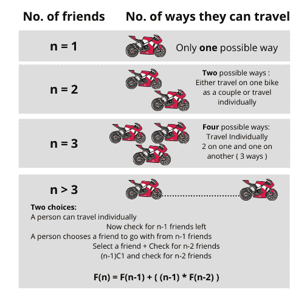

# 用 Python 解决朋友旅行问题[谷歌面试问题]

> 原文：<https://www.askpython.com/python/examples/friends-travel-problem>

在本教程中，我们将了解一个非常有趣的问题，称为**朋友旅行问题**。我们先来了解一下，在这个问题上，我们想达到什么目的？

* * *

## 朋友-旅行问题解释

让我们假设 n 个朋友想去参加一个聚会，他们可以单独旅行，也可以结伴同行。我们假设对于 n 个朋友，有 n 辆摩托车可用。

我们需要计算 n 个朋友可以去参加聚会的方式，可以是单独去，也可以是两人一组去。

* * *

## 朋友旅行问题的解决方案

人们可以使用循环和 if-else 条件手工编写简单的方法，也可以使用更快的方法，即**递归**方法。如果你想知道更多关于递归的知识，请阅读下面提到的教程。

***了解更多关于递归的知识:[Python 中的递归](https://www.askpython.com/python/python-recursion-function)***

为了解决一个更大的问题，你需要把一个更大的问题分解成更小的问题。但在此之前，我们先来看看 **n** ( 1，2，3)的较低值。

对于 n = 1 和 n = 2，分别只有一种和两种可能的方式。对于 n = 3，我们有四种可能的情况。怎么会？

对于 n 的每一个值，一个朋友有两种选择，要么这个朋友可以独自旅行，我们可以检查 n-1 个朋友。

或者朋友可以从 n-1 个朋友中选择一个朋友一起旅行，然后我们检查 n-2 个朋友。



Recursive Solution Friends Bike Problem

* * *

## 朋友自行车问题的代码实现

通过递归，代码实现非常简单。只要确保你已经理解了前面解释的解决方案。

```
def count_no_ways(n):
    if(n<3):
        return n
    return (count_no_ways(n-1)) + ((n-1) * count_no_ways(n-2))

n = int(input("Enter the number of friends: "))
print(count_no_ways(n))

```

* * *

希望问题、解决方案、代码实现对你来说已经很清楚了。感谢您阅读教程！

快乐学习！😇

* * *