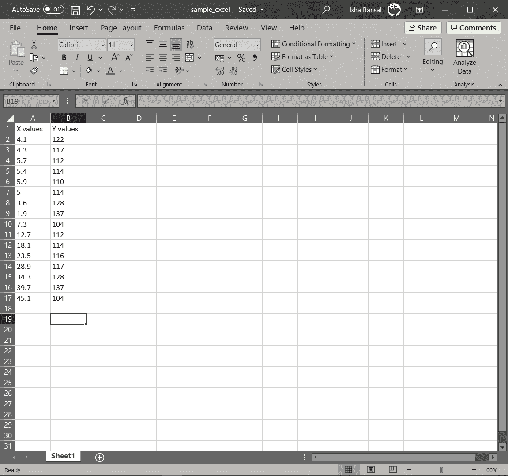
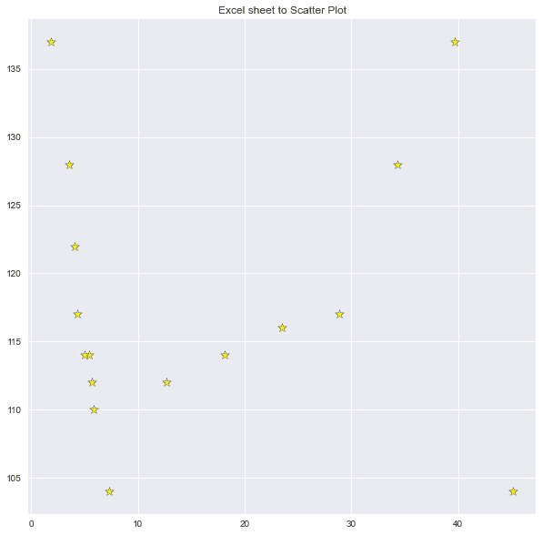

# 使用 Python 绘制 Excel 表格中的数据

> 原文：<https://www.askpython.com/python/examples/plot-data-from-excel-sheet>

在本教程中，我们将学习机器学习和数据科学领域的一个基本要求。绘制数据有助于可视化数据，并有助于更好地理解数据点。

## 使用 Python 从 Excel 表绘制数据的步骤

今天我们将在 Python 编程中的 [pandas](https://www.askpython.com/python-modules/pandas/python-pandas-module-tutorial) 和 [matplotlib](https://www.askpython.com/python-modules/matplotlib/python-matplotlib) 模块的帮助下，利用 excel 表格绘制数据。所以让我们开始吧！

### 步骤 1:导入模块

我们将导入 matplotlib 和 pandas 模块，其中 matplotlib 模块用于绘图，pandas 用于处理 excel 文件数据点。

在导入模块之前，我们需要确保模块已经安装在我们的系统中，这可以使用 CMD(命令提示符)上的以下命令来完成。

```
pip install pandas
pip install matplotlib

```

现在，我们将使用下面的代码行在程序中导入这两个模块。

```
import pandas as pd
import matplotlib.pyplot as plt

```

### 步骤 2:加载数据集

为了加载数据，我们将使用 pandas 模块中的`read_excel`函数，该函数将 excel 文件的路径作为参数。

对于本教程，我们创建了一个包含一些样本数据点的样本 excel 表，如下图所示。



Sample Excel Sheet Data Chosen

现在，数据的加载是在下面提到的代码语句的帮助下完成的。

```
var = pd.read_excel("sample_excel.xlsx")
print(var)

```

### 步骤 3:分离 x 和 y 值

现在，在数据集中，我们有两列，一列用于 x 数据点，另一列用于 y 数据点。这是在将第一列和第二列分成单独的变量之后完成的。

```
x = list(var['X values'])
y = list(var['Y values'])

```

在 x 和 y 坐标分离后，我们将在下一步中为数据绘制散点图。

### 步骤 4:绘制散点图

散点图是在下述代码块的帮助下显示的。

```
plt.figure(figsize=(10,10))
plt.style.use('seaborn')
plt.scatter(x,y,marker="*",s=100,edgecolors="black",c="yellow")
plt.title("Excel sheet to Scatter Plot")
plt.show()

```



Final Plot Excel Data

您可以尝试不同的数据集或在线搜索 excel 格式的随机数据集。我希望你彻底理解了这个概念，并且能够自己实现它！

感谢您的阅读！快乐学习！