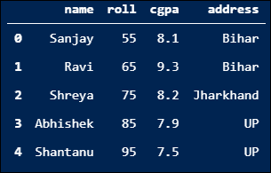

# 如何给熊猫数据框添加一个新列？

> 原文：<https://www.askpython.com/python-modules/pandas/add-new-column-to-dataframe>

在本教程中，我们将讨论向 pandas 数据框添加新列的不同方法。

* * *

## **什么是熊猫数据框？**

**[Pandas data frame](https://www.askpython.com/python-modules/pandas/conditionally-grouping-values)** 是一种二维异构数据结构，以表格形式存储数据，并带有标记索引，即行和列。

通常，当我们必须处理大型数据集时，会使用数据框，然后我们可以通过将该大型数据集加载到 pandas 数据框中来查看其摘要，并查看数据框的摘要。

在现实场景中，熊猫数据框是通过从现有的 CSV 文件、Excel 文件等加载数据集来创建的。

但是也可以从[列表](https://www.askpython.com/python/difference-between-python-list-vs-array)、[字典](https://www.askpython.com/python/dictionary/python-dictionary-dict-tutorial)、列表列表、字典列表、n 数组/列表字典等创建 pandas 数据帧。在我们开始讨论如何向现有数据框添加新列之前，我们需要一个 pandas 数据框。

## **安装和导入熊猫**

我们需要 Python 的**熊猫**库来处理数据帧，所以我们必须首先安装[熊猫库](https://www.askpython.com/python-modules/pandas/python-pandas-module-tutorial)，然后将其导入 Python 程序。以下是安装和导入 pandas 的命令:

```
# Installing pandas Python library
pip install pandas

```

```
# Importing pandas into the program
import pandas as pd

```

在我们开始讨论如何向现有的 pandas 数据框添加新列之前，我们需要一个 pandas 数据框。

## **从列表字典创建数据框**

```
# Creating a dictionary of lists
data = {'name': ['Sanjay', 'Ravi', 'Shreya', 'Abhishek', 'Shantanu'],
'roll': [55, 65, 75, 85, 95]}

# Creating a pandas data frame from the above data
df = pd.DataFrame(data)
print(df)

```

**输出:**


现在，让我们讨论向我们刚刚创建的现有数据框添加新列的不同方法。向现有数据框中添加新列有多种方法，但这里我们将只讨论三种主要的可靠且强大的方法。

## **使用数据帧索引添加新列**

这是向现有 pandas 数据框添加新列的最简单方法，我们只需用新列的名称对现有数据框进行索引，并为相应的行分配一个要存储在列中的值列表:

```
# Adding a new column named 'cgpa' to the data frame
# Using DataFrame indexing
df['cgpa'] = [8.1, 9.3, 8.2, 7.9, 7.5]
print(df)

```

**输出:**


## **使用 assign()** 向 pandas 数据框添加新列

这是使用 pandas 内置的`assign()`方法向现有数据框添加新列的第二种健壮方法。这将向现有数据框添加一个新列，然后返回一个包含添加列的新数据框。让我们看看使用它的 Python 代码:

```
# Adding a new column named 'address' to the data frame
# Using the assign() method
# And saving the new returned data frame
df2 = df.assign(address = ['Bihar', 'Bihar', 'Jharkhand', 'UP', 'UP'])
print(df2)

```

**输出:**



## **使用 insert()方法添加新列**

这是向现有数据框添加新列的第三种有效方式。与以前向数据框添加列的方法不同，以前的方法只是将新列作为最后一列添加到数据框的末尾，而`insert()`方法允许我们在现有数据框中的任何指定位置添加新列。让我们看看使用它的 Python 代码:

```
# Adding a column named 'branch'to the data frame
# Using the insert() method
# First argument is the column position
# Second argument is the column name
# And third argument is the column value
df2.insert(3, 'branch', ['ECE', 'CSE', 'ECE', 'EE', 'ECE'])
print(df2)

```

**输出:**


在输出中，可以清楚地看到名为 ***分支*** 的新列被添加到 Python 代码中指定的第三列索引处。

## **结论**

因此，在本教程中，我们学习了什么是 pandas 数据框架，如何从列表字典创建新的数据框架，以及向现有数据框架添加新列的三种可靠方法:`DataFrame`索引、`assign()`方法和`insert()`方法。