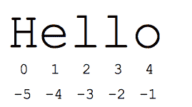

# Python 中的字符串–完整参考

> 原文：<https://www.askpython.com/python/string/strings-in-python>

Python 中的字符串是广泛使用的数据类型之一，它是通过用引号将字符括起来而创建的。例如:

```
string1 = "Hello"
string2 = "welcome"

```

字符串用单引号或双引号括起来。这两者都被解释器认为是字符串。

Python 不支持“字符”数据类型，但支持长度为 1 的字符串。例如:

```
var char1 = "H"

```

## 如何用 Python 创建字符串？

在 Python 中有 3 种不同的方法可以用来创建字符串[对象。](https://www.askpython.com/python/oops/python-classes-objects)

### 1.使用单引号

字符串可以通过用单引号将字符括起来来创建。
例如:

```
var example = 'Welcome to the tutorial!'

```

### 2.使用双引号

字符串通常是通过用双引号括住字符来创建的。
例如:

```
var example = "Welcome to the tutorial!"

```

### 3.使用三重引号

可以使用三重引号创建字符串。通过三重引号，字符串可以由三个单引号或三个双引号组成。它允许用户声明多行字符串。

此外，三重引号习惯于[注释掉](https://www.askpython.com/python/python-comments)在执行代码时被解释器忽略的代码段。

```
var example = '''Welcome to the tutorial!'''

var example2 = """Welcome to the tutorial"""

# multi-line comment
''' This is the comment section.
The interpreter will ignore this section'''

```

## 在 Python 中访问和操作字符串



Indexes In String

虽然我们现在知道了制作字符串的方法，但是我们还必须了解如何访问和使用字符串来满足我们的编程需求。让我们了解一下如何访问字符串索引的基本原理。

在 Python 中，字符串的字符可以通过索引来访问。所需字符的位置在方括号中指定，其中索引 0 标记字符串的第一个字符(如上图所示):

```
var1 = 'Hello World!'
print("var1[0]: ", var1[0])

```

上述代码的输出是:

```
var1[0]:  H

```

索引允许负地址引用访问字符串末尾的字符，例如-1 表示最后一个字符，-5 表示倒数第五个字符，依此类推。

**例如:**

```
var1 = 'Hello World'
print("var1[-1]: ", var1[-1])
print("var1[-5]: ", var1[-5])

```

**上面代码的输出是:**

```
var1[-1]: d
var1[-1]: W

```

而访问超出范围的索引将导致 **IndexError** 。下面的例子可以说明这一点:

```
var1 = 'Hello'
print(var1[5])  # gives error

```

**注意:**只允许整数作为索引传递。
任何其他数据类型都会导致**类型错误**。

### 1.Python 字符串切片

要访问字符串中的某个范围的字符，可以使用切片操作符(冒号)对字符串进行切片。

```
Str1 = "AskPython Strings Tutorial"
print(Str1[10:20]) 

print("\nSlicing characters from 3rd to 5th character: ") 
print(String1[3:5]) 

```

代码的输出如下所示:

```
Strings Tu

Slicing characters from 3rd to 5th character: 
Py

```

如果你有兴趣进一步了解细节，我们有一篇关于 Python [字符串切片](https://www.askpython.com/python/string/slice-strings-in-python)的综合文章。

### 2.串并置

使用“+”运算符将字符串[连接起来](https://www.askpython.com/python/string/string-concatenation-in-python)。下图显示了相同的情况:

```
var1 = "Hi,"
var2 = "Good Morning!"
var3 = var1 + var2
print(var3)

```

上述代码片段的输出如下所示:

```
Hi,Good Morning!

```

### 3.在 Python 中更新字符串

字符串是不可变的，因此更新或删除字符是不可能的。这可能会导致错误，因为不支持项分配(更新的情况)或从字符串中删除项。

```
String1 = "Hello"

# Updating character 
String1[2] = 'p'
print("\nUpdating character at 2nd Index: ") 
print(String1) 

```

上述代码片段的输出如下:

```
Traceback (most recent call last):
File “/Desktop/trial.py”, line 4, in
String1[2] = ‘p’
TypeError: ‘str’ object does not support item assignment

```

但是，使用内置的 del 关键字删除整个字符串是可行的。

```
String1 = "hello"
del(String1)

```

字符串也可以更新，如下所示:

```
# Updating entire string
String1 = "Hello"
print(String1)     # prints Hello

String1 = "Welcome"
print(String1)     # prints Welcome

# concatenation and slicing to update string
var1 = 'Hello World!'
print ("Updated String :- ", var1[:6] + 'Python')
# prints Hello Python!

```

### 4.重复字符串

可以使用星号(*)运算符重复字符串，如下所示:

```
var1 = "hello"
print(var1*2)    

```

上面代码的输出是它打印字符串两次。

```
hello hello

```

### 5.用 Python 格式化字符串

**方法 1:使用格式化操作符**

字符串[格式操作符](https://www.askpython.com/python/string/python-f-string) %是字符串特有的，其行为类似于 C 的 printf()系列格式选项。

```
print("%s has Rs %d with her" % ('Aisha', 100))

```

上述代码的输出是:

```
Aisha has Rs 100 with her

```

**方法 2:使用 format()方法**
字符串的 format()方法包含花括号{}作为占位符，它可以根据位置或关键字保存参数以指定顺序。

```
Str1 = "{} {}".format('Hi, It is', '2020')
print(Str1)

```

上述代码片段的输出如下所示:

```
Hi, It is 2020

```

Python 中的 [format()方法可用于格式化整数，允许从十进制格式转换为二进制、八进制和十六进制格式。](https://www.askpython.com/python/string/python-format-function)

```
num = int(input())
ar1 = "{0:b}".format(num) 
print("\nBinary representation of ",num," is ", ar1)

```

## 结论

这就把我们带到了教程的结尾。我希望您对字符串及其功能有非常扎实的理解。我们涵盖了许多关于 [Python 的文章，并在这里展示了一些真正有趣的](https://www.askpython.com/python/oops) [Python 编程示例](https://www.askpython.com/python/examples)。

## 参考

[https://docs.python.org/2/library/string.html](https://docs.python.org/2/library/string.html)