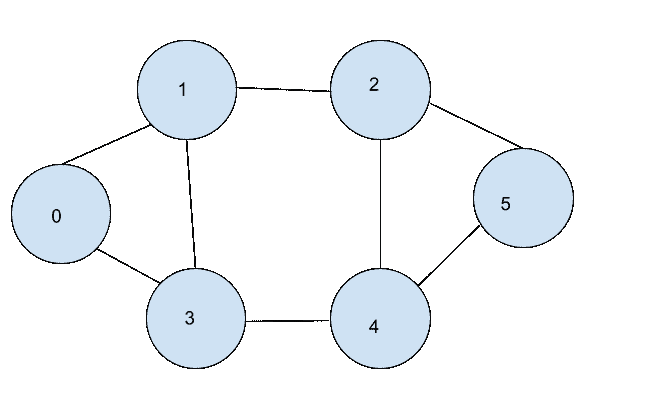

# 图中的广度优先搜索

> 原文：<https://www.askpython.com/python/examples/breadth-first-search-graph>

广度优先搜索是一种遍历技术，在这种技术中，我们遍历一个图，并恰好打印一次顶点。在本文中，我们将研究并实现 python 中遍历图的广度优先搜索。

## 什么是广度优先搜索算法？

在广度优先搜索中，我们从任意单个顶点开始，遍历图的每个[顶点恰好一次。对于每个选中的顶点，我们首先打印该顶点，然后打印它的所有邻居。这个过程一直持续到遍历完所有顶点。当使用广度优先搜索遍历图形时，看起来我们是从所选的顶点开始分层移动的。](https://www.askpython.com/python/examples/graph-operations)

从下面的例子可以清楚地理解这一点。



Graph Implementation In Python- Askpython

如果我们以广度优先的方式从 0 开始访问上图，我们将按照 0 –> 1 –> 3 –> 2 –> 4 –> 5 的顺序处理顶点。也可能有替代遍历。如果我们在 1 之前处理 3，而我们在 0，那么图的 BFS 遍历将看起来像:0 –> 3 –> 1 –> 4 –> 2 –> 5。

## Python 中图的广度优先搜索算法

由于我们对广度优先搜索有了一个大致的概念，现在我们将阐述图的 BFS 遍历的算法。这里，我们将假设图的所有顶点都可以从起始顶点到达。

***也读作:[用 Python 实现一个图形](https://www.askpython.com/python/examples/graph-in-python)***

假设已经给了我们一个邻接表表示的图和一个起始顶点，我们必须遍历这个图。

我们将首先打印起始顶点的值，然后我们将打印起始顶点的邻居的值，在完成当前级别后，我们将继续下一个级别，直到图形的所有顶点都被打印出来。

因此，我们的任务是打印当前级别的顶点，从第一个顶点开始，直到每个顶点都被遍历。为了实现这个概念，我们将使用先进先出技术，即队列来处理图形。

此外，我们将使用一个访问过的顶点列表来检查顶点是否在过去被遍历过，这样就不会有顶点被打印两次。

我们将打印一个顶点，将其添加到已访问的顶点列表中，并将其邻居放入队列中。我们将从队列中逐个取出顶点，打印后添加到已访问列表中，然后将它们的邻居放入队列中。下面是描述整个过程的图的广度优先搜索遍历算法。

```
Algorithm BFS:
Input: Graph(Adjacency list) and Source vertex
Output: BFS traversal of graph
Start:
    1.Create an empty queue Q.
    2.Create an empty set to keep record of visited vertices.
    3.Insert source vertex into the Q and Mark the source as visited.
    4.If Q is empty, return. Else goto 5.
    5.Take out a vertex v from Q.
    6.Print the Vertex.
    7.Insert all the vertices in the adjacency list of v which are not in visited list into Q and mark them visited.
    8.Goto 4.
Stop.

```

## Python 中图的广度优先搜索遍历

现在我们已经熟悉了概念和算法，我们将实现图的广度优先搜索算法，然后我们将执行上图中给出的图的算法。

```
from queue import Queue

graph = {0: [1, 3], 1: [0, 2, 3], 2: [4, 1, 5], 3: [4, 0, 1], 4: [2, 3, 5], 5: [4, 2], 6: []}
print("The adjacency List representing the graph is:")
print(graph)

def bfs(graph, source):
    Q = Queue()
    visited_vertices = set()
    Q.put(source)
    visited_vertices.update({0})
    while not Q.empty():
        vertex = Q.get()
        print(vertex, end="-->")
        for u in graph[vertex]:
            if u not in visited_vertices:
                Q.put(u)
                visited_vertices.update({u})

print("BFS traversal of graph with source 0 is:")
bfs(graph, 0)

```

输出:

```
The adjacency List representing the graph is:
{0: [1, 3], 1: [0, 2, 3], 2: [4, 1, 5], 3: [4, 0, 1], 4: [2, 3, 5], 5: [4, 2], 6: []}
BFS traversal of graph with source 0 is:
0-->1-->3-->2-->4-->5-->

```

如果你还不能理解代码的执行，这里有一个修改的 BFS 算法解释每一步。

```
from queue import Queue

graph = {0: [1, 3], 1: [0, 2, 3], 2: [4, 1, 5], 3: [4, 0, 1], 4: [2, 3, 5], 5: [4, 2], 6: []}
print("The adjacency List representing the graph is:")
print(graph)

def bfs_explanation(graph, source):
    Q = Queue()
    visited_vertices = set()
    Q.put(source)
    visited_vertices.update({0})
    while not Q.empty():
        vertex = Q.get()
        print("Processing {} after taking out from Q".format(vertex))
        for u in graph[vertex]:
            if u not in visited_vertices:
                print("At {}, adding {} to Q".format(vertex, u))
                Q.put(u)
                visited_vertices.update({u})
        print("visited vertices are: ", visited_vertices)

print("Explanation of BFS traversal of graph with source 0 is:")
bfs_explanation(graph, 0)

```

输出:

```
The adjacency List representing the graph is:
{0: [1, 3], 1: [0, 2, 3], 2: [4, 1, 5], 3: [4, 0, 1], 4: [2, 3, 5], 5: [4, 2], 6: []}
Explanation of BFS traversal of graph with source 0 is:
Processing 0 after taking out from Q
At 0, adding 1 to Q
At 0, adding 3 to Q
visited vertices are:  {0, 1, 3}
Processing 1 after taking out from Q
At 1, adding 2 to Q
visited vertices are:  {0, 1, 2, 3}
Processing 3 after taking out from Q
At 3, adding 4 to Q
visited vertices are:  {0, 1, 2, 3, 4}
Processing 2 after taking out from Q
At 2, adding 5 to Q
visited vertices are:  {0, 1, 2, 3, 4, 5}
Processing 4 after taking out from Q
visited vertices are:  {0, 1, 2, 3, 4, 5}
Processing 5 after taking out from Q
visited vertices are:  {0, 1, 2, 3, 4, 5}

```

## 结论

在本文中，我们看到了图的广度优先搜索遍历算法背后的基本概念，设计了它的算法，然后用 python 实现了它。我们还看到了 Python 中算法的逐步执行。请继续关注更多内容丰富的文章。