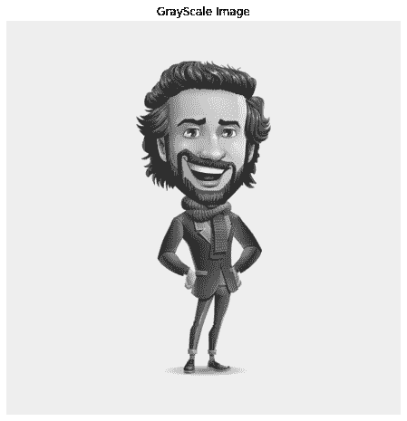
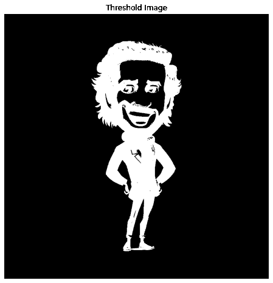
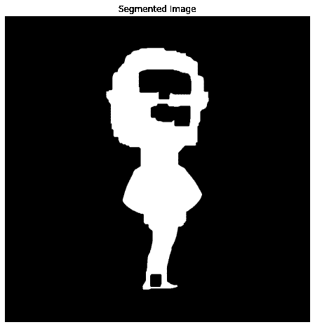
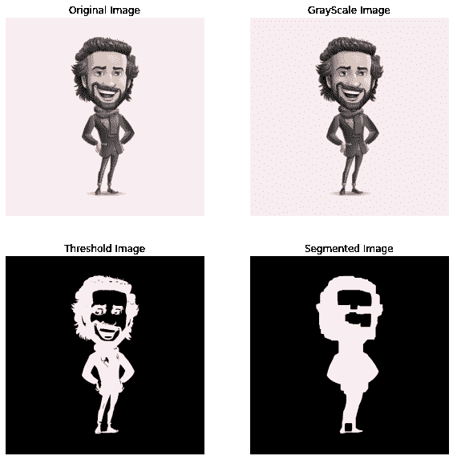

# Python:图像分割

> 原文：<https://www.askpython.com/python/examples/image-segmentation>

你好，各位程序员！今天在本教程中，我们将了解什么是图像分割，并在后面的章节中使用 Python 编程语言中的 OpenCV 实现相同的功能。

## 什么是图像分割？

图像分割意味着将一组相似的像素和图像的部分组合在一起，以便于对图像中的对象进行分类和归类。

## 为什么需要图像分割？

图像分割是图像处理系统中的一个重要阶段，因为它有助于提取我们感兴趣的对象，并使未来的建模变得容易。它有助于将所需的对象与不必要的对象分开。

## 图像分割的应用

图像分割在现实生活中有着广泛的应用。其中一些如下:

1.  交通管理系统
2.  癌症和其他医学问题检测
3.  卫星图像分析

## 图像分割实现

### 1.导入模块

图像分割实现和图像绘制所需的所有必要模块都被导入到程序中。

```
import numpy as np
import cv2
from matplotlib import pyplot as plt

```

### 2.正在加载原始图像

下一步是使用下面的代码加载原始图像(存储在与代码文件相同的目录中)。输出也显示在代码的正下方。

```
img = cv2.imread('image1.jpg')
img=cv2.cvtColor(img,cv2.COLOR_BGR2RGB)
plt.figure(figsize=(8,8))
plt.imshow(img,cmap="gray")
plt.axis('off')
plt.title("Original Image")
plt.show()

```


Original Img Segmentation

### 3.转换为灰度

为了使未来的图像处理不那么复杂和简单，我们将使用下面提到的代码将上一步加载的图像转换为灰度图像。输出图像也显示在代码下方。

```
gray = cv2.cvtColor(img, cv2.COLOR_BGR2GRAY)
plt.figure(figsize=(8,8))
plt.imshow(gray,cmap="gray")
plt.axis('off')
plt.title("GrayScale Image")
plt.show()

```



Grayscale Img Segmentation

### 4.转换为二进制反转图像

为了更详细地研究图像，并对图像进行非常精确的研究，我们将使用下面提到的代码将图像转换为二进制反转图像。输出也与代码一起显示。

```
ret, thresh = cv2.threshold(gray, 0, 255,cv2.THRESH_BINARY_INV +cv2.THRESH_OTSU)
plt.figure(figsize=(8,8))
plt.imshow(thresh,cmap="gray")
plt.axis('off')
plt.title("Threshold Image")
plt.show()

```



Threshold Img Segmentation

### 5.分割图像

现在最后一步是在下面提到的代码的帮助下得到分割的图像。我们将在某处或其他地方使用所有以前的图像，以尽可能获得最准确的分割图像。

```
kernel = np.ones((3, 3), np.uint8)
closing = cv2.morphologyEx(thresh, cv2.MORPH_CLOSE,kernel, iterations = 15)
bg = cv2.dilate(closing, kernel, iterations = 1)
dist_transform = cv2.distanceTransform(closing, cv2.DIST_L2, 0)
ret, fg = cv2.threshold(dist_transform, 0.02*dist_transform.max(), 255, 0)
cv2.imshow('image', fg)
plt.figure(figsize=(8,8))
plt.imshow(fg,cmap="gray")
plt.axis('off')
plt.title("Segmented Image")
plt.show()

```



Segmented Img Segmentation

## 最终输出

在所有的处理完成并且图像被分割之后，让我们借助于支线剧情在一帧中绘制所有的结果。下面提到了相同的代码。

```
plt.figure(figsize=(10,10))

plt.subplot(2,2,1)
plt.axis('off')
plt.title("Original Image")
plt.imshow(img,cmap="gray")

plt.subplot(2,2,2)
plt.imshow(gray,cmap="gray")
plt.axis('off')
plt.title("GrayScale Image")

plt.subplot(2,2,3)
plt.imshow(thresh,cmap="gray")
plt.axis('off')
plt.title("Threshold Image")

plt.subplot(2,2,4)
plt.imshow(fg,cmap="gray")
plt.axis('off')
plt.title("Segmented Image")

plt.show()

```

最终结果如下。



Segmentation Output1

对另一幅图像测试了相同的算法，结果如下。你可以看到结果相当令人满意。


Segmentation Output2

## 结论

今天我们学习了图像分割，现在你知道如何自己实现它了。自己尝试各种图像。编码快乐！

感谢您的阅读！