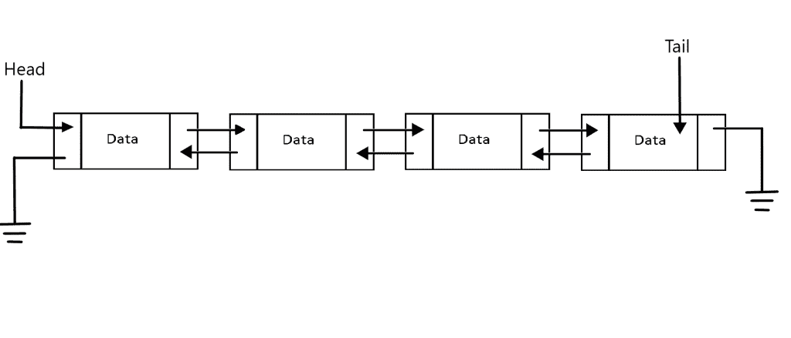
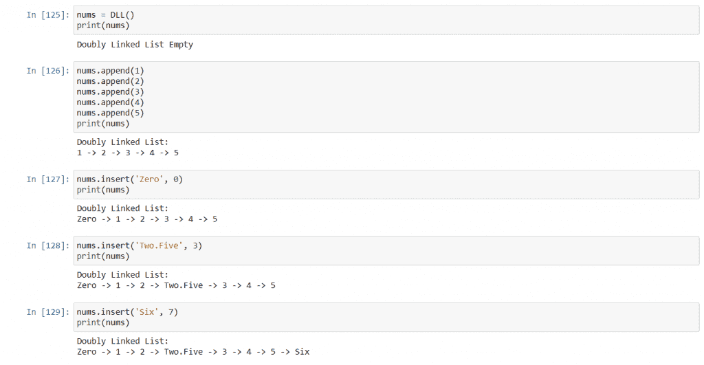
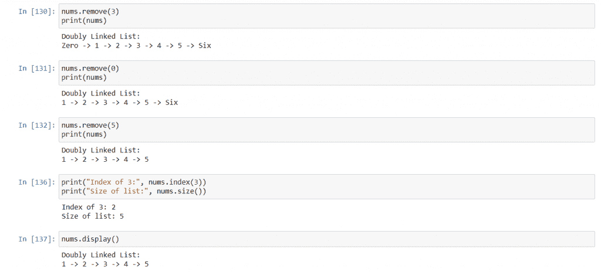

# Python 中的双向链表——变得简单

> 原文：<https://www.askpython.com/python/examples/doubly-linked-list>

双向链表是一种用于存储列表的数据结构。它非常类似于链表，但是有一些额外的特性。在本教程中，我们将讨论什么是双向链表，我们将在 python 中实现它，并查看它的输出。

## 先决条件:链表

在我们继续讨论双向链表之前，我们需要讨论什么是[链表](https://www.askpython.com/python/examples/linked-lists-in-python)。

顾名思义，链表是一种列表，其中的列表项以特定的方式链接到其他列表项。在不同类型的链表中，项目链接的确切方式是不同的。

最常见的链表是“单向链表”，或者简称为“链表”，在这种情况下，每一项都链接到列表中的下一项。因此，要访问第 10 项，我们需要首先访问第 9 项，因为它链接到第 10 项。一旦我们访问第 10 项，它将允许我们通过第 10 项拥有的链接访问第 11 项。

链表中的每一项称为一个节点。在单链表中，每个节点有两部分。第一部分存储该节点的数据，第二部分存储到下一个节点的链接。

现在让我们看看双向链表。

## 什么是双向链表？

双向链表也是一种通过链接来连接节点的链表，但是在这种情况下，每个节点都链接到前一个项目以及下一个项目。因此，一旦我们访问了第 10 个节点，我们就可以访问第 9 个节点和第 11 个节点，要访问特定的节点，我们需要访问它之前的节点或之后的节点。

我们这样做的方法是每个节点有三个部分。第一部分是要存储的实际数据，第二部分是到列表中上一个节点的链接，第三部分是到列表中下一个节点的链接。

拥有两个链接的好处是，它使得像追加和删除这样的操作比单链表更容易和更快。

为了形象化，双向链表看起来像这样:



Doubly Linked List Representation

在上面的例子中，你可以看到链表中有四个条目/节点。每个节点都有一些数据或内容，并且每个节点都指向/链接到列表的下一个和上一个节点。第一个节点的上一个链接和最后一个节点的下一个链接不指向任何东西，所以它们存储`None`(在 python 的情况下)。

首先，列表头指向列表中的第一个节点，列表尾指向列表中的最后一个节点。因此可以通过它们直接访问第一个和最后一个节点。为了到达其他节点，我们或者穿过头部或者尾部，然后随后分别访问下一个或者前一个节点，直到我们到达目标。

## 在 Python 中实现双向链表

创建双向链表非常简单。我们必须创建两个类，一个类用于节点，另一个类将使用第一个类创建的节点创建链表。

### 1.类别:节点

对于节点类，我们在类中只有三个成员。一个存储数据，一个存储下一个节点，一个存储上一个节点。

该类的定义如下所示:

```
class Node:
    def __init__(self, data = None):
        self.data = data
        self.next = None
        self.previous = None

```

在这里，最初，节点不指向任何其他节点，它可能有也可能没有数据，这取决于它是如何创建的。

### 2。类:双向链表

这个类将包含比节点类更多的内容。它将包含头节点、尾节点、列表中的项数，以及许多必要的方法，如插入新节点、删除现有节点、搜索现有节点和打印列表的方法。

这个类看起来会像这样:

```
class DLL:
    def __init__(self):
        self.head = None
        self.tail = None
        self.count = 0

    def __repr__(self):
        string = ""

        if(self.head == None):
            string += "Doubly Linked List Empty"
            return string

        string += f"Doubly Linked List:\n{self.head.data}"        
        start = self.head.next
        while(start != None):
            string += f" -> {start.data}"
            start = start.next
        return string

    def append(self, data):
        if self.head == None:
            self.head = Node(data)
            self.tail = self.head
            self.count += 1
            return

        self.tail.next = Node(data)
        self.tail.next.previous = self.tail
        self.tail = self.tail.next
        self.count += 1

    def insert(self, data, index):
        if (index > self.count) | (index < 0):
            raise ValueError(f"Index out of range: {index}, size: {self.count}")

        if(index == self.count):
            self.append(data)
            return

        if(index == 0):
            self.head.previous = Node(data)
            self.head.previous.next = self.head
            self.head = self.head.previous
            self.count += 1
            return

        start = self.head
        for _ in range(index):
            start = start.next
        start.previous.next = Node(data)
        start.previous.next.previous = start.previous
        start.previous.next.next = start
        start.previous = start.previous.next
        self.count += 1
        return

    def remove(self, index):
        if (index >= self.count) | (index < 0):
            raise ValueError(f"Index out of range: {index}, size: {self.count}")

        if index == 0:
            self.head = self.head.next
            self.head.previous = None
            self.count -= 1
            return

        if index == (self.count - 1):
            self.tail = self.tail.previous
            self.tail.next = None
            self.count -= 1
            return

        start = self.head
        for i in range(index):
            start = start.next
        start.previous.next, start.next.previous = start.next, start.previous
        self.count -= 1
        return

    def index(self, data):
        start = self.head
        for i in range(self.count):
            if(start.data == data):
                return i
            start = start.next
        return None

    def size(self):
        return self.count

    def display(self):
        print(self)

```

上面的类有很多成员，让我们一个一个讨论。

### 3。`__init__`法

在构造函数中，我们声明了三个变量。`head`和`tail`用`None`初始化，这意味着开始时列表中没有变量，所以`count`也用`0`初始化。

### 4。`__repr__`法

__repr__ 方法将返回打印链表的字符串。所以要么这个列表是空的，在这种情况下我们打印它，要么这个列表不是空的，所以我们逐个打印每个节点中的数据。

### 5。`append`和`insert`方法

在这个实现中，我们可以在指定的位置追加或插入节点。为了追加，我们将检查列表是否为空，如果是，那么`head`和`tail`可以指向新的节点。否则，我们将使最后一个节点的`next`指向新节点，然后使新节点的`previous`指向最后一个节点，最后，使`tail`指向新节点。

要在指定的位置插入，如果位置在末尾，那么我们只追加节点，否则，如果位置在开头，那么我们让第一个节点的`previous`指向新节点，然后让新节点的`next`指向第一个节点，最后，我们让`head`指向新节点。

如果指定的位置在中间，那么我们首先到达那个位置，使那个位置之前的节点的`next`指向新节点，然后使新节点的`previous`指向那个位置之前的节点，然后使新节点的`next`指向那个位置的节点，最后，我们使那个位置的节点的`previous`指向新节点。

我们还检查给定的索引是否有效，如果无效，我们可以引发一个`ValueError`。此外，我们在每次成功的插入操作后增加`count`。

### ⑥。`remove`法

要移除一个项目，我们必须指定要从哪里移除该项目。如果指定的索引超出范围，我们就抛出一个`ValueError`。如果索引为 0，我们将删除第一项，为此，我们让`head`指向第二个节点。如果`head`为空，意味着列表现在为空，如果不是，那么我们必须创建新的`head`的`previous`商店`None`。

类似地，如果索引比列表的大小小 1，这意味着我们必须删除最后一项，所以我们让`tail`指向倒数第二个节点，然后让新的`tail`的`next`存储`None`。

如果索引在中间某处，我们先到达那个位置，然后让那个位置之前的节点的`next`指向那个位置之后的节点，最后让那个位置之后的节点的`previous`指向那个位置之前的节点。

在移除过程中，我们只是使节点从列表中不可访问，而将它从内存中移除的实际过程留给了 Python 的垃圾收集模块。

### 7。`index`、`size`和`display`方法。

`index`方法用于搜索列表中的项目，我们根据列表大小遍历整个列表，如果找到目标就返回索引。如果没有，我们返回`None`。

`size`方法返回该类的`count`成员的值，该成员存储列表中的项目数。

而`display`方法打印对象，对象调用`__repr__`方法，返回的字符串被打印到屏幕上。

## 输出

在对该类执行多条语句后，输出如下:



Example illustrating initialization, append method, and insert method.



Example illustrating remove method, index method, size method, and display method.

## 结论

在本教程中，我们学习了双向链表，并用 Python 实现了它。我们从理解单向链表的工作开始，然后我们讨论了双向链表的不同之处。我们用 python 编写了数据结构的代码，并讨论了每个方法的工作原理，最后我们查看了代码的输出。

我希望你在学习中过得愉快，下次教程再见。