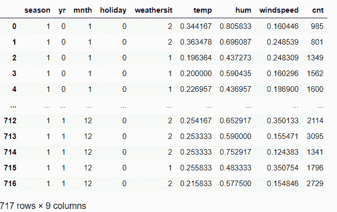

# 在 Python 中创建虚拟变量

> 原文：<https://www.askpython.com/python/examples/creating-dummy-variables>

读者朋友们，你们好！在本文中，我们将了解在 Python 中创建虚拟变量的**。**

所以，让我们开始吧！

* * *

## 首先，什么是哑变量？

让我试着通过下面的场景向您介绍数据建模的独特而重要的概念——虚拟变量。

考虑一个由连续数据和分类数据组成的数据集。当我们阅读《分类》这部作品时，我们首先想到的是数据中的类别或群体的存在。

通常情况下，变量代表生动/不同类型的类别。随着数据集大小的增加，并且很快模糊性开始增加，处理数据中的大量组并将其提供给模型成为一项繁琐而复杂的任务。

这时虚拟变量的概念就出现了。

**虚拟变量是一个数值变量，代表数据集分类变量的子类别或子组。**

简而言之，虚拟变量使我们能够区分数据的不同子组，也使我们能够使用数据进行回归分析。

请看下面的例子！

考虑包含 10-15 个数据变量的数据集，其中包含“**男性**”和“**女性**”的类别。

任务是了解哪个性别通常会选择“粉色”作为他们手机壳的颜色。现在，在这种情况下，我们可以使用虚拟变量，将 0 指定为男性，1 指定为女性。这反过来将有助于喂养模型更好地理解和清理所喂养的数据。

* * *

## 现在让我们用 Python 创建一个虚拟变量！

现在让我们从创建一个虚拟变量开始。我们使用了**自行车租赁数量预测**问题来分析和创建虚拟变量。

所以，让我们开始吧！

* * *

### 1.加载数据集

首先，我们需要将数据集加载到工作环境中，如下所示:

```
import pandas
BIKE = pandas.read_csv("Bike.csv")

```

**原始数据集:**



**Dataset-Bike Prediction**

### 2.创建要处理的原始数据集的副本。

为了确保原始数据集保持不变，我们创建了一个原始数据集的副本来处理和执行创建虚拟数据集的操作。

我们同样使用了`pandas.dataframe.copy()`功能。

```
bike = BIKE.copy()

```

### 3.将所有分类变量存储在一个列表中

现在让我们将数据集中的所有分类变量保存到一个列表中进行处理！

```
categorical_col_updated = ['season','yr','mnth','weathersit','holiday']

```

### 4.使用 get_dummies()方法创建变量的哑元

[Pandas 模块](https://www.askpython.com/python-modules/pandas/python-pandas-module-tutorial)为我们提供了`dataframe.get_dummies()`函数来创建分类数据的虚拟模型。

```
bike = pandas.get_dummies(bike, columns = categorical_col_updated) print(bike.columns)

```

我们已经将数据集和分类列值传递给函数来创建虚拟对象。

**输出:**

如下所示，为每个类别下的每个子组创建了一个虚拟或单独的列。

比如,“月”列将所有 12 个月作为类别。

因此，每个月都被视为一个子组，get_dummies()函数为每个列创建了一个单独的列。

```
Index(['temp', 'hum', 'windspeed', 'cnt', 'season_1', 'season_2', 'season_3',
       'season_4', 'yr_0', 'yr_1', 'mnth_1', 'mnth_2', 'mnth_3', 'mnth_4',
       'mnth_5', 'mnth_6', 'mnth_7', 'mnth_8', 'mnth_9', 'mnth_10', 'mnth_11',
       'mnth_12', 'weathersit_1', 'weathersit_2', 'weathersit_3', 'holiday_0',
       'holiday_1'],
      dtype='object')

```

**你可以在这里通过 get_dummies()函数[找到结果数据集。](https://github.com/Safa1615/BIKE-RENTAL-COUNT/blob/master/Bike.csv)**

* * *

## 结论

到此，我们就结束了这个话题。如果你遇到任何问题，欢迎在下面评论。

更多与 Python 相关的帖子，敬请关注，在此之前，祝你学习愉快！！🙂

* * *

## 参考

*   [在 Python 中创建虚拟变量— StackOverFlow](https://stackoverflow.com/questions/11587782/creating-dummy-variables-in-pandas-for-python)