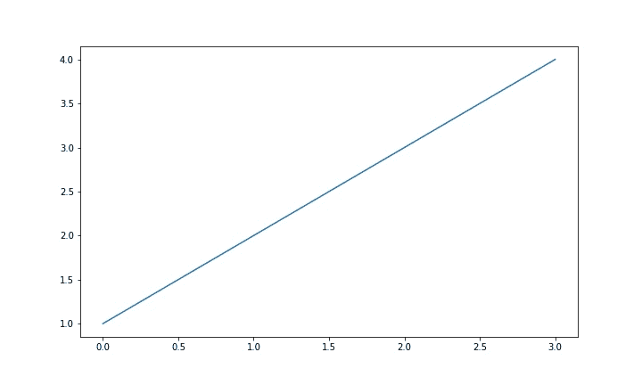
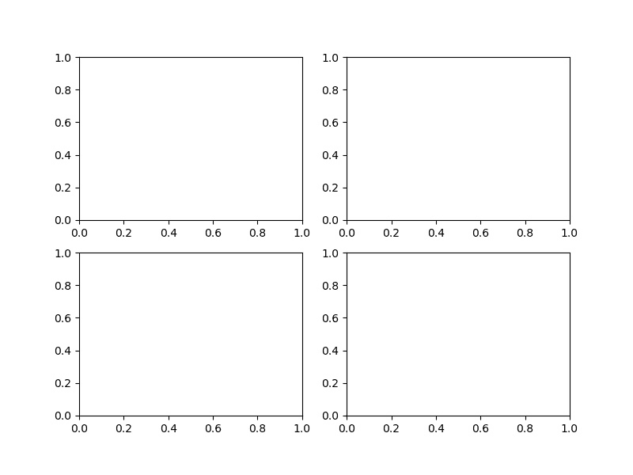
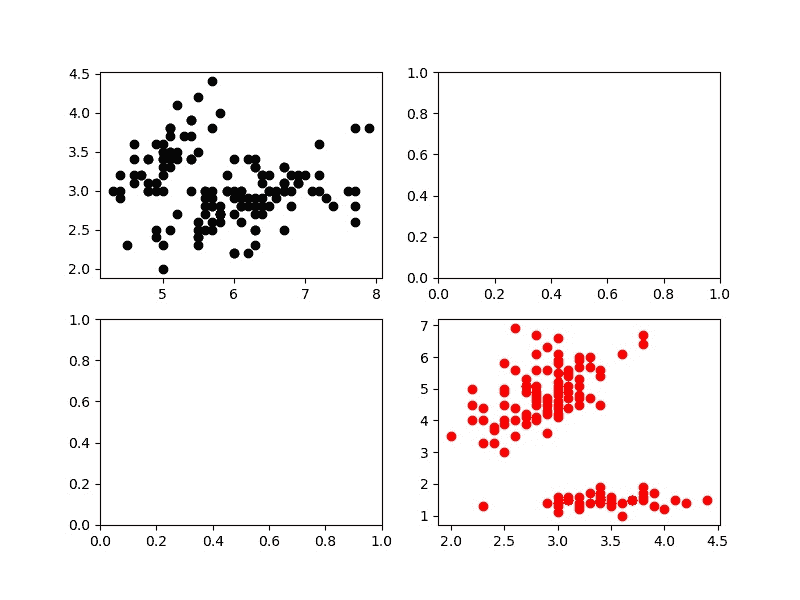
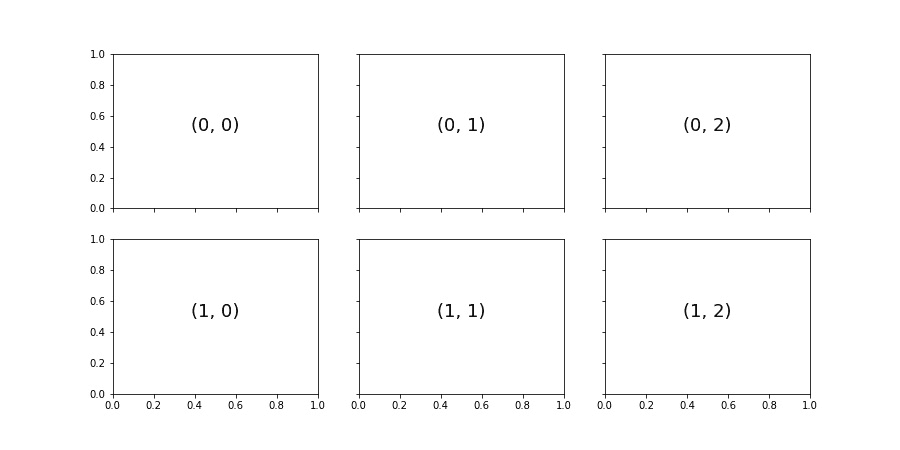
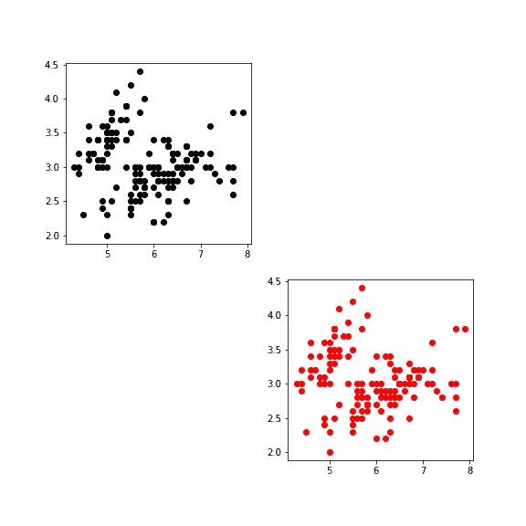

# Matplotlib 子图–使用 Matplotlib 绘制多个图形

> 原文:# t0]https://www . aspython . com/python-modules/matplot lib/matplot lib-subplot[

在本文中，我们将学习如何创建 Matplotlib 支线剧情。

在实践中，我们经常需要不止一个情节来形象化变量，这就是支线剧情出现的时候。 [Matplotlib](https://www.askpython.com/python-modules/matplotlib/python-matplotlib) subplot method 是一个方便的函数，用于在一个图形中创建多个图形。

## 使用 Matplotlib 创建基本绘图

在 Matplotlib 中创建绘图是一项简单的任务，只需一行代码和一些输入参数即可完成。下面的代码显示了如何用单个图形进行简单的绘图。

```
#Importing required libraries 
import matplotlib.pyplot as plt
import numpy as np

#Create data
data = np.arange(1,5,1)

#Plotting the data:
plt.plot(data)

```



Simple Plotting

`plt.plot()`显示输入数据的线图。

## **创建 Matplotlib 子情节**

现在考虑这样一种情况，我们需要多个图来解释我们的数据。例如，我们有一个以温度和降雨率为变量的数据集，我们需要将数据可视化。

我想到的一件事是将这两个变量绘制在一个图中，但温度(开尔文)的测量尺度与降雨率(毫米)的测量尺度不同。

在这里，我们需要一个单独的情节为两者，以便有视觉上的解释。Matplotlib 子情节是我们制作多个情节所需要的，我们将详细探讨这一点。

### 1.使用 subplots()方法

让我们对使用`matplotlib.subplots`有一些看法。

matplotlib subplots()方法需要一些行和一些列作为输入参数，它返回一个图形对象和轴对象。

可以使用简单的索引来访问每个轴对象。在选择了需要绘制的轴之后，绘制的过程将像我们在上面的代码中所做的那样遵循正常的过程。

让我们创建 4 个网格状的支线剧情。

```
#Importing required libraries
import matplotlib.pyplot as plt

# Creates fig and ax from subplots().
fig , ax = plt.subplots(nrows = 2, ncols = 2)

```



**4 Subplots**

### 2.访问支线剧情

访问单个轴非常简单。让我们在第一个和最后一个次要情节上做一些策划。

```
import matplotlib.pyplot as plt
from sklearn.datasets import load_iris

#Loading Dataset
data = load_iris()
df = data.data

fig , ax = plt.subplots(nrows = 2, ncols = 2, figsize=(8,6))

#Plotting on the 1st axes
ax[0][0].scatter(df[:,0],df[:,1] , color = 'black')

#Plotting on the last axes
ax[1][1].scatter(df[:,1],df[:,2] , color = 'red')

```



**Accessing 1st And 4th Subplots**

把每个轴想象成排列在 2D 数组中的一些对象，访问每个子情节类似于访问 2D 数组中的元素。

*   **ax[0][0]** 表示我们首先选择第一行(索引 0)和该行的第一个元素(索引 0)。
*   **ax[1][1]** 表示我们首先选择第二行(索引 1)和该行的第二个元素(索引 1)。

### 3.具有共享轴的 Matplotlib 子图

在许多应用中，我们需要支线图的轴相互对齐。matplotlib subplots()方法接受另外两个参数，即`sharex`和`sharey`，这样所有的 subplots 轴都具有相似的比例。

```
#Import required libraries
import matplotlib.pyplot as plt

#Plotting
fig, ax = plt.subplots(2, 3, sharex=True, sharey=True)
for i in range(0,2):
    for j in range(0,3):
        ax[i][j].text(0.5, 0.5, str((i,j)),fontsize=18, ha='center')

```



Subplots with Shared Axis

### 4.使用 add_subplot()方法

`add_subplot`是 Matplotlib `figure`对象的一个属性。每当我们想要一个接一个地给我们的人物添加支线剧情时，它就会被使用。

让我们用示例代码来演示这一点。

```
#Importing libraries
import matplotlib.pyplot as plt
from sklearn.datasets import load_iris

#Loading Data to plot
data = load_iris()
df = data.data

#Create a figure object
fig = plt.figure(figsize=(8,8))

#Adding one subplot to the figure
ax_1 = fig.add_subplot(2, 2, 1) #selecting 1st out of 4 subplots 
ax_1.scatter(df[:,0],df[:,1] , color = 'black')

#Adding one more subplot
ax_2 = fig.add_subplot(2,2,4)
ax_2.scatter(df[:,0],df[:,1] , color = 'red')

```



Adding Subplots One By One

在上面的代码中，figure 对象的`add_subplot`属性需要一些行和列作为输入参数，以及 subplot 的索引。

但是在这里，我们只需要传递一个类似数字的整数，而不是将支线剧情索引为 2D 数组。

在上面的代码中，将首先创建一个 2×2 的子图网格，并返回第一个子图轴对象，我们可以在其上绘制数据。

## 结论

在这篇文章中，我们看到了如何在一个图形中可视化多个情节的数据，使用`subplots`方法和多种方法来创建支线剧情。

快乐学习！