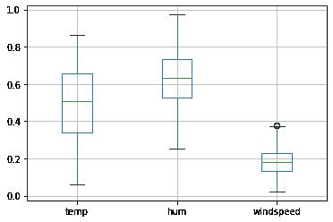

# Python 中异常值的检测和移除——一本易于理解的指南

> 原文：<https://www.askpython.com/python/examples/detection-removal-outliers-in-python>

读者朋友们，你们好！在我们的数据处理和分析系列中，今天我们将看看 Python 中的**异常值检测和移除**。

所以，让我们开始吧！

* * *

## Python 中有哪些离群值？

在深入探讨**离群值**的概念之前，让我们先了解一下原始数据的来源。

提供给系统的原始数据通常是通过调查和从网络上的实时操作中提取数据而生成的。这可能引起数据的变化，并且在记录数据时存在测量误差的可能性。

这是离群值出现的时候。

**离群值是远离数据集**的其余数据值的一个点或一组数据点。也就是说，它是出现在数据集中数据值总体分布之外的数据点。

异常值只可能出现在连续值中。因此，异常值的检测和移除仅适用于回归值。

基本上，离群值似乎偏离了数据元素的整体适当且结构良好的分布。可以认为是出现在远离类别或总体的**异常分布。**

理解了离群值的概念后，现在让我们在接下来的小节中关注删除离群值的需要。

* * *

## 为什么有必要从数据中删除异常值？

如上所述，异常值是远离通常数据分布的数据点，并对整体数据分布产生以下影响:

*   **影响数据的整体标准偏差。**
*   **处理数据的总体平均值。**
*   **将数据转换成倾斜形式。**
*   **导致机器学习模型的精度估计出现偏差。**
*   **影响数据集的分布和统计。**

由于上述原因，在对数据集建模之前，有必要检测并去除异常值。

* * *

## 异常值检测——IQR 方法

可以通过以下方法检测数据集中的异常值:

*   **Z 分数**
*   **散点图**
*   **四分位距(IQR)**

在本文中，我们将实现 IQR 方法来检测和处理异常值。

**IQR 是四分位数范围**的缩写。**它测量数据值**的统计离差，作为总体分布的度量。

IQR 分别相当于第一个四分位数(Q1)和第三个四分位数(Q3)之差。

这里，Q1 指的是第一个四分位数，即 25%，Q3 指的是第三个四分位数，即 75%。

我们将使用箱线图来检测和可视化数据集中存在的异常值。

箱线图以四分位数的形式描述了数据的分布，由以下部分组成

*   **Q1-25%**
*   **Q2-50%**
*   **Q3-75%**
*   **下限/晶须**
*   **上须/束缚**


**BoxPlot**

位于下限以下和上限以上的任何数据点都被视为异常值。

现在让我们实现箱线图来检测下例中的异常值。

**举例**:

最初，我们已经将数据集导入到环境中。你可以在这里找到数据集[。](https://github.com/Safa1615/BIKE-RENTAL-COUNT/blob/master/day.csv)

```
import pandas
import numpy
BIKE = pandas.read_csv("Bike.csv")

```

此外，我们将变量分为数值和分类值。

```
numeric_col = ['temp','hum','windspeed']
categorical_col = ['season', 'yr', 'mnth', 'holiday', 'weekday', 'workingday', 'weathersit']

```

我们在数字变量上使用`boxplot() function`应用箱线图，如下所示:

```
BIKE.boxplot(numeric_col)

```



**Detection Of Outlier-BoxPlot**

如上所述，变量“风速”包含位于下限以上的异常值。

* * *

## 剔除异常值

现在是处理异常值的时候了，这些异常值是我们在上一节中使用箱线图检测到的。

使用 IQR，我们可以遵循以下方法用空值替换异常值:

*   计算第一个和第三个四分位数(Q1 和第三季度)。
*   进一步，评估四分位距， **IQR = Q3-Q1** 。
*   估计下界，**下界= Q1*1.5**
*   估计上界，**上界= Q3*1.5**
*   用空值替换位于下限和上限之外的数据点。

```
for x in ['windspeed']:
    q75,q25 = np.percentile(BIKE.loc[:,x],[75,25])
    intr_qr = q75-q25

    max = q75+(1.5*intr_qr)
    min = q25-(1.5*intr_qr)

    BIKE.loc[BIKE[x] < min,x] = np.nan
    BIKE.loc[BIKE[x] > max,x] = np.nan

```

因此，我们使用`numpy.percentile() method`来计算 Q1 和 Q3 的值。此外，我们已经用作为空值的`numpy.nan`替换了异常值。

用 nan 替换了异常值后，现在让我们使用下面的代码检查空值或缺失值的总和:

```
BIKE.isnull().sum()

```

**数据集中每一列的空值/异常值的总数:**

```
season        0
yr            0
mnth          0
holiday       0
weathersit    0
temp          0
hum           0
windspeed     5
cnt           0
dtype: int64

```

现在，我们可以使用以下任何技术来处理空值:

*   **[用平均值、中值或 Knn 估算值估算缺失值。](https://www.askpython.com/python/examples/impute-missing-data-values)**
*   删除空值(如果比例相对较小)

这里，我们将使用`pandas.dataframe.dropna()`函数删除空值

```
BIKE = BIKE.dropna(axis = 0)

```

处理完异常值后，现在让我们检查数据集中是否存在缺失值或空值:

```
BIKE.isnull().sum()

```

**输出—**

```
season        0
yr            0
mnth          0
holiday       0
weathersit    0
temp          0
hum           0
windspeed     0
cnt           0
dtype: int64

```

因此，数据集中存在的所有异常值都已被检测和处理(移除)。

* * *

## 结论

到此，我们就结束了这个话题。如果你遇到任何问题，欢迎在下面评论。

更多与 Python 相关的文章。敬请关注，在那之前，祝你学习愉快！！🙂