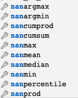
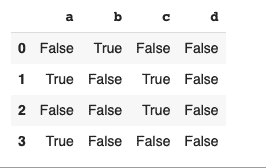
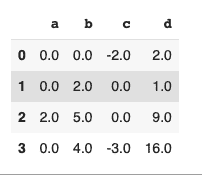

# 解读《熊猫与熊猫》中的南

> 原文：<https://www.askpython.com/python/examples/nan-in-numpy-and-pandas>

NaN 是**的简称，不是数字**。它用于表示未定义的条目。它还用于表示数据集中缺失的值。

NaN 的概念甚至在 Python 被创建之前就存在了。IEEE 浮点运算标准(IEEE 754)在 1985 年引入了 NaN。

NaN 是一个特殊的浮点值，只能转换为 float 类型。

在本教程中，我们将看看南如何在熊猫和 Numpy 工作。

## 南在数字

让我们看看南在 [Numpy](https://www.askpython.com/python-modules/numpy/python-numpy-module) 下是如何工作的。为了观察 NaN 的属性，让我们用 NaN 值创建一个 Numpy 数组。

```
import numpy as np
arr = np.array([1, np.nan, 3, 4, 5, 6, np.nan]) 
pritn(arr) 

```

输出:

```
[ 1\. nan  3\.  4\.  5\.  6\. nan]

```

### 1.具有 NaN 的 Numpy 阵列上的数学运算

让我们尝试在 [Numpy 数组](https://www.askpython.com/python-modules/numpy/python-numpy-arrays)上调用一些基本函数。

```
print(arr.sum())

```

输出:

```
nan

```

让我们试着从[数组](https://www.askpython.com/python/array/python-array-declaration)中找出最大值:

```
print(arr.max())

```

输出:

```
nan

```

幸运的是，Numpy 提供了在执行数学运算时忽略 NaN 值的方法。

### 2.在 Numpy 数组上执行数学运算时如何忽略 NaN 值

Numpy 提供了类似 np.nansum()和 np.nanmax()的方法，用于在忽略数组中的 NaN 值后计算 sum 和 max。

```
np.nansum(arr)

```

输出:

```
19.0

```

```
np.nanmax(arr) 

```

```
6.0

```

如果您在 IDE 中打开了自动完成功能，则在使用 np.nan 时，您会看到以下选项列表:



Np Nan

### 3.检查 NaN 值

要检查 Numpy 数组中的 NaN 值，可以使用 np.isnan()方法。

这将输出一个与原始数组大小相同的布尔掩码。

```
np.isnan(arr)

```

输出:

```
[False  True False False False False  True]

```

对于原始数组中为 NaNs 的索引，输出数组为 true，而对于其余的索引，输出数组为 false。

### 4.等同于两个 nan

两个 nan 相等吗？

这可能是一个令人困惑的问题。让我们试着通过运行一些 python 代码来回答这个问题。

```
a = np.nan
b = np.nan

```

这两条语句用 nan 初始化两个变量 a 和 b。让我们试着把两者等同起来。

```
a == b

```

输出:

```
False

```

在 Python 中，我们还有 **is** 操作符。让我们试着用这个来比较两个变量。

```
a is b

```

输出:

```
True 

```

原因是==运算符比较两个操作数的值，并检查值是否相等。另一方面，`is operator`检查两个操作数是否指向同一个对象。

事实上，您可以打印出 a 和 b 的 id，并看到它们引用同一个对象。

```
id(a)

```

输出:

```
139836725842784

```

```
id(b)

```

输出:

```
139836725842784

```

## 熊猫数据框中的南

[Pandas DataFrames](https://www.askpython.com/python-modules/pandas/dataframes-in-python) 是将数据导入 python 的一种常见方式。让我们看看如何在一个[熊猫](https://www.askpython.com/python-modules/pandas/python-pandas-module-tutorial)数据框架中处理 NaN 值。

让我们从创建一个数据帧开始。

```
 s = pd.DataFrame([(0.0, np.nan, -2.0, 2.0),
...                    (np.nan, 2.0, np.nan, 1),
...                    (2.0, 5.0, np.nan, 9.0),
...                    (np.nan, 4.0, -3.0, 16.0)],
...                   columns=list('abcd'))
s

```

输出:


Dataframe

### 1.检查 NaN 值

您可以通过使用 **isnull()方法**来检查 NaN 值。输出将是一个布尔掩码，其尺寸为原始数据帧的尺寸。

```
s.isnull()

```

输出:



Isnull

### 2.替换 NaN 值

有多种方法可以替换熊猫数据帧中的 NaN 值。最常见的方法是使用**。fillna()方法。**

此方法要求您指定一个值来替换 NaNs。

```
s.fillna(0)

```

输出:



Fillna(0)

或者，您也可以按列的方式提及这些值。这意味着一列中的所有 nan 将被替换为相同的值。

```
values = {'a': 0, 'b': 1, 'c': 2, 'd': 3}
s.fillna(value=values)

```

输出:


您还可以使用[插值](https://www.askpython.com/python/examples/interpolation-to-fill-missing-entries)来填充数据框中缺失的值。与相比，插值是一种稍微高级的方法。菲尔娜()。

插值是一种可以估计两个已知数据点之间的未知数据点的技术。

### 3.删除包含 NaN 值的行

要删除带有 nan 的行或列，您可以使用**。dropna()** 法。

要删除带有 nan 的行，请使用:

```
df.dropna()

```

要删除带有 nan 的列，请使用:

```
df.dropna(axis='columns')

```

## 结论

本教程是关于 Python 中的 NaNs 的。我们主要集中在处理 Numpy 的 NaNs 和熊猫。希望你和我们一起学习愉快。