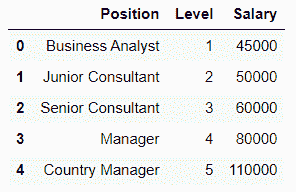
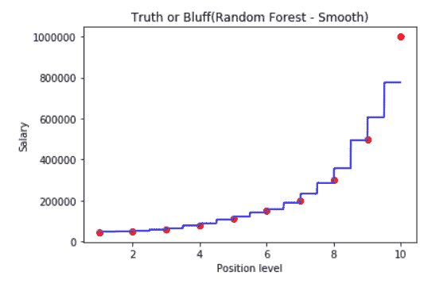

# 随机森林回归:完全参考

> 原文：<https://www.askpython.com/python/examples/random-forest-regression>

欢迎阅读这篇关于随机森林回归的文章。首先让我快速地向您介绍一下回归的含义。

## 什么是机器学习中的回归？

回归是一种机器学习技术，用于预测一定范围内的值。让我们用一个例子来理解这个概念，考虑雇员的工资和他们多年的经验。

此数据的回归模型有助于预测员工的工资，即使该年在数据集中没有相应的工资。

## 什么是随机森林回归？

随机森林回归是一种集成学习技术。但是什么是集成学习呢？

在集成学习中，你可以多次使用多个算法或同一个算法，然后组合成一个比原来更强大的模型。

基于树的预测更准确，因为它考虑了许多预测。这是因为使用了平均值。这些算法更稳定，因为数据集中的任何变化都会影响一棵树，但不会影响树的森林。

## 执行随机森林回归的步骤

这是一个四步流程，我们的步骤如下:

1.  从训练集中随机选取 K 个数据点。
2.  构建与这 K 个数据点相关的决策树。
3.  选择你想要构建的 N 棵树，重复步骤 1 和 2。
4.  对于新的数据点，让每个 Ntree 树预测问题中数据点的 Y 值，并将所有预测的 Y 值的平均值赋给新的数据点。

## 在 Python 中实现随机森林回归

我们的目标是建立一个决策树团队，每个决策树对因变量进行预测，随机森林的最终预测是所有树预测的平均值。

对于我们的示例，我们将使用 Salary-positions 数据集，该数据集将根据预测来预测工资。

使用的数据集可以在[https://github . com/content-anu/dataset-polynomial-regression](https://github.com/content-anu/dataset-polynomial-regression)找到

### 1.导入数据集

我们将使用 [numpy](https://www.askpython.com/python-modules/numpy/python-numpy-module) 、 [pandas](https://www.askpython.com/python-modules/pandas/python-pandas-module-tutorial) 和 [matplotlib](https://www.askpython.com/python-modules/matplotlib/python-matplotlib) 库来实现我们的模型。

```
import pandas as pd
import numpy as np
import matplotlib.pyplot as plt

dataset = pd.read_csv('Position_Salaries.csv')
dataset.head()

```

数据集快照如下:



Output snapshot of dataset

### 2.数据预处理

我们不会有太多的数据预处理。我们只需识别特征矩阵和矢量化数组。

```
X = dataset.iloc[:,1:2].values
y = dataset.iloc[:,2].values

```

### 3.将随机森林回归拟合到数据集

我们将从 sklearn 的 ensemble 库中导入 RandomForestRegressor。我们使用 RFR 类构造函数创建一个回归对象。这些参数包括:

1.  n_estimators:森林中树木的数量。(默认值= 10)
2.  标准:默认值为 mse，即均方误差。这也是决策树的一部分。
3.  随机状态

```
from sklearn.ensemble import RandomForestRegressor
regressor = RandomForestRegressor(n_estimators = 10, random_state = 0)
regressor.fit(X,y)

```

**回归直线如下:**


Regressor line

我们将只做如下测试预测:

```
y_pred=regressor.predict([[6.5]])
y_pred

```


Output of the prediction

### 4.可视化结果

```
#higher resolution graph
X_grid = np.arange(min(X),max(X),0.01)
X_grid = X_grid.reshape(len(X_grid),1) 

plt.scatter(X,y, color='red') #plotting real points
plt.plot(X_grid, regressor.predict(X_grid),color='blue') #plotting for predict points

plt.title("Truth or Bluff(Random Forest - Smooth)")
plt.xlabel('Position level')
plt.ylabel('Salary')
plt.show()

```

生成的图形如下所示:



Graph for 10 trees

### 5.上图的解释

在这个图中，我们得到了比一个决策树更多的步骤。我们有更多的音程和间隔。我们的楼梯有更多的台阶。

每一个预测都是基于 10 次投票(我们取了 10 棵决策树)。Random forest 为每个间隔计算许多平均值。

我们包含的树的数量越多，精确度就越高，因为许多树会收敛到相同的最终平均值。

### 6.为 100 棵树重建模型

```
from sklearn.ensemble import RandomForestRegressor
regressor = RandomForestRegressor(n_estimators = 100, random_state = 0)
regressor.fit(X,y)

```

上述 100 棵树形成的回归方程如下:


Regressor equation

### 7.创建 100 棵树的图形

```
#higher resolution graph
X_grid = np.arange(min(X),max(X),0.01)
X_grid = X_grid.reshape(len(X_grid),1) 
plt.scatter(X,y, color='red') 

plt.plot(X_grid, regressor.predict(X_grid),color='blue') 
plt.title("Truth or Bluff(Random Forest - Smooth)")
plt.xlabel('Position level')
plt.ylabel('Salary')
plt.show()

```


Graph with 100 trees

图中的步数不会随着森林中树木的数量增加 10 倍。但是预测会更好。让我们预测同一个变量的结果。

```
y_pred=regressor.predict([[6.5]])
y_pred

```


Output prediction

### 8.为 300 棵树重建模型

```
from sklearn.ensemble import RandomForestRegressor
regressor = RandomForestRegressor(n_estimators = 300, random_state = 0)
regressor.fit(X,y)

```

上述代码片段的输出产生以下回归量:


Regressor for 300 trees

### 9.300 棵树的图形

```
#higher resolution graph
X_grid = np.arange(min(X),max(X),0.01)
X_grid = X_grid.reshape(len(X_grid),1) 

plt.scatter(X,y, color='red') #plotting real points
plt.plot(X_grid, regressor.predict(X_grid),color='blue') #plotting for predict points

plt.title("Truth or Bluff(Random Forest - Smooth)")
plt.xlabel('Position level')
plt.ylabel('Salary')
plt.show()

```

上面的代码生成了下图:


Graph for 300 trees

现在，让我们做一个预测。

```
y_pred=regressor.predict([[6.5]])
y_pred

```

上述代码的输出如下:


Prediction using 300 trees

## 实现随机森林回归的完整 Python 代码

```
import pandas as pd
import numpy as np
import matplotlib.pyplot as plt

dataset = pd.read_csv('Position_Salaries.csv')
dataset.head()

X = dataset.iloc[:,1:2].values
y = dataset.iloc[:,2].values

# for 10 trees
from sklearn.ensemble import RandomForestRegressor
regressor = RandomForestRegressor(n_estimators = 10, random_state = 0)
regressor.fit(X,y)

y_pred=regressor.predict([[6.5]])
y_pred

#higher resolution graph
X_grid = np.arange(min(X),max(X),0.01)
X_grid = X_grid.reshape(len(X_grid),1) 

plt.scatter(X,y, color='red') #plotting real points
plt.plot(X_grid, regressor.predict(X_grid),color='blue') #plotting for predict points

plt.title("Truth or Bluff(Random Forest - Smooth)")
plt.xlabel('Position level')
plt.ylabel('Salary')
plt.show()

# for 100 trees
from sklearn.ensemble import RandomForestRegressor
regressor = RandomForestRegressor(n_estimators = 100, random_state = 0)
regressor.fit(X,y)

#higher resolution graph
X_grid = np.arange(min(X),max(X),0.01)
X_grid = X_grid.reshape(len(X_grid),1) 
plt.scatter(X,y, color='red') 

plt.plot(X_grid, regressor.predict(X_grid),color='blue') 
plt.title("Truth or Bluff(Random Forest - Smooth)")
plt.xlabel('Position level')
plt.ylabel('Salary')
plt.show()

y_pred=regressor.predict([[6.5]])
y_pred

# for 300 trees
from sklearn.ensemble import RandomForestRegressor
regressor = RandomForestRegressor(n_estimators = 300, random_state = 0)
regressor.fit(X,y)

#higher resolution graph
X_grid = np.arange(min(X),max(X),0.01)
X_grid = X_grid.reshape(len(X_grid),1) 

plt.scatter(X,y, color='red') #plotting real points
plt.plot(X_grid, regressor.predict(X_grid),color='blue') #plotting for predict points

plt.title("Truth or Bluff(Random Forest - Smooth)")
plt.xlabel('Position level')
plt.ylabel('Salary')
plt.show()

y_pred=regressor.predict([[6.5]])
y_pred

```

上述代码的输出将是图形和预测值。以下是图表:


Output graphs

## 结论

正如你所观察到的，10 棵树模型预测 6.5 年工作经验的工资是 167，000 英镑。100 棵树模型预测为 158，300 棵，300 棵树模型预测为 160，333.33 棵。因此，树的数量越多，我们的结果就越准确。