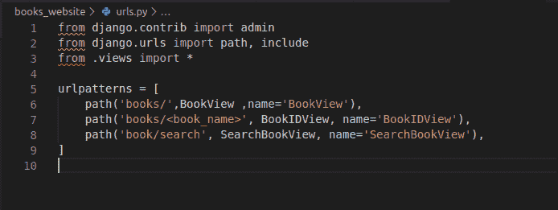
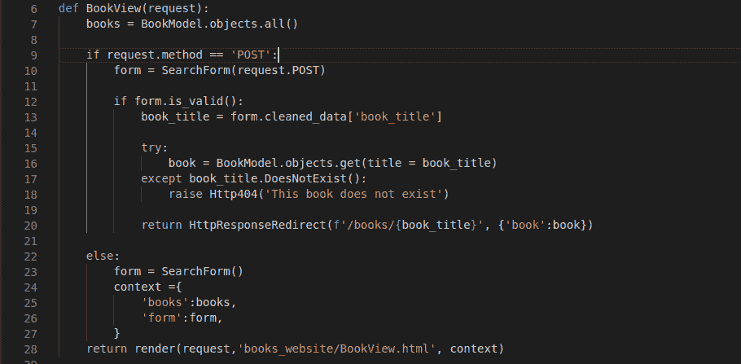
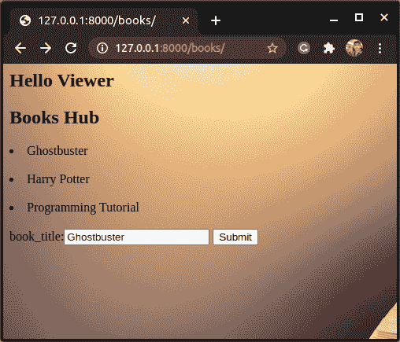
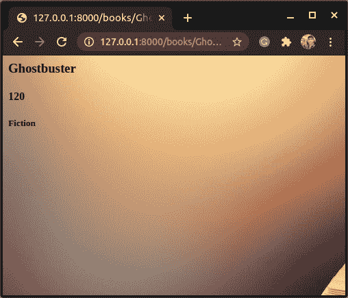
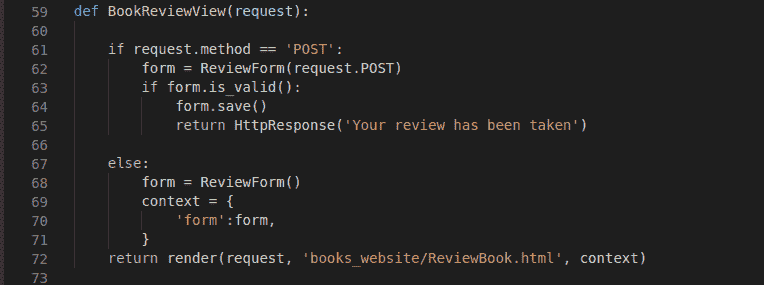
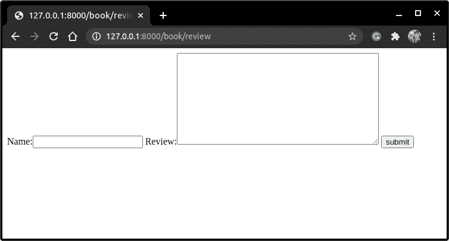
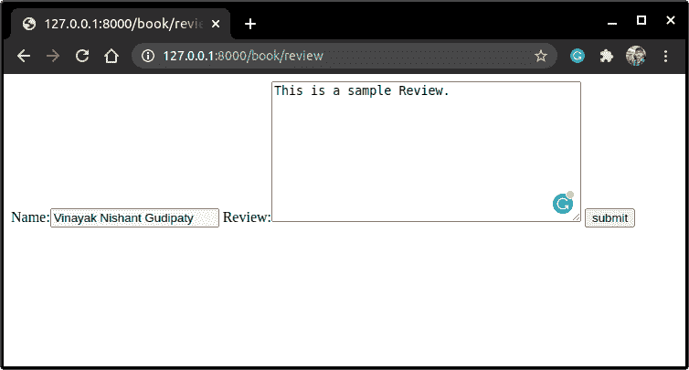
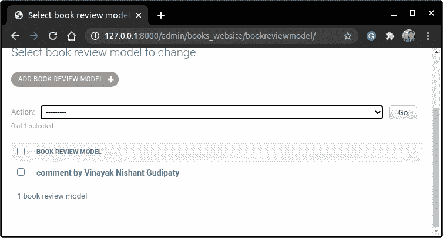

# Django 表单介绍

> 原文：<https://www.askpython.com/django/django-forms>

Django 表单是从 web 前端接受文本、图像或文件形式的用户输入的一种方式。

我们遇到的表单的简单例子是 Django 管理站点的登录页面。管理网站从我们这里获取了输入文本**“用户名”**和输入文本“**密码”**。

在我们的网站上有两种使用表单的方式；

1.  一个使用 **<表单>** 属性的 HTML 模板文件
2.  使用 Django 表单模型类。

我们将学习 HTML 表单的基础知识来了解它们是什么。我们的主要焦点是 Django forms 本身。

## 为 Django 创建 HTML 表单

我们可以使用 **<表单>** 属性在 HTML 自身中创建表单，并使用 **<输入>** 属性从客户端获取信息。典型 HTML 表单的语法如下所示:

```py
<form action="</action/>" method="post">
    <label for="element_id">Your name: </label>
    <input id="element_id" type="text" name="<name>" value="<pre-set_value>">
    <input type="submit" value="OK">
</form>

```

让我们来理解一下上面的代码是什么意思:

1.  **动作:**这告诉 HTML 将提交的表单数据发送到哪里。它通常包含我们要将数据发送到的 URL
2.  **Method="POST"** 这是我们在向服务器发送信息时使用的一种特殊方法。还有一个 GET 方法，这是我们在本文中需要的。
3.  **标签用于:**该标签给出了一个名称来标识该特定标签。例如:`<label for='fname'>First Name:</label>`这里我们给出一个简称 **fname** 来标识标签**First Name**
4.  `<input id= type= name= value=>`:这个 input 属性在 HTML 表单中是最重要的，input 指定了我们将从客户端获取的表单字段——例如，类型、名称、分配给它的预设值等等。
5.  `<input type="submit">`:该输入提交客户输入的表单。

我们可以使用 Django 表单，而不是使用 **< input >** 属性来创建表单字段，这是一种更有效的方法。但在此之前，我们需要了解更多关于**获取**和**发布**的方法。

### 何时使用 GET，何时使用 POST

默认情况下，浏览器使用 GET 方法向服务器请求资源。

例如，继续我们的图书模型示例，我们在后端自动使用 GET 请求来提取图书的数据。因为我们没有在前端修改列表，所以这个方法非常好。

但是假设我们想在模型数据库中添加一本书。然后我们基本上改变了 DB 元素，因此我们需要 POST 方法。因此，POST 方法向服务器发送一些信息。

当我们改变关于一本书的信息或者在 Django 管理站点中添加一本书时，我们使用了 **POST 方法**。

当我们在管理站点中查看 BookModel 下的图书列表时，我们使用了 **GET 方法**。

除此之外，还有其他 HTTP 方法，它们将在 REST API 框架文章中学习。

## 利用 Django 表单

Django 表单的工作方式类似于 [Django 模型](https://www.askpython.com/django/django-models)的工作方式。我们创建一个表单类，并将它们保存在一个单独的 **forms.py** 文件中。

模型和表单之间唯一的区别是，在模型中，我们将**模型字段**映射到**数据库字段**，而在表单中，我们将**表单字段**映射到 HTML 表单 **<输入>** 元素。

关于表单的另一个有趣的事实是，我们在网站上显示空白表单，并从客户端获取信息来存储它，而对于模型，我们将数据库中存储的数据显示给客户端。

## 在 Django 应用程序中创建 forms.py python 文件。

在 [Django 应用](https://www.askpython.com/django/django-app-structure-project-structure)中，创建一个新的 python 文件，命名为 **forms.py**


Forms.py

## 创建搜索表单以从 Book_website 搜索图书

我们现在将创建一个简单的表单，将书名作为输入，然后将我们重定向到该书的网站。因此，让我们开始吧。

### 1.在 forms.py 中创建搜索表单

首先我们需要导入表单库。

```py
from django.forms import forms

```

然后，包含以下代码来创建一个带有 **book_title** 字段的 SearchForm。

```py
class SearchForm(forms.Form):
    book_title = forms.CharField(label = "book_title",max_length =80)

```

语法类似于包含 **max_length 的模型。**

这里的**标签**与我们在 **HTML 表单中学到的标签功能相同。**

### 2.在 views.py 中创建 SearchBookView 视图

在 views.py 中，创建一个名为 **SearchBookView 的函数[视图](https://www.askpython.com/django/django-views)。**

现在有两种可能的方法:

1.  **客户端使用 GET 方法到达网页。**

*   当客户第一次打开网页，或者想要搜索另一本书时，就会发生这种情况。

2.  **客户端使用 POST 方法到达网页。**

*   当客户端输入图书名称，然后按下提交/搜索按钮时，就会出现这种情况。

因此，视图必须处理这两种情况。

**1。GET 方法的代码**

当客户端使用 GET 方法时，他必须获得一个空白表单来输入图书名称。

因此，在这种情况下，我们的代码将只包含代码。

```py
form = SearchForm()

```

就像模型一样，我们创建一个新的表单对象，并将它传递给 HTML 文件。

2.**过账方式的代码**

当客户端使用 POST 方法时，他将被重定向到我们在之前的文章**(books/<Book _ name>)**中创建的图书网页

因此，执行此任务的代码将是:

```py
if request.method == 'POST':
        form = SearchForm(request.POST)

        if form.is_valid():
            book_title = form.cleaned_data['book_title']

            try:
                book = BookModel.objects.get(title = book_title)
            except book_title.DoesNotExist():
                raise Http404('This book does not exist')

            return HttpResponseRedirect(f'/books/{book_title}', {'book':book})

```

这里

*   **form = SearchForm(请求。POST)** 保存客户输入到创建的表单对象**表单中的信息。**
*   **form.is_valid()** 检查字段中输入的信息是否有效。即，例如，我们是否仅在电子邮件字段中输入了电子邮件。
*   **form . cleaned_data[' book _ title ']:**表单库的这个属性自动将客户输入的信息转换成正确的 python 可接受的格式，并由此命名为 cleaned _ data
*   **try and except block:** 这在 python 中被称为异常处理，你可能在 [Python 异常处理](https://www.askpython.com/python/python-exception-handling)中学过
*   如果客户输入的**书名**存在于数据库中，那么我们将使用

```py
 book = BookModel.objects.get(title = book_title)

```

*   否则，如果**书不存在**，那么我们抛出一个 **Http404** 错误，该错误存在于 **Django.shortcuts 库**中
*   一旦我们从数据库中保存了关于这本书的信息，我们就使用

```py
HttpResponseRedirect("<url>",<context>)

```

这个属性将客户端重定向到提到的 **URL** ，以及上下文字典。

现在我们已经研究了 search book 视图的两个部分，让我们把它们结合起来，得到完整的最终结果**search book 视图**

```py
from django.shortcuts import render,HttpResponse,HttpResponseRedirect,Http404

from .models import BookModel
from .forms import SearchForm
def SearchBookView(request):

    if request.method == 'POST':
        form = SearchForm(request.POST)

        if form.is_valid():
            book_title = form.cleaned_data['book_title']

            try:
                book = BookModel.objects.get(title = book_title)
            except book_title.DoesNotExist():
                raise Http404('This book does not exist')

            return HttpResponseRedirect(f'/books/{book_title}', {'book':book})

    else:
        form = SearchForm()
        context ={
            'form':form,
        }
    return render(request, 'books_website/SearchBook.html', context)

```

因此，如果请求是 POST，我们会将用户重定向到**/books/<book _ title>**URL，否则，如果客户端使用 GET，我们只是向他显示一个空白表单。


SearchBookView

别忘了从 **django.shortcuts** 和 **forms.py** 导入 **HttpResponseRedirect、Http404** 和 **searchForm**

### 3.在模板文件夹中创建 SearchBook.html 模板文件

因为我们已经创建了一个 Django 表单，所以我们不必再为 book_title 创建输入字段。

我们只需要在表单中添加提交按钮，就可以了。

所以让我们创建 HTML 文件。

```py
<form method ='post'>
    
    {{form}}
    <input type="submit" value = "Submit">
</form>

```

**** 即**跨站点请求伪造令牌**防止 csrf 攻击，因此用于表单的安全目的。


SearchBook HTML

### 4.在 urls.py 中为 SearchBookView 创建 URL 端点

现在，我们将为我们创建的 SearchBookView 创建一个新的 URL 路径( **book/search** )。

我们已经在 [Django URL 映射](https://www.askpython.com/django/django-url-mapping)中学习了如何将视图映射到 URL，所以让我们在这里再做一次。

```py
path('book/search', SearchBookView, name='SearchBookView'),

```



URL

就这样，现在让我们运行服务器

```py
python manage.py runserver

```


Browser

搜索捉鬼敢死队，点击提交


Ghostbuster

* * *

现在，如果你看到的话，大多数网页在图书网页上有搜索按钮 **(books/)** 本身。为此，我们需要将 SearchBookView 和 BookView 结合起来。

所以只需从 SearchBookView 中剪切代码，粘贴到 BookView 中即可。然后**图书视图**看起来会像这样:

```py
def BookView(request):
    books = BookModel.objects.all()

    if request.method == 'POST':
        form = SearchForm(request.POST)

        if form.is_valid():
            book_title = form.cleaned_data['book_title']

            try:
                book = BookModel.objects.get(title = book_title)
            except book_title.DoesNotExist():
                raise Http404('This book does not exist')

            return HttpResponseRedirect(f'/books/{book_title}', {'book':book})

    else:
        form = SearchForm()
        context ={
            'books':books,
            'form':form,
        }
    return render(request,'books_website/BookView.html', context)

```

试着理解上面的代码，看看我是如何修改 searchBookView 来包含它的。

现在在这里，因为我们在下面的网页中有搜索表单，我们将在我们的 BookView.html 中包含 SearchBook.html。

现在，由于 SearchBook.html 是 BookView.html 的一部分，我们可以只渲染**BookView.html**模板本身(在底部)并删除该行

```py
render(request, 'books_website/SearchBook.html',context)

```



BookView

就是这样；现在我们甚至不需要刚刚创建的端点。所以删除 **URL 路径(book/search)。**

加载服务器并打开浏览器


Books



Book Ghostbuster

点击提交并检查



Ghostbuster

## 使用模型表单创建表单

如果我们想将表单数据保存到 DB 表中，那么我们需要为此创建一个 Django 模型。

Django 提供了一种方法，将客户端通过**表单**输入的**信息链接到为保存数据而创建的**模型**。**

使用 ModelForm，我们可以高效地执行上述任务，而无需编写太多代码。让我们开始吧

## 创建书评表单

我们将在图书**(books/<book _ name>)**网页上创建一个评论表单，以便读者可以对该书进行评论。

### 1.在 models.py 中创建 BookReviewModel

在 models.py 中，创建一个新的模型 **BookReviewModel** ，并编写所需的模型字段，如下面的代码所示。

```py
class BookReviewModel(models.Model):

    name = models.CharField(max_length = 80)
    review = models.TextField()

    class Meta:
        ordering = ['name']

    def __str__(self):
        return f"comment by {self.name}"

```

这里，我们使用 **Textfield，**因为评论可能会很长。这个模型很容易理解，因为我们在 [Django Models 文章](https://www.askpython.com/django/django-models)中学到了这一点

### 2.在 forms.py 中创建模型表单

现在，在 forms.py 中，创建一个如下所示的表单。

```py
class ReviewForm(forms.ModelForm):
    class Meta:
        model = BookReviewModel
        fields =('name','review',)

```

这里:

*   从导入 **BookReviewModel。型号**

```py
from .models import BookReviewModel

```

*   然后我们使用元类**(我们在 Django 模型中学到的)**来包含我们的 Django 模型，并在表单中提到我们想要的字段


ReviewForm

### 3.在 views.py 中创建 BookReviewView

我们将编写一个函数视图，类似于我们在制作搜索表单时编写的视图。

在 Views.py 中，创建一个新的函数视图 **BookReviewView** 并添加以下代码。

```py
def BookReviewView(request):

    if request.method == 'POST':
        form = ReviewForm(request.POST)
        if form.is_valid():
            form.save()
            return HttpResponse('Your review has been taken')

    else:
        form = ReviewForm()
        context = {
            'form':form,
        }
    return render(request, 'books_website/ReviewBook.html', context)

```

这里:

*   **如果表单有效，**，那么我们只需使用**保存**属性将客户端输入的信息存储到数据库中。

看看将表单条目保存到数据库中是多么简单。我们现在将创建**ReviewBook.html**模板文件。



BookReviewView

### 4.正在创建 ReviewBook.html 模板文件。

在 **templates/books_website** 中，创建一个名为【ReviewBook.html 的新文件

正如我们上面所做的，我们将创建一个表单属性。

```py
<form method='post'>
    
    {{form}}
    <input type="submit" value = "submit">
</form>

```

就这样，我们的 HTML 文件准备好了

### 5.创建 BookReviewView 的 URL 路径

现在我们只需要创建一个新的路径到 **BookReviewView。**

转到 urls.py 并添加

```py
path('book/review', BookReviewView, name='BookReviewView'),

```

另外，不要忘记在 admins.py 中注册**书评模型**

```py
admin.site.register(BookReviewModel)

```

就这样伙计们！！让我们运行服务器并进入(**预订/评论)**网页。



Browser



Browser

然后按提交按钮，你会看到**感谢你的回复网页**。


Browser 6

现在，如果您转到管理站点，并在 **BookReviewModel** 中检查，您将看到表单条目已保存。



Admin Site

## **结论**

Django 表单教程到此结束！我们希望您已经掌握了 Django 表单的所有基础知识，以及它们是如何与 HTML 表单链接的。此外，您可以从官方文档中了解更多关于 Django 表单的信息。

请继续关注 Django 主题的更多高级教程！