# Django 管理站点的完整基础

> 原文：<https://www.askpython.com/django/django-admin-site>

Django 附带了一个非常强大的管理界面。这将从 models.py 中获取关于模型的信息，并还原成一个快速简单的以模型为中心的界面。

在管理界面中，用户可以与模型表进行交互，并以非常简单有效的方式执行添加/删除元素等任务。

另外，Django 让我们有机会使用管理库中的管理类模型来编辑/更改默认的管理界面。

## Django 管理站点入门

现在，在我们访问 Django 管理界面之前，我们需要创建一个超级用户。现在让我们来为我们的管理站点创建超级用户。

### **创建超级用户**

如果您尝试进入管理/端点(主机网站/管理)，您会看到需要用户名和密码。这些是 web 应用程序的超级用户的用户名和密码。


Admin Starting Page

超级用户类似于站点的最高管理员，有以下用途:

*   拥有删除、更改和添加新元素的全部权力。
*   还可以创建新用户**(以及超级用户)**，并为这些用户分配不同的用户权限。

为了创建一个新的超级用户，我们在 shell 中编写下面的代码

```
python manage.py createsuperuser

```

然后它会询问用户名、电子邮件和密码。输入详细信息，然后超级用户将被创建。


Superuser

现在我们可以用刚刚创建的用户名和密码登录到管理站点 **(** / **admin)** 。

一旦我们登录，管理站点看起来像这样。

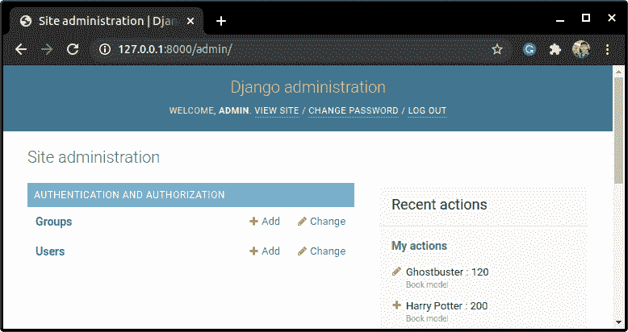

Admin Interface 1

### 2.**为管理站点注册模型**

前面的图像向我们展示了默认的管理界面。现在，我们将在这个界面上工作，并将模型注册到这个站点。

为此，请转到 admin.py 并写下:

```
from django.contrib import admin
from .models import BookModel, AuthorModel

admin.site.register(BookModel)
admin.site.register(AuthorModel)

```

**admin.site.register(<model _ name>，<admin _ model>)**——这是一个将括号中的模型注册到管理站点的函数，因此命名为 admin . site . register。

现在，我们将把 BookModel 和 AuthorModel 本身作为参数。

一会儿我们将学习第二个论点。


admin.py

当您修改文件时，服务器应该会自动重新启动，但是如果没有，您可以再次运行 runserver 命令:

```
manage.py runserver

```

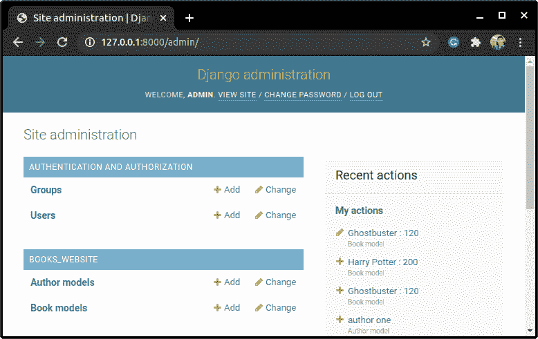

Admin Site Models 1

现在您将能够看到管理站点显示了 BookModel 和 AuthorModel。

让我们从 web 界面开始编辑模型。

## **通过管理站点编辑模型表元素**

现在我们已经在站点中注册了表，我们可以尝试添加新元素/删除/编辑它们。

### 1.**添加新对象**

在管理站点，选择作者模型，然后在**右上角**，你会看到一个**添加新对象选项**。

单击该按钮添加新的作者模型对象。

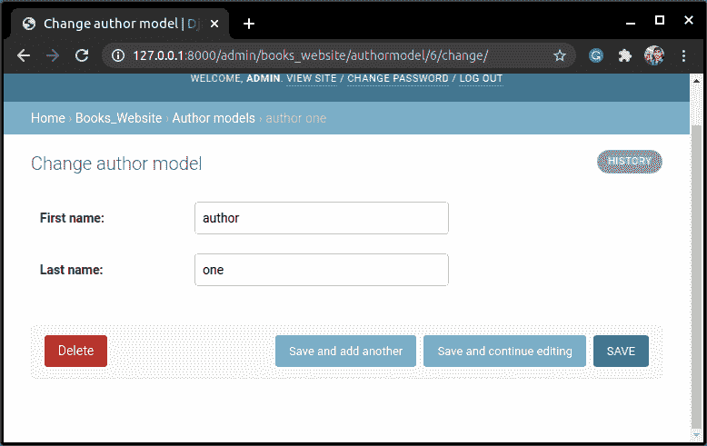

Add Author

同样，让我们在表中再添加几个作者。


Authors 3

### 2.**编辑/修改现有对象**

如果您想更改之前保存的任何元素，您可以单击它，下面的页面将再次出现。

您现在可以编辑它们，一旦完成，点击**保存**保存新值。


Edit Author

这里可以看到**保存并继续编辑**或保存选项，可以用来保存编辑过的对象。

### **3。删除对象**

点击你想删除的元素，然后你会看到下面的页面。

字段下方会出现一个红色的删除选项，只需单击该删除按钮，该特定对象就会被删除。

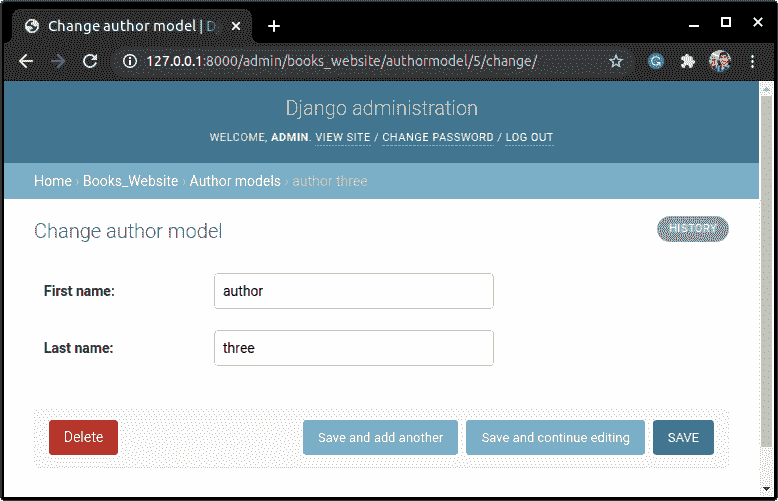

Add Author

看看在**管理站点**中添加或更改表中的元素是多么简单(与 python shell 中的漫长过程相比！)

## 与 Django 管理接口的外键链接

在上一篇文章中，我们看到了如何使用外键链接两个 Django 模型。现在如果你进入管理部分> > AuthorModel，你可以看到我已经添加了三个作者。

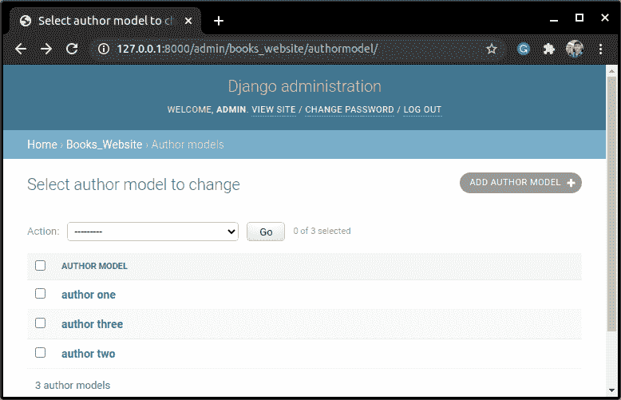

Authors

现在，在 **BookModel 表**中，当您尝试添加一本新书时，在 **author_id** 字段中，您将开始获得 author_id 的下拉列表。

这是因为我们使用了**外键**链接，因此我们现在可以很容易地从 **AuthorModel** 列表中选择一个作者。


FK

我们不必为所有的书一次又一次地添加作者姓名，我们只需将两个模型(BookModel 和 AuthorModel)链接起来，然后从下拉列表中进行选择。

现在让我们为每个作者增加几本书。

在这里，我选择了**捉鬼敢死队**和**哈利波特**的**作者 1** 和**编程教程**的**作者 2**

现在，我们将看到**外键的另一个功能。**假设**作者** **one** 决定删除他的账户，并因此从 **AuthorModel 中移除他的账户**作者 one** 。**

从**作者模型**中删除作者 1


Add Author

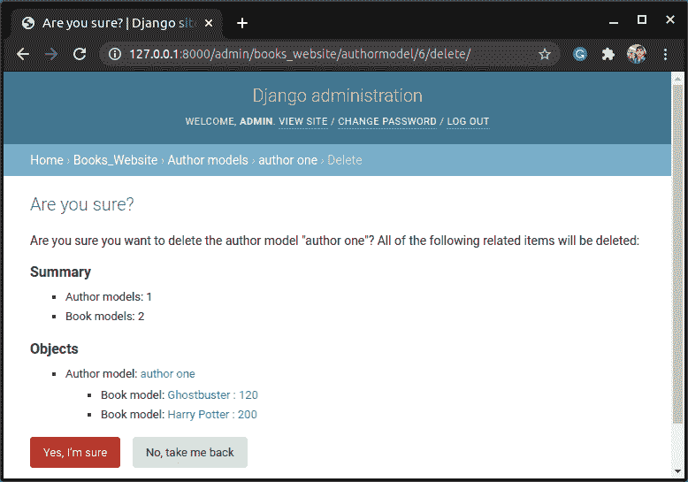

Delete Author

现在，如果我们去 BookModel，你会看到**作者 one** 写的所有书都被**自动删除了。**


Delete Books

这就是我们通过使用 **FK 获得的优势。**

## 更改界面视图

现在我们知道了默认界面是如何工作的，让我们尝试使用**管理模型来改变这个界面的一些方面。**

语法:

```
#Decorator
@admin.register(BookModel)
class BookModelAdmin(admin.ModelAdmin):
    #Fields
    fields =('<model_field_names>')

    #List Display
    list_display = ('<model_field_names>')

    #List_filter
    list_filter = ('<model_field_names>')

    #ordering
    ordering = ('<model_field_names>')

    #fieldsets
    fieldsets =(
                ('Required information',{
                    'description' : '<'description_sentence>',
                    'fields':('<model_fields'>)
                }), 
                ('Optional Information',{
                    'classes' : ('collapse',),
                    'fields': ('<model_fields>')
                })
        )

```

让我们在下面一个一个地检查每一个元素。

### 1.装饰者

第一行**admin . register(book model)**被称为寄存器，在它所应用的类之前与一个 **@符号**一起使用。

其功能与 **admin.site.register** 类似。这只是注册模型和 adminModel 的不同方式。但是如果您不想使用这个，那么您必须使用前面提到的方法添加管理模型。

```
admin.site.register(BookModel,BookModelAdmin)

```

### **2。字段**

此选项允许您安排模型字段在管理界面中的显示顺序和位置。

**注意:**该选项将(字段的)输入作为**元组。**

```
 fields =(('title','price'),'genre','author_id')

```

在这里，您可以看到我希望字段出现的顺序。

如果你想在同一个水平层次上显示多个字段，那么我们把它们作为一个元组加在一起。(如代码所示)

### **3。列表 _ 显示**

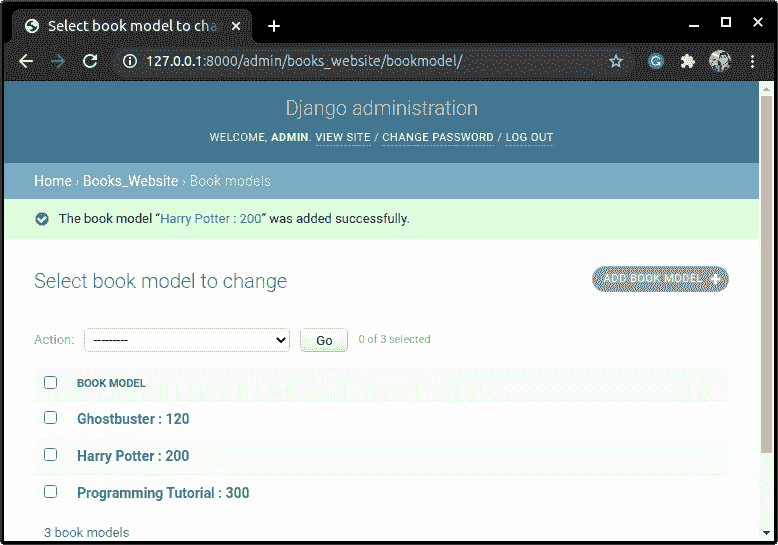

Books

现在如果你看到图像，只有一个标题“**图书型号”**。现在，如果你想显示不同的标题，那么我们使用这个选项叫做 l **ist_display。**

因此，该选项允许您选择在上面显示的页面上显示的所有字段。

**注意:**该选项将**输入作为[元组](https://www.askpython.com/python/tuple/python-tuple)。**

```
list_display = ('title','price')

```

### 4.列表 _ 过滤器


Books

如你所见，在默认界面中。，没有筛选依据选项。使用 **list_filter** 在上面显示的页面上创建一个**过滤选项。这有助于我们快速搜索表中的特定元素。**

**注意:**该选项以**输入为元组。**

```
list_filter = ('genre',)

```

### 5.排序

就像我们在 [Django 模型](https://www.askpython.com/django/django-models)中看到的**元类**一样，这里的**排序**也有同样的功能。我们可以指定特定字段元素的显示顺序。

语法类似于**元类模型中的**排序**。**

**注意:**该选项以**输入**为**元组。**

```
ordering = ('title',)

```

### 6.字段集

这是提到我们在上面看到的**字段**的另一种方式。

正如您在许多网站上看到的那样，在单击“显示更多”按钮后，您可以看到一些可选信息。字段集给了我们同样的能力，使一些字段保持可选，而一些字段保持必需。

这里的语法有点混乱，请尝试理解下面给出的代码:

```
fieldsets =(
            ('Required information',{
                'description' : '<'description_sentence>',
                'fields':('<model_fields'>)
            }),
            ('Optional Information',{
                'classes' : ('collapse',),
                'fields': ('<model_fields>')
            })
    )

```

**管理库中还有许多其他类似的管理选项，可以像**一样使用

*   空值显示
*   排除
*   列表 _ 可编辑
*   只读字段

现在让我们更改 BookModel 和 AuthorModel 的管理界面。

## **在管理站点中更改 BookModel 视图**

让我们使用各种**管理选项**来改变**图书模型**的外观

```
@admin.register(BookModel)
class BookModelAdmin(admin.ModelAdmin):

    fields =(('title','price'),'genre','author_id')
    list_display = ('title','price')
    list_filter = ('genre',)
    ordering = ('title',)

```

**注意**:对于单值元组，我们需要在末尾加上一个**逗号“，”**来表示 **Python** 是一个**元组**。

这里:

*   我们将标题和价格保持在同一水平
*   列表-显示标题和价格
*   按流派过滤
*   根据标题按字母顺序排列元素

现在让我们运行服务器并检查。

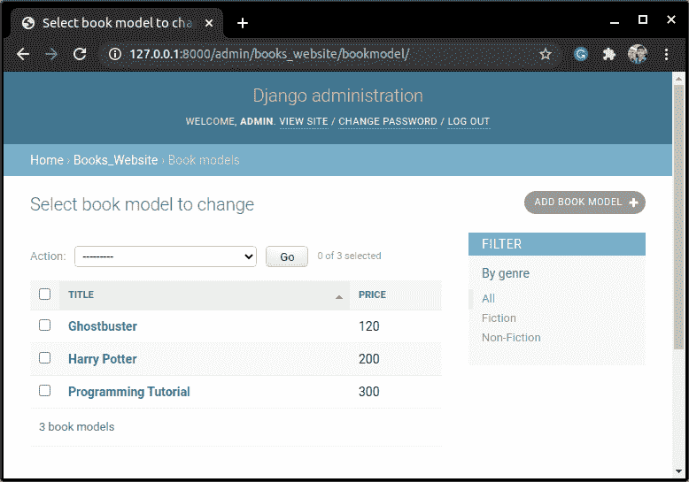

Book Admin

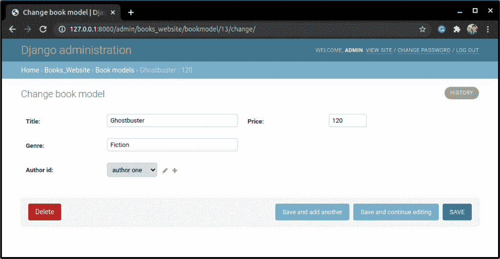

Book admin

## **在管理站点中更改 AuthorModel 视图**

类似地，让我们也使用上面学到的管理选项来更改 AuthorModel 的外观。

```
@admin.register(AuthorModel)
class AuthorModelAdmin(admin.ModelAdmin):

    fieldsets =(
            ('Required information',{
                'description' : 'These fields are compulsory',
                'fields':('first_name',)
            }),
            ('Optional Information',{
                'classes' : ('collapse',),
                'fields': ('last_name',)
            })
    )

    list_display =('first_name','last_name')
    ordering =('first_name',)

```

这里

*   名字用在必填信息下
*   姓氏用在可选信息下
*   列表-显示名字和姓氏
*   根据名字按字母顺序排列元素

现在让我们运行服务器并检查。

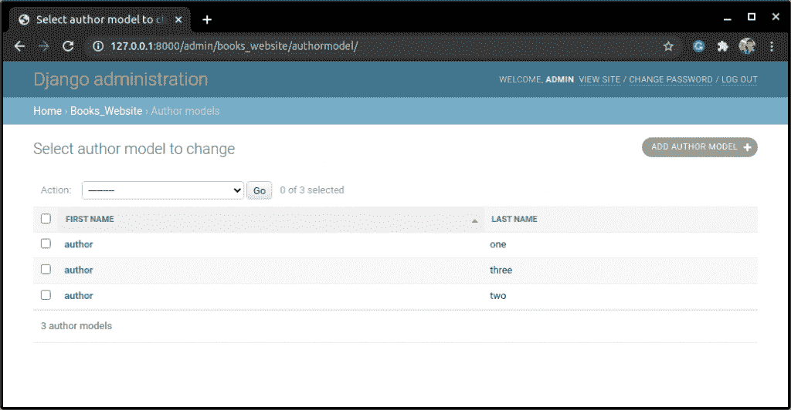

Author Admin

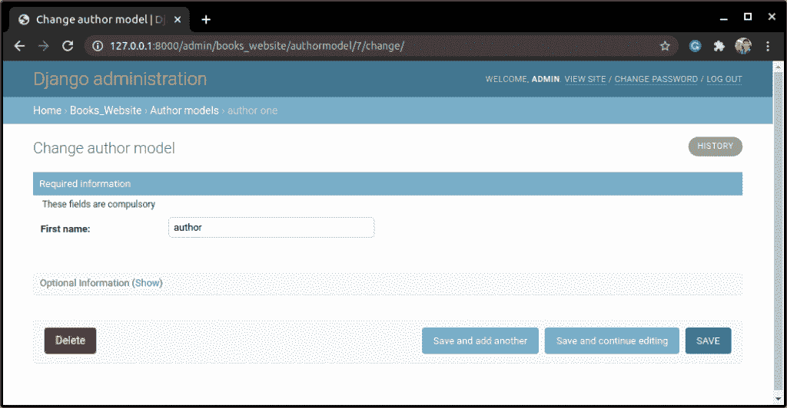

Author Admin(hidden)


Author Adminshown

## Django 管理站点中的其他选项

在 Django 管理站点的主页上，已经出现了一些其他选项，比如**用户、组。**


Admin Site

用户选项用于处理超级用户以及每个用户的权限。

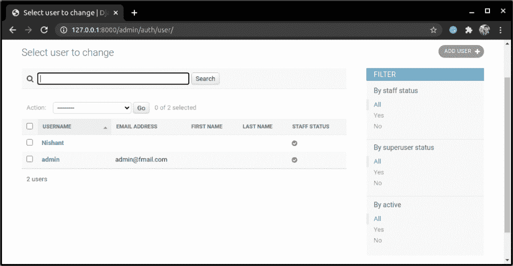

Users

屏幕上显示的所有元素都是可点击的，用户权限可以通过点击它们进行编辑，并修改权限集。

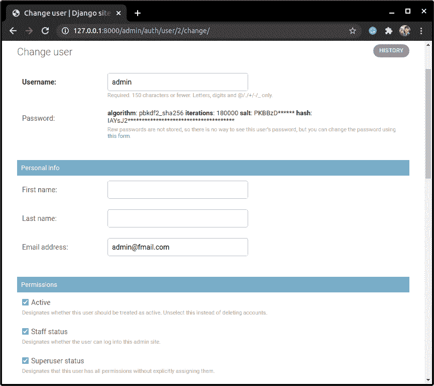

User Permissions

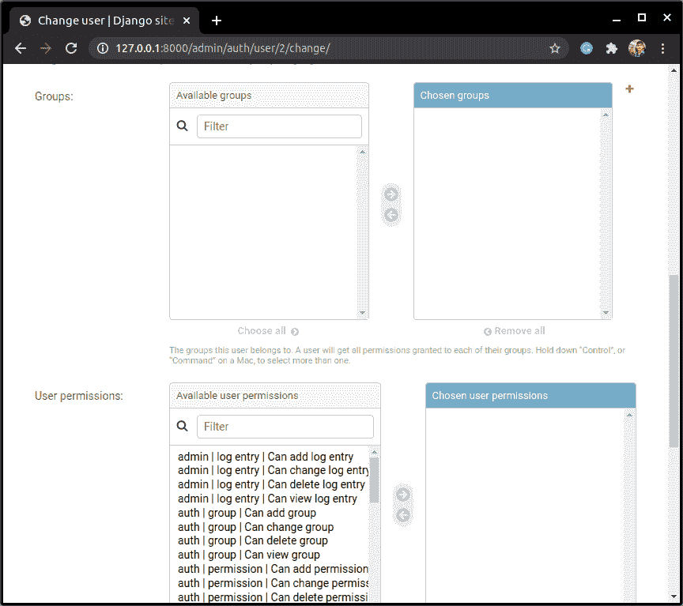

User Permissions

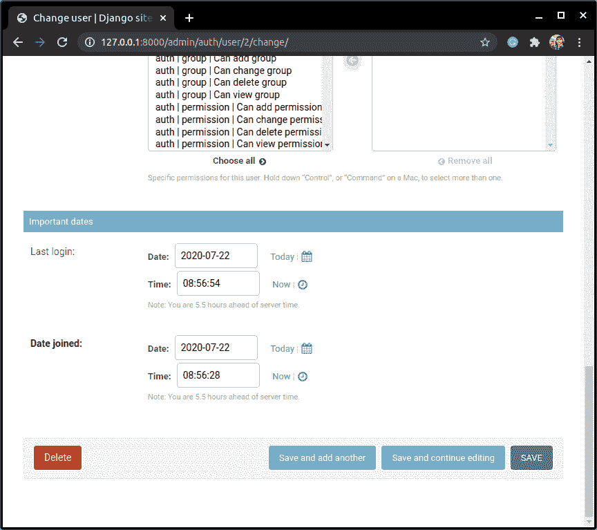

User Permissions

## **结论**

就这样，伙计们。我们已经到了这篇文章的结尾。在下一节中，我们将了解**模板**。请继续关注接下来几天更多的 Django 和 Flask 文章。**继续编码！！！**