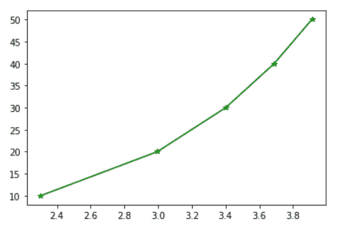

# 了解 Python Numpy 日志

> 原文：<https://www.askpython.com/python-modules/numpy/python-numpy-log>

嘿，伙计们！在本文中，我们将重点关注 **Python Numpy 对数函数**。

* * *

## Python NumPy 日志入门

Python NumPy 模块处理数组数据元素的创建和操作。

`numpy.log() method`是用来计算一个元素的数据值/数组值的自然对数值。

**语法:**

```
numpy.log(element/array)

```

**例 1:**

```
import numpy as np
data = 12.2
log_val = np.log(data)
print(log_val)

```

**输出:**

```
2.501435951739211

```

**例 2:**

```
import numpy as np
data = np.e
log_val = np.log(data)
print(log_val)

```

**输出:**

```
1.0

```

* * *

### 以 2 为底的对数

除了默认的`log() method`功能，我们可以使用下面的命令计算一个 NumPy 数组或一个带有`base 2`的元素的日志值:

```
numpy.log2(element)

```

**举例:**

```
import numpy as np
data = 4
log_val = np.log2(data)
print(log_val)

```

**输出:**

```
2.0

```

* * *

### 以 10 为底的 NumPy 对数

`numpy.log10() function`用于计算一个元素以 10 为底的自然对数值。

**语法:**

```
numpy.log10(data)

```

**举例:**

```
import numpy as np
data = 1000
log_val = np.log10(data)
print(log_val)

```

**输出:**

```
3.0

```

* * *

### 带自定义底数的 NumPy 对数

NumPy log()函数提供了根据用户定义的基数寻找对数值的可能性。

**语法:**

```
numpy.log(data)/numpy.log(base)

```

**举例:**

```
import numpy as np
data = 1000
base = 40
log_val = np.log(data)/np.log(base)
print(log_val)

```

在上面的例子中，我们计算了以 40 为基数的对数值 1000。

众所周知，


**Log Value With Custom Base**

因此，上述数学概念用于计算数据值对自定义基值的对数值。

**输出:**

```
1.8725890517453545

```

* * *

### 在二维阵列上执行 NumPy 日志

numpy.log()方法可应用于二维 numpy 数组，以计算所有数组元素的对数值。

**语法:**

```
numpy.log(array)

```

**举例:**

```
import numpy as np
arr = np.arange(1,5).reshape(2,2)
print("Original Array:\n")
print(arr)
print("\Logarithmic value of array elements:\n")
log_val=np.log(arr)
print(log_val)

```

在上面的例子中，我们使用`numpy.reshape() function`创建了一个 2×2 的数组，并使用随机数通过`numpy.arange() method`创建数据值。

此外，numpy.log()方法用于查找数组中每个元素的对数值。

**输出:**

```
Original Array:

[[1 2]
 [3 4]]

Logarithmic value of array elements:

[[0\.         0.69314718]
 [1.09861229 1.38629436]]

```

* * *

### 在 NumPy 阵列上应用 NumPy 日志

**举例:**

```
import numpy as np
arr = np.array([10,20,30,4,5])
print("Original Array:\n")
print(arr)
print("\nLogarithm value of array elements:\n")
log_val=np.log(arr)
print(log_val)

```

我们使用 `numpy.array() function`创建了一个 NumPy 数组，并使用 numpy.log()方法计算一维数组中所有数据项的对数值。

**输出:**

```
Original Array:

[10 20 30  4  5]

Logarithm value of array elements:

[2.30258509 2.99573227 3.40119738 1.38629436 1.60943791]

```

* * *

### 数字日志的图形表示

为了更好地理解计算出的日志值，我们可以使用 [Python Matplotlib 模块](https://www.askpython.com/python-modules/matplotlib/python-matplotlib)绘制原始值的日志值。

**举例**:

```
import numpy as np
import matplotlib.pyplot as plt
arr = np.array([10,20,30,40,50])
log_val=np.log(arr)
plt.plot(log_val,arr,marker='*',color='green')

```

在上面的例子中，我们使用了`pyplot.plot() method`来绘制原始数组值的对数值。

**输出:**



**Graphical Representation Of Numpy Log**

* * *

## 结论

因此，在本文中，我们已经了解了 Python NumPy log 方法的工作原理以及不同的情况。

* * *

## 参考

*   [Python NumPy log() —文档](https://numpy.org/doc/1.18/reference/generated/numpy.log.html)
*   [具有不同基础的 Python NumPy 日志—堆栈溢出](https://stackoverflow.com/questions/25169297/numpy-logarithm-with-base-n)