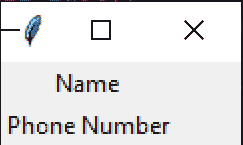
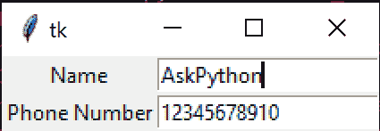
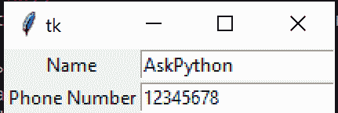

# Tkinter 入口小部件

> 原文：<https://www.askpython.com/python-modules/tkinter/tkinter-entry-widget>

又见面了！这是我们 Tkinter 教程系列的另一篇文章，今天我们将讨论 Tkinter 入口小部件。

上次，我们经历了一个[t inter 画布窗口](https://www.askpython.com/python-modules/tkinter/tkinter-canvas)的概念。这一次，我们将做一些不同的事情。

今天的帖子在 **Tkinter Entry** 小工具上。任何小部件都是主应用程序的一部分。如果您想从用户那里获得输入，入口小部件非常有用。

我们可以在我们的主应用程序中创建一个入口小部件，还可以为我们的应用程序添加输入文本框，以便用户可以在上面键入一些内容。

我们开始吧！

* * *

## Tkinter 入口小部件

这个小部件允许我们输入单行文本。

如果我们输入的字符串超过了小部件的长度，我们必须向下滚动到下一部分。

如果您想获得小字段(如姓名和电话号码)的用户输入，这很有用。

现在让我们看看如何在我们的应用程序中使用它。

### 入口小部件的语法

要声明入口小部件，我们可以使用以下类型的语法:

```
entry_object = tk.Entry(master, option, ... )

```

这为我们的父窗口引入了`master`对象句柄。这将指示我们可以放置入口对象的位置。

我们可以使用`option`参数提供某些选项，比如您希望将它放在哪一行和哪一列。

* * *

### 步骤 1:为我们的应用程序创建标签

但是在此之前，让我们为我们的应用程序创建一个`Label`小部件。我们可以用它来命名一个文本块。

**注意**:我们**不能**在标签等其他部件旁边使用画布，因为我们正在使用`canvas.pack()`。这些完全是为了不同的目的。

虽然我们不能使用`Canvas`，但是让我们为我们的应用程序复制一个类似的模板。

```
import tkinter as tk

class Application(tk.Frame):
	def __init__(self, master=None):
		# We need the master object to
		# initialize important stuff
		super().__init__(master) # Call tk.Frame.__init__(master)
		self.master = master # Update the master object after tk.Frame() makes necessary changes to it

# Create our master object to the Application
master = tk.Tk()
# Create our application object
app = Application(master=master)
# Start the mainloop
app.mainloop()

```

要创建`Label`小部件，请使用以下语法:

```
tk.Label(master, text).grid(row)

```

这将使用`text`字符串将其插入到 man 应用程序网格的`row`号中！

现在让我们为我们的班级写它。我们将编写一个名为`createGridLabel`的函数来完成这项工作。

```
	def createGridLabel(self, text, row_number):
		# Create a label with the text, on the row number
		tk.Label(self.master, text=text).grid(row=row_number)

```

现在，让我们看看整个程序。

```
import tkinter as tk

class Application(tk.Frame):
	def __init__(self, master=None):
		# We need the master object to
		# initialize important stuff
		super().__init__(master) # Call tk.Frame.__init__(master)
		self.master = master # Update the master object after tk.Frame() makes necessary changes to it
	def createGridLabel(self, text, row_number):
		# Create a label with the text, on the row number
		tk.Label(self.master, text=text).grid(row=row_number)

# Create our master object to the Application
master = tk.Tk()
# Create our application object
app = Application(master=master)
# Create a label with the following text, on row #0
app.createGridLabel("Name", 0)
app.createGridLabel("Phone Number", 1)
# Start the mainloop
app.mainloop()

```

输出



Label Widget

虽然图像很小，但是标签确实在屏幕上！现在让我们来看看这些标签的实际`Entry`部件。

我们可以使用`tk.Entry(master)`创建我们的入口对象

```
# Create the entry objects
e1 = tk.Entry(master)
e2 = tk.Entry(master)

```

现在，让我们将条目放在适当的位置。第一个条目属于行 0 和列 1(因为列 0 有我们的标签`Name`，而第二个条目小部件位于(1，1)。

```
# Place it in it's suitable position
e1.grid(row=0, column=1)
e2.grid(row=1, column=1)

```

现在让我们看看完整的代码。

```
import tkinter as tk

class Application(tk.Frame):
	def __init__(self, master=None):
		# We need the master object to
		# initialize important stuff
		super().__init__(master) # Call tk.Frame.__init__(master)
		self.master = master # Update the master object after tk.Frame() makes necessary changes to it
	def createGridLabel(self, text, row_number):
		# Create a label with the text, on the row number
		tk.Label(self.master, text=text).grid(row=row_number)

# Create our master object to the Application
master = tk.Tk()

# Create our application object
app = Application(master=master)

# Create a label with the following text, on row #0
app.createGridLabel("Name", 0)
app.createGridLabel("Phone Number", 1)

# Create the entry objects
e1 = tk.Entry(master)
e2 = tk.Entry(master)

# Place it in it's suitable position
e1.grid(row=0, column=1)
e2.grid(row=1, column=1)

# Start the mainloop
app.mainloop()

```

**输出**



Entry Widget

如你所见，它不仅显示了一个文本框，而且我还可以在上面打字！

如果您想为这些字段放置一些默认的占位符值呢？这非常简单，每个条目只需要一行代码！

我们可以使用`entry.insert(0, text)`，其中`text`是文本框所需的值。

现在让我们把这两个字段上的`AskPython`和`12345678`作为默认值。

```
e1.insert(0, "AskPython")
e2.insert(0, "12345678") # Must be a string, not an integer

```

**输出**



Entry Default

希望这对你也有用。我们已经成功地将默认值添加到我们的应用程序中！

* * *

## 结论

在本教程中，我们学习了如何使用 Tkinter 来使用入口小部件。

敬请关注 Tkinter 上的更多教程！

* * *