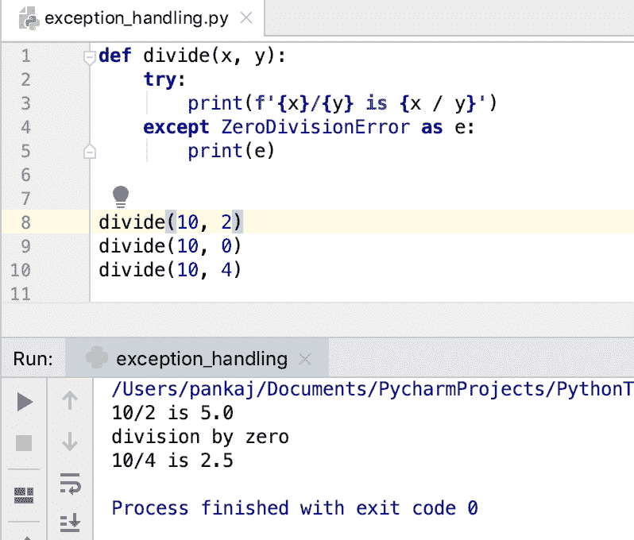
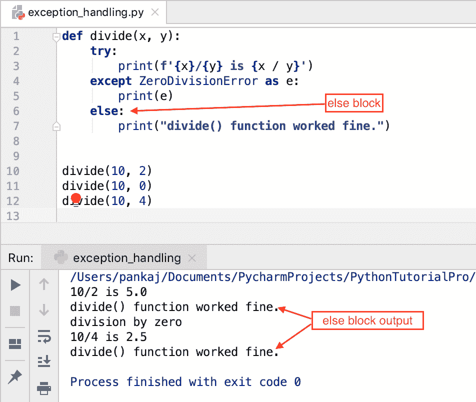
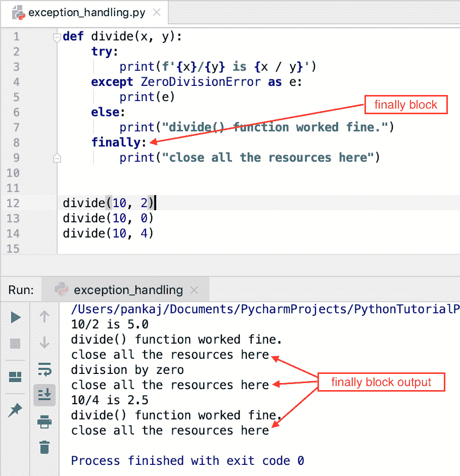

# Python 异常处理–Try，Except，Finally

> 原文：<https://www.askpython.com/python/python-exception-handling>

*   异常是改变程序正常执行流程的错误场景。
*   处理可能的异常的过程称为异常处理。
*   如果异常处理不当，程序可能会提前终止。这可能会导致数据损坏或不必要的结果。
*   Python 异常处理是通过三个[关键字](https://www.askpython.com/python/python-keywords)块实现的——try、except 和 finally。
*   **try** 块包含可能引发异常或错误的代码。
*   **except** 块用于捕捉异常并处理它们。
*   catch 块代码仅在引发相应的异常时执行。
*   可以有多个 catch 块。我们也可以在一个 catch 块中捕获多个异常。
*   **finally** 块代码总是被执行，无论程序是否正确执行或是否引发异常。
*   我们也可以用 try-except 块创建一个" **else** "块。如果没有引发异常，则执行 else 块中的代码。

* * *

## Python 中如何处理异常？

让我们看一个需要异常处理的例子。

```
def divide(x, y):
    print(f'{x}/{y} is {x / y}')

divide(10, 2)
divide(10, 0)
divide(10, 4)

```

如果我们运行上面的程序，我们会得到下面的输出。

```
10/2 is 5.0
Traceback (most recent call last):
  File "/Users/pankaj/Documents/PycharmProjects/PythonTutorialPro/hello-world/exception_handling.py", line 6, in <module>
    divide(10, 0)
  File "/Users/pankaj/Documents/PycharmProjects/PythonTutorialPro/hello-world/exception_handling.py", line 2, in divide
    print(f'{x}/{y} is {x / y}')
ZeroDivisionError: division by zero

```

对 divide()函数的第二次调用引发了 **ZeroDivisionError** 异常，程序终止。

我们从未得到第三次调用 divide()方法的输出，因为我们没有在代码中进行异常处理。

让我们用适当的异常处理重写 divide()方法。如果有人试图除以 0，我们将捕捉异常并打印一条错误消息。这样，程序不会过早终止，输出也更有意义。

```
def divide(x, y):
    try:
        print(f'{x}/{y} is {x / y}')
    except ZeroDivisionError as e:
        print(e)

divide(10, 2)
divide(10, 0)
divide(10, 4)

```

**输出:**

```
10/2 is 5.0
division by zero
10/4 is 2.5

```



Python Exception Handling

* * *

## 什么是 BaseException 类？

BaseException 类是所有异常的基类。它有四个子类。

1.  **异常**–这是所有非退出异常的基类。
2.  **generator exit**–请求发电机退出。
3.  **键盘中断**–程序被用户中断。
4.  **系统退出**–请求退出解释器。

* * *

## 一些内置的异常类

Python 中的一些内置异常类有:

*   **算术错误**–这是算术错误的基类。
*   **断言错误**–当断言失败时引发。
*   **属性错误**–找不到属性时。
*   **缓冲器错误**
*   **EOFError**–文件结束后读取
*   **导入错误**–当导入的模块没有找到时。
*   **LookupError**–查找错误的基本异常。
*   **内存错误**–出现内存不足时
*   **name error**–未在全局范围内找到名称时。
*   **OSError**–I/O 错误的基类
*   **参考错误**
*   **RuntimeError**
*   **停止迭代**，**停止迭代**
*   **语法错误**–无效语法
*   **系统错误**–Python 解释器中的内部错误。
*   **类型错误**–无效的参数类型
*   **值错误**–无效的参数值

* * *

## 一些内置的警告类

警告类是所有警告的基类。它有以下子类。

*   **bytes warning**–字节，以及与缓冲区相关的警告，主要与字符串转换和比较相关。
*   **弃用警告**–关于弃用功能的警告
*   **future warning**–警告未来语义发生变化的结构的基类。
*   **import warning**–关于模块导入错误的警告
*   **PendingDeprecationWarning**–关于未来将被弃用的功能的警告。
*   **资源警告**–资源使用警告
*   **运行时警告**–关于可疑运行时行为的警告。
*   **语法警告**–关于可疑语法的警告
*   **Unicode warning**–与 Unicode 转换相关的警告
*   **用户警告**–用户代码生成的警告

* * *

## 在单个 Except 块中处理多个异常

除了块，一个 try 块可以有多个**。我们可以在每个 except 块中捕捉特定的异常。**

```
def divide(x, y):
    try:
        print(f'{x}/{y} is {x / y}')
    except ZeroDivisionError as e:
        print(e)
    except TypeError as e:
        print(e)
    except ValueError as e:
        print(e)

```

每个 except 块中的代码都是相同的。在这个场景中，我们可以在一个 except 块中处理多个异常。我们可以向 except 块传递一组异常对象来捕捉多个异常。

```
def divide(x, y):
    try:
        print(f'{x}/{y} is {x / y}')
    except (ZeroDivisionError, TypeError, ValueError) as e:
        print(e)

```

* * *

## 在单个 Except 块中捕获所有异常

如果我们没有在 except 块中指定任何异常类，它将捕获 try 块引发的所有异常。当我们不知道 try 块可能引发的异常时，这样做是有益的。

空的 except 子句必须是异常处理链中的最后一个子句。

```
def divide(x, y):
    try:
        print(f'{x}/{y} is {x / y}')
    except ZeroDivisionError as e:
        print(e)
    except:
        print("unknown error occurred")

```

* * *

## 将 else 块与 try-except 一起使用

else 块代码是可选的。当 try 块没有引发异常时，就执行这个函数。

```
def divide(x, y):
    try:
        print(f'{x}/{y} is {x / y}')
    except ZeroDivisionError as e:
        print(e)
    else:
        print("divide() function worked fine.")

divide(10, 2)
divide(10, 0)
divide(10, 4)

```

**输出:**



Python Try Except Else Block

当 divide()函数 try 块正常工作时，else 块代码执行了两次。

* * *

## 使用带有 try-except 的 finally 块

无论是否有异常，finally 块代码在所有情况下都会被执行。finally 块用于关闭资源和执行清理活动。

```
def divide(x, y):
    try:
        print(f'{x}/{y} is {x / y}')
    except ZeroDivisionError as e:
        print(e)
    else:
        print("divide() function worked fine.")
    finally:
        print("close all the resources here")

divide(10, 2)
divide(10, 0)
divide(10, 4)

```

**输出:**



Python Try Except Else Finally Block

* * *

## Python 异常处理语法

现在我们已经看到了 Python 中与异常处理相关的所有内容，最后的语法是:

```
try -> except 1...n -> else -> finally

```

对于一个 try 块，我们可以有许多 except 块。但是，我们只能有一个其他的，并最终阻止。

* * *

## 创建自定义异常类

我们可以通过扩展异常类来创建一个定制的异常类。最佳实践是创建一个基本异常，然后派生其他异常类。下面是一些创建用户定义的异常类的例子。

```
class EmployeeModuleError(Exception):
    """Base Exception Class for our Employee module"""
    pass

class EmployeeNotFoundError(EmployeeModuleError):
    """Error raised when employee is not found in the database"""

    def __init__(self, emp_id, msg):
        self.employee_id = emp_id
        self.error_message = msg

class EmployeeUpdateError(EmployeeModuleError):
    """Error raised when employee update fails"""

    def __init__(self, emp_id, sql_error_code, sql_error_msg):
        self.employee_id = emp_id
        self.error_message = sql_error_msg
        self.error_code = sql_error_code

```

命名约定是在异常类的名称后面加上“Error”。

* * *

## 引发异常

我们可以使用 raise 关键字从代码中抛出一个异常。一些可能的情况是:

*   函数输入参数验证失败
*   捕捉异常，然后引发自定义异常

```
class ValidationError(Exception):
    pass

def divide(x, y):
    try:
        if type(x) is not int:
            raise TypeError("Unsupported type")
        if type(y) is not int:
            raise TypeError("Unsupported type")
    except TypeError as e:
        print(e)
        raise ValidationError("Invalid type of arguments")

    if y is 0:
        raise ValidationError("We can't divide by 0.")

try:
    divide(10, 0)
except ValidationError as ve:
    print(ve)

try:
    divide(10, "5")
except ValidationError as ve:
    print(ve)

```

**输出:**

```
We can't divide by 0.
Unsupported type
Invalid type of arguments

```

* * *

## 嵌套的 try-except 块示例

我们可以在 Python 中嵌套 try-except 块。在这种情况下，如果嵌套的 try 块中出现异常，将使用嵌套的 except 块来处理它。如果嵌套的 except 不能处理它，外部的 except 块将用于处理该异常。

```
x = 10
y = 0

try:
    print("outer try block")
    try:
        print("nested try block")
        print(x / y)
    except TypeError as te:
        print("nested except block")
        print(te)
except ZeroDivisionError as ze:
    print("outer except block")
    print(ze)

```

**输出:**

```
outer try block
nested try block
outer except block
division by zero

```

* * *

## Python 异常处理最佳实践

*   总是试图在代码中处理异常，以避免程序异常终止。
*   创建自定义异常类时，在其名称后面加上“Error”。
*   如果 except 子句具有相同的代码，请尝试在单个 except 块中捕获多个异常。
*   使用 finally 块关闭重资源并移除重对象。
*   使用 else 块记录代码的成功执行，发送通知等。
*   尽可能避免裸露的 except 子句。如果你不知道异常，那就只使用它。
*   为特定场景创建特定于模块的异常类。
*   您可以在 except 块中捕获异常，然后引发另一个更有意义的异常。
*   总是用有意义的消息引发异常。
*   避免嵌套的 try-except 块，因为这会降低代码的可读性。

* * *

## 参考资料:

*   [Python 异常处理文档](https://docs.python.org/3.8/tutorial/errors.html#handling-exceptions)