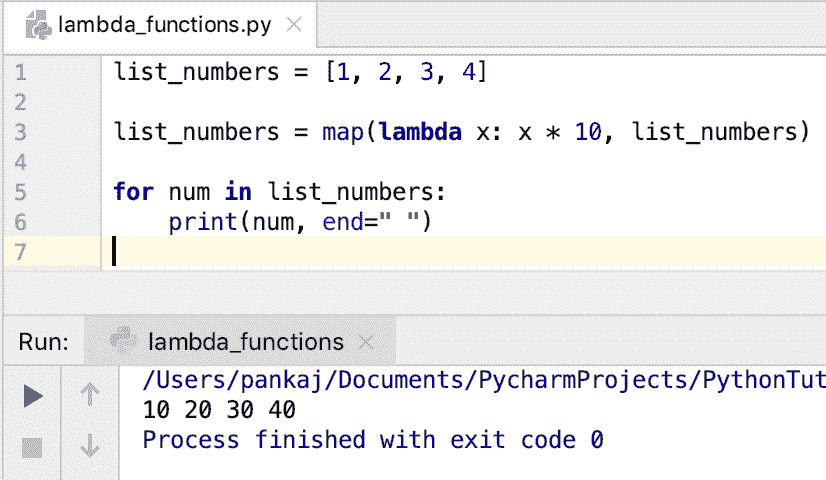
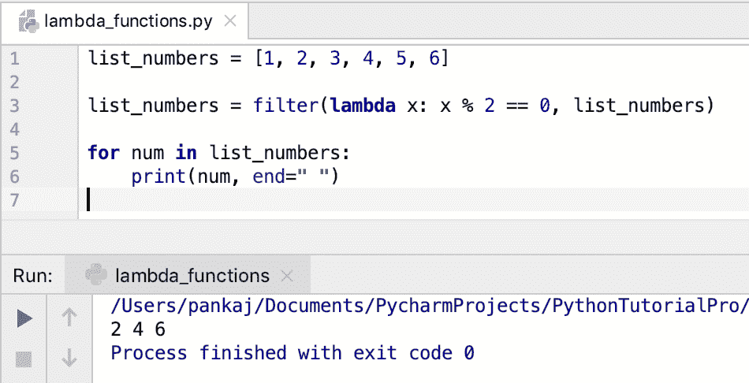
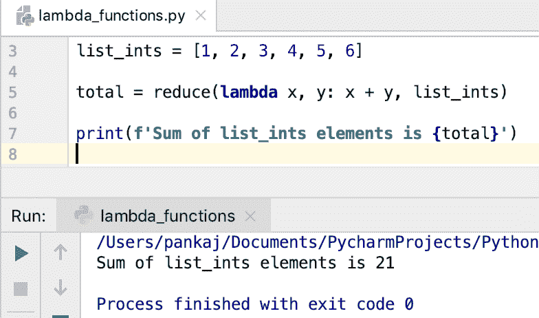

# python lambda–匿名函数

> 原文：<https://www.askpython.com/python/python-lambda-anonymous-function>

*   Python lambda 函数或 Python 匿名函数没有名称。
*   我们可以使用**λ**保留关键字定义一个匿名函数。
*   匿名函数的作用域限于定义它的当前作用域。
*   一个 lambda [函数](https://www.askpython.com/python/python-functions)可以有一个或多个参数，但是它只能有**一个表达式**。
*   计算表达式，结果从 lambda 函数返回。
*   lambda 函数通常与 map()、filter()和 reduce()操作一起使用。

* * *

## Python lambda 函数语法

lambda 函数的语法是:

```
lambda arguments : expression

```

* * *

## Python 匿名函数示例

假设我们有一个函数来计算一个矩形的面积。

```
def area_of_rectangle(l, w):
    return l * w

print(f'Area of Rectangle (4, 5) is {area_of_rectangle(4, 5)}')

```

让我们使用 lambda 关键字创建一个匿名函数来获取矩形的面积。

```
rectangle_area = lambda x, y: x * y

print(f'Area of Rectangle (4, 5) is {rectangle_area(4, 5)}')

```

* * *

## 什么时候使用匿名功能？

*   对于不太复杂的小而琐碎的任务。
*   当函数只有一个表达式时。
*   用于临时性的重复性任务。
*   当您希望函数范围仅限于当前范围时。
*   当函数参数是另一个函数(如 map()、filter()和 reduce()函数)时，这很有用。

* * *

## 带有 map()的 Lambda 函数

map()函数接受一个函数和一个 iterable 作为参数。该函数应用于 iterable 中的每个元素，并返回更新后的 iterable。

假设我们有一个整数列表。我们必须通过将每个元素乘以 10 来创建一个新的列表。我们可以在这里使用 lambda 函数，而不是为这个用例创建一个函数。

```
list_numbers = [1, 2, 3, 4]

list_numbers = map(lambda x: x * 10, list_numbers)

for num in list_numbers:
    print(num, end=" ")

```

**输出:**



Python lambda Function with map()

* * *

## 带过滤器的 Lambda 函数()

内置的 filter()函数接受一个函数和一个 iterable 作为参数。该函数应用于 iterable 的每个元素。如果函数返回 True，则元素被添加到返回的 iterable 中。

假设我们有一个整数列表，我们想删除所有的奇数。最终的列表应该只有偶数。我们可以在 lambda 函数中使用 filter()函数。

```
list_numbers = [1, 2, 3, 4, 5, 6]

list_numbers = filter(lambda x: x % 2 == 0, list_numbers)

for num in list_numbers:
    print(num, end=" ")

```



Python lambda Function with filter()

* * *

## 带 reduce()的 Lambda 函数

reduce()函数存在于 **functools** 模块中。这个函数以一个函数和一个序列作为参数。该函数应该接受两个参数。序列中的元素与累积值一起传递给函数。最终结果是一个单一的值。

假设我们有一个整数列表，我们想得到所有元素的和。我们可以在 lambda 函数中使用 reduce()函数。

```
from functools import reduce

list_ints = [1, 2, 3, 4, 5, 6]

total = reduce(lambda x, y: x + y, list_ints)

print(f'Sum of list_ints elements is {total}')

```



Python lambda Function with reduce()

* * *

## 没有参数的 Python lambda 函数

有人问我我们能不能有一个没有任何自变量的 lambda 函数？

是的，我们可以定义一个没有任何参数的 lambda 函数。但是，这将是无用的，因为将没有什么可操作的。让我们看一个简单的例子。

```
get_5 = lambda: 5

print(get_5())  # 5

```

因为 lambda 函数总是返回相同的值，所以我们可以给它赋一个变量。不带任何参数地使用 lambda 函数显然是对这个特性的滥用。

* * *

## 结论

Python 匿名函数是使用 lambda 关键字创建的。当函数参数是另一个函数时，它们很有用。它主要用于创建一次性使用的简单实用函数。

* * *

## 参考资料:

*   [Python Lambda 表达式](https://docs.python.org/3/tutorial/controlflow.html#lambda-expressions)
*   [Python lambda 关键字](https://docs.python.org/3/reference/expressions.html#lambda)