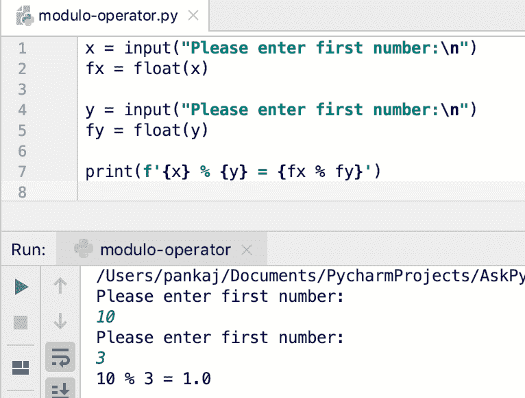
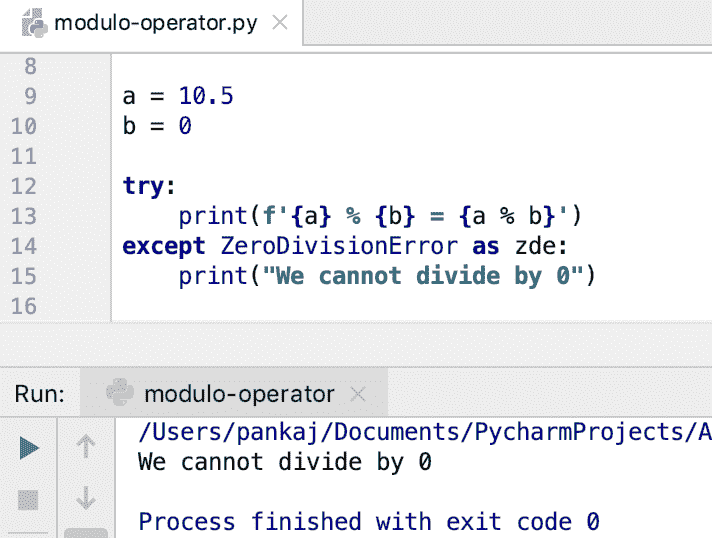

# python Modulo –%运算符，math.fmod()示例

> 原文：<https://www.askpython.com/python/python-modulo-operator-math-fmod>

Python 模运算符(%)用于获得除法的余数。整数和浮点数支持模运算。

模运算符的语法是`a % b`。这里“a”是被除数，“b”是除数。输出是 a 除以 b 的余数。

如果“a”和“b”都是整数，那么余数也是整数。如果其中一个是 float，结果也是浮点数。

* * *

## Python 模块运算符示例

让我们看一些模运算符的例子。

### 1.整数取模

```
>>> 10 % 3 
1
>>> 2 % 2
0
>>> 

```

* * *

### 2.浮点取模

```
>>> 9 % 3.0
0.0
>>> 10 % 3.0
1.0
>>> 

```

* * *

### 3.用户输入的模数

```
x = input("Please enter first number:\n")
fx = float(x)

y = input("Please enter first number:\n")
fy = float(y)

print(f'{x} % {y} = {fx % fy}')

```



Python Modulo Operator

当我们得到用户输入的数据时，它是字符串形式的。我们使用 float()内置函数将它们转换成浮点数。这就是为什么余数是 1.0 而不是 1。

**推荐阅读** : [Python 输入()函数](https://www.askpython.com/python/examples/python-user-input)

* * *

### 4.ZeroDivisionError 示例

如果除数为 0，模运算符将抛出`ZeroDivisionError`。我们可以使用 [try-except 块](https://www.askpython.com/python/python-exception-handling)来捕捉错误。

```
a = 10.5
b = 0

try:
    print(f'{a} % {b} = {a % b}')
except ZeroDivisionError as zde:
    print("We cannot divide by 0")

```



Python Modulo ZeroDivisionError

* * *

### 5.负数取模

Python 模运算符总是返回与除数符号相同的余数。这可能会导致输出混乱。

```
>>> -5 % 3
1
>>> 5 % -3
-1
>>> -10 % 3
2
>>> 

```

*   -5 % 3 = (1 -2*3) % 3 = 1
*   5 % -3 = (-1 * -2*-3) % 3 = -1
*   -10 % 3 = (2 -4*3) % 3 = 2

* * *

### 6\. Python Modulo math.fmod()

带有负数的%运算符的行为不同于平台 C 库。如果你想让模运算表现得像 C 编程一样，你应该使用数学模块 fmod()函数。这是获取浮点数模的推荐函数。

```
>>> import math
>>> math.fmod(-5, 3)
-2.0
>>> math.fmod(5, -3)
2.0
>>> math.fmod(-10, 3)
-1.0
>>> 

```

*   fmod(-5, 3) = fmod(-2 -1*3, 3) = -2.0
*   fmod(5, -3) = fmod(2 -1*-3, -3) = 2.0
*   fmod(-10, 3) = fmod(-1 -3*3, 3) = -1.0

* * *

## 重载模算子

我们可以通过在类定义中实现`__mod__()`函数来重载模操作符。

```
class Data:

    def __init__(self, i):
        self.id = i

    def __mod__(self, other):
        print('modulo function called')
        return self.id % other.id

    def __str__(self):
        return f'Data[{self.id}]'

d1 = Data(10)
d2 = Data(3)

print(f'{d1} % {d2} = {d1%d2}')

```

**输出:**

```
modulo function called
Data[10] % Data[3] = 1

```

* * *

## 关于浮点运算问题的快速说明

我们用二进制格式在计算机中存储数值。说到分数，大部分时候我们都不能把它们精确的表示成二进制分数。例如，1/3 不能用精确的二进制格式表示，它总是一个近似值。

这就是为什么用浮点数进行算术运算时会得到意想不到的结果。从下面模运算的输出可以清楚地看出。

```
>>> 9.6 % 3.2
3.1999999999999993

```

输出应该是 0，因为 3.2*3 是 9.6。但是，浮点小数值并没有精确地表示出来，这种近似导致了这种误差。这个例子也很清楚。

```
>>> 9.6 == 3.2 * 3
False
>>> 

```

因此，在处理浮点数时，您应该格外小心。建议先进行舍入，然后只比较两个浮点数。

```
>>> round(9.6, 3) == round(3.2 * 3, 3)
True

```

* * *

## 参考资料:

*   [浮点运算问题](https://docs.python.org/3/tutorial/floatingpoint.html)
*   [恐怖片](https://docs.python.org/3.7/library/exceptions.html#ZeroDivisionError)
*   [Python 运算符](https://www.askpython.com/python/python-operators)
*   [math.fmod() API 文档](https://docs.python.org/3/library/math.html#math.fmod)